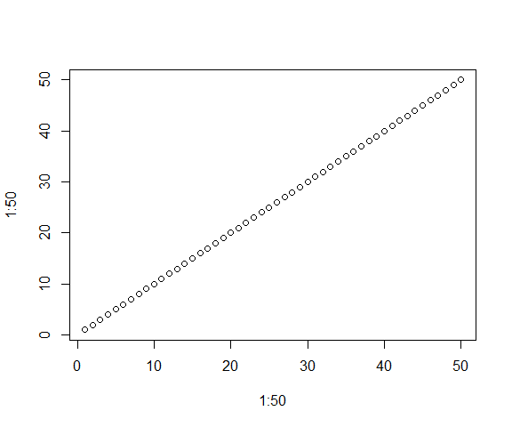

# Introduction

## Pourquoi utiliser R Markdown ?

Dans le contexte de recherche reproductible, R Markdown est un outil de choix.  
En effet, il permet de produire des documents scientifiques mélangeant du texte, du code R et le résultat de l'exécution de ce code de manière automatique.  

Autre avantage, il permet de regrouper tous les résultats d'analyses y compris les graphes en un seul document, visualisable par n'importe qui.  
Ces rapports peuvent être générés dans différents formats (HTML, PDF, Office WORD,...) et dans différents représentations (page html, site web, présentations type powerpoint...).  

Facile à prendre en main au début, les utilisateurs avancés peuvent par la suite customiser leur document à volonté via du code HTML et CSS.

## Documentation

La documentation officielle se trouve à cette page [R Markdown: The Definitive Guide](https://bookdown.org/yihui/rmarkdown/).  
Cette documentation est évidemment le produit d'un document généré par R Markdown !

Ne pas oublier l'incontournable [cheatsheet](https://www.rstudio.com/resources/cheatsheets/#rmarkdown) de RStudio.

De plus, il existe une multitude de tutoriels disponibles en ligne y compris en français (Cf. en bas de page).  


## Premiers pas

La solution la plus commode pour générer un rapport R Markdown est de créer un nouveau document R Markdown dans RStudio. Un fichier avec l'extension `.Rmd` est créé avec un modèle par défaut.

Pour générer le rapport, on utilise le bouton `Knit` ou la combinaison de touches <kbd>Ctrl</kbd> + <kbd>shift</kbd> + <kbd>k</kbd>.

La production du document appelle des fonctions des packages `knitr`et `rmarkdown` qui sont chargés à la compilation du script.
<Br>

>
Dans le cas de la production de documents PDF, il faut veiller à installer une installation fonctionnelle de LaTeX. 
Il est recommandé d'utiliser [tinyTeX](https://yihui.name/tinytex/)
> 

<Br>


```r
install.packages("tinytex")
tinytex::install_tinytex()  # install tinyTeX
```

<Br>

>
ATTENTION:<Br>Certains affichages ne sont pas compatibles avec un document PDF, notamment les tables et les graphes intéractifs.
>

# Anatomie d'un R Markdown

Un document R Markdown est constitué de 3 parties:

 - des méta-données (obligatoires)
 - du texte
 - du code à exécuter (`chunk`)
 
 ````r
# insertion d'un chunk dans le script

```r
x = 2 + 2
x
```
````


## Méta-données: YAML

Partie la plus obscure du script quand on démarre.

Les méta-données sont saisies en début de script entre une paire de 3 tirets `---`.  
Elles renseignent certains paramètres qui permettent de contrôler des caractéristiques du document produit en fonction du format de sortie choisi. 
La syntaxe utilisée suit le format YAML (https://fr.wikipedia.org/wiki/YAML).

Pour bien comprendre l'utilité de cette partie, il convient de s'attarder sur le processus de création du document R Markdown.

Dans le diagramme suivant sont représentées les différentes étapes:

 - Création d'un script dans RStudio avec l'extension `.rmd`.
 - `knitr` transforme le script en document markdown `.md`, ce document contient les codes R, les résultats (ou les sorties), et les textes.
 - conversion de ce document dans le format désiré à l'aide de [`pandoc`](https://pandoc.org/MANUAL.html) (inclus dans RStudio)
 - Pandoc appelle LaTeX si le format de sorti est un PDF.


<Br>
Pour "contrôler" le rendu de notre document on intervient:

 - Au niveau de la traduction du fichier  `.rmd` en `.md` avec des options de `knitr`
 - Au niveau de la conversion dans le format de sortie en passant des informations à `pandoc`.  

Les options de `knitr` sont précisées dans les chunks (code R), elles peuvent s'appliquer:

 - Soit uniquement au chunk dans lequel elle se trouve
 - Soit à tout le document

Les méta-données du YAML permettent de préciser le rendu final du document, comme le titre, la présence d'un sommaire, d'une bibliographie...  

Les méta-données dépendent donc de `Pandoc` et des options disponibles en fonction du format de sortie choisi.  
Pour maîtriser cette partie il est conseillé de "lire" la doc de [`Pandoc`](https://pandoc.org/MANUAL.html), ce qui n'est pas vraiment la partie la plus fun.  

Ou bien on s'inspire de ce qui existe déjà !

## Du texte

La principale fonction d'un R Markdown est de présenter des analyses statistiques et de commenter les résultats.
Tout ce texte de présentation et d'accompagnement est formaté et mis en page à l'aide de petites "balises".  
On s'habitue vite à la syntaxe, c'est la grande force du Markdown: modifier du texte très simplement.

## Des lignes de codes

Les analyses statistiques produites et présentées dans le document proviennent de l'exécution de code R.  
Ces lignes de code sont séparées du texte par ce qu'on appelle des chunks délimités par 2 séries de 3 backquotes <kbd>Alt Gr</kbd> + <kbd>7</kbd>.  
Par défaut le code inséré dans un chunk est affiché puis exécuté.  
Le résultat de l'exécution est à son tour affiché.

### En résumé

<font size = "4">Un document R Markdown est constitué d'un **en-tête** suivi d'une succession de lignes de **texte** et de **lignes de code R** intégrées dans des chunks.</font>
<Br> <Br> <Br>
 
# R Markdown dans le détail

Revenons en détails sur les différentes parties d'un R Markdown

## Méta-données: YAML

A l'ouverture d'un script `.Rmd` un YAML de base est généré par défaut.  

Il suffit de renseigner les champs correspondent, puis on "knite".  Le document produit est une page HTML placée dans le répertoire où se trouve le script.  
Elle a le même nom que le script mais avec l'extension HTML.  
Par défaut le fichier `.md` généré lors de la conversion n'est pas gardé.

Dans le cas suivant, on a renseigné le titre, l'auteur, la date, et le format du document de sortie.

Si on précise le format de sortie `output` sans argument, on peut rajouter uniquement la fonction sur la même ligne.  


```r
---
title: "Exemple R Markdown"
author: "Laurent Cauquil"
date: "14 juillet 2023"
output: html_document
---
```

Si on spécifie plusieurs format de sortie il faut utiliser l'indentation. Mettre `default` si aucun paramètres n'est précisé.


```r
---
title: "Exemple R Markdown"
author: "Laurent Cauquil"
date: "14 juillet 2023"
output: 
  html_document: default
  pdf_document: default
---
```

On peut personnaliser la page en ajoutant des paramètres de formatage dans le YAML.  
Par exemple pour personnaliser un document html, on rajoute des "sub-options" dans le YAML aprés `html_document` (Cf l'aide `?rmardown::html_document`).  
Ne pas oublier de rajouter `:` après `html_document` si on précise des paramètres et de respecter un décalage de 2 espaces à la ligne suivante.

Exemple:  
Rajouter un sommaire et fixer la largeur des figures.


```r
---
title: "Exemple R Markdown"
author: "Laurent Cauquil"
date: "14 juillet 2023"
output: 
  html_document:
    toc: TRUE
    fig_width: 9
---
```

>
ATTENTION la syntaxe de YAML est stricte notamment au niveau des indentations (2 espaces).
>

Rajouter un sous-titre


```r
---
title: "Exemple R Markdown"
subtitle: "Customisation avancée"
author: "Laurent Cauquil"
date: "14 juillet 2023"
output: 
  html_document:
    toc: TRUE
    fig_width: 9
---
```

Rendre le sommaire mobile sur la droite du rapport quand on parcours la page.


```r
---
title: "Exemple R Markdown"
subtitle: "Customisation avancée"
author: "Laurent Cauquil"
date: "14 juillet 2023"
output: 
  html_document:
    toc: TRUE
    toc_float: TRUE
    fig_width: 9
---
```

>
ATTENTION il ne faut pas oublier de renseigner toc: TRUE avant de mettre toc_float: TRUE
>

Dans les précédents exemples de YAML, la date est saisie en "dur", il faudra penser à la mettre à jour lorsqu'on génére un rapport.  
Pour éviter d'avoir à le faire à chaque fois (risque d'oublis ou d'erreur), on peut insérer la date courante directement, en exécutant un code R.  
On utilise des backquotes `` ` `` pour indiquer qu'il y a du code à exécuter et on ajoute `r` pour spécifier le langage utilisé, puis enfin la fonction qui fait le job:  
 `Sys.Date()`.
 


```r
---
title: "Exemple R Markdown"
subtitle: "Customisation avancée"
author: "Laurent Cauquil"
date: "`r Sys.Date()`"
output: 
  html_document:
    toc: TRUE
    toc_float: TRUE
    fig_width: 9
---
```

Exemples d'autres paramètres disponibles pour personnaliser un document HTML


```r
---
title: "Exemple R Markdown"
subtitle: "Customisation avancée"
author: "Laurent Cauquil"
date: "`r Sys.Date()`"
output: 
  html_document:
    toc: TRUE
    toc_float: TRUE
#   Rajouter un bouton pour afficher ou cacher tous les codes R (hide/show)
    code_folding: hide
# choisir un thème pour le texte    
    theme: paper
# On peut limiter la profondeur de l'affichage du sommaire
    toc_depth: 2
# On peut appliquer la numérotation automatique des titres
    number_sections: TRUE
# choisir un thème pour les parties relatives aux codes R
    highlight: "zenburn"
# définir des paramètres pour les graphs
    fig_height: 8
    fig_width: 8
---
```

On peut rajouter des arguments pour plusieurs formats de sortie dans le YAML.


```r
---
title: "Exemple R Markdown"
subtitle: "Customisation avancée"
author: "Laurent Cauquil"
date: "`r Sys.Date()`"
output: 
  html_document:
    toc: TRUE
    toc_float: TRUE
  pdf_document
    toc: TRUE
```

On peut ensuite générer le document simultanément dans les différents formats avec la fonction `render()` du package `rmarkdown`  

`> markdown::render("monfichier.Rmd", output_format = "all")`

<Br>
Tableau présentant différentes sub-options disponibles en fonction du format de sortie:


>
NB: On peut utiliser yes/no, true/false, on/off, TRUE/FALSE
>

## Formatage du texte

Le formatage du texte suit généralement la syntaxe markdown.  

### Corps du texte

Pour du texte en italique, on encadre le texte avec des underscores ou des asterisques simples `_texte_` ou `*texte*`,  
<center>*texte ne italique*</center>
Pour mettre en gras, on double les underscores et les astérisques: `__texte__` ou `**texte**`,  
<center>**texte en gras**</center>
Pour mettre des caractères en indices ou en exposants, on encadre avec des tildes et des carets `H~3~PO~4~^2-^`  
<center>H~3~PO~4~^2-^</center>  

### Titres

On utilise des séries de `#` pour définir la hiérarchie des titres


```r
# First-level header

## Second-level header

### Third-level header
```

Dans le cas où on utilise la numérotation des titres dans le sommaire (`number_sections: TRUE` dans le YAML) on peut ponctuellement supprimer cette numérotation en rajoutant `{-}` ou `{.unnumbered}` après le titre


```r
# Preface {-}
```

### Paragraphes

Les listes sont définies par `*`, `-` ou `+`, attention de sauter un ligne avant de commencer la liste et de respecter les espaces entre le symbole et le texte


```r
- one item
* one item
- one item
    - one more item
    + one more item
    - one more item
```

- one item
* one item
- one item
    - one more item
    + one more item
    - one more item
    
Pour numéroter les listes, ce n'est pas aussi souple.  
Rajouter les chiffres avant le `.`  et **sans espace** . Les chiffres se suivront obligatoirement au sein d'un même rang hiérarchique.


```r
1. one item
2. one item
3. one item
    5. one more item
    10. one more item
    15. one more item
```

1. one item
2. one item
3. one item
    5. one more item
    10. one more item
    15. one more item
    
Pour mettre en avant un petit paragraphe, on encadre le texte avec des `>`


```r
>
REMARQUE
>
```

>
REMARQUE
>


### Format ligne de code

Pour transformer un texte en format ligne de code, on l'encadre par des backquotes `` `ligne de code` ``

>
Remarque: pour intégrer des backquotes dans du texte, il faut les encadrer avec le mêmes nombre de quotes + 1  
ex: ````` ```` ```code``` ```` `````, affichera ```` ```code``` ````
>

### Afficher des formules mathémathiques et autres caractères grecs

Pour écrire grec, on rajoute des dollars **`$`**

Markdown utilise la syntaxe [LaTeX](https://en.wikibooks.org/wiki/LaTeX/Mathematics)  

On encadre les formules **sans espace** avec un `$` ou avec `$$` si on veut les centrer.


```r
$\alpha, Alpha$
$\beta, Beta$
$\gamma \Gamma$
$x = y $
$$x_{1} + x_{2} + \cdots + x_{n}$$
$$\lim_{x \to \infty} f(x)$$
```

$\alpha, Alpha$  
$\beta, Beta$  
$\gamma, \Gamma$  
$x = y$  
$$x_{1} + x_{2} + \cdots + x_{n}$$  
$$\lim_{x \to \infty} f(x)$$

Vous noterez que RStudio prévisualise en popup les formules mathématiques encadrées par `$` et affiche directement dans le script les formules encadrées par `$$`  

On peut vraiment faire ce qu'on veut si on prend le temps de regarder la doc


```r
$$f(k) = {n \choose k} p^{k} (1-p)^{n-k}$$
```

$$f(k) = {n \choose k} p^{k} (1-p)^{n-k}$$


### Hyperlink

R Markdown reconnaît les liens internet automatiquement (quand ils commencent par http:// ou https://), ils seront affichés en bleu et le lien s'ouvrira si on clique dessus.

Néanmoins pour gagner en lisibilité on peut associer un tag qui sera affiché à la place de l'adresse complète.


```r
Cliquer [ICI](https://en.wikibooks.org/wiki/LaTeX/Mathematics) pour retrouver la page de la doc de LaTeX
```

Cliquer [ICI](https://en.wikibooks.org/wiki/LaTeX/Mathematics) pour retrouver la page de la doc de LaTeX

### Images

C'est exactement le même principe pour insérer des liens, il faut juste rajouter un `!` en début et mettre le chemin de l'image. Dans l'exemple suivant, on utilise un chemin relatif par rapport au répertoire courant.


```r

```


### Renvois (footnotes)

Les renvois ou footnote sont automatiquement numérotés et ajoutés en fin de document. Ils sont insérés dans le texte en utilisant les crochets et le caret: `^[texte du renvoi]` ^[texte du renvoi].


### Citations

On peut intégrer des citations dans le texte. R Markdown reconnaît la syntaxe des fichiers BibTeX (format exportable depuis les logiciels de bibliographies).  
Toutes les références insérées dans le texte seront reportées en bas du document avec des renvois automatiques.  
Pour utiliser cette option, rajouter le champ `bibliography` ainsi que le chemin vers le fichier BibTeX dans le YAML. On rajoute le champ `link-citations` pour lier les références dans le texte avec le bas du document.  


```r
title: "Tutoriel R Markdown"
subtitle: "Customisation avancée"
author: "Laurent Cauquil"
date: "`r Sys.Date()`"
output: 
  html_document:
    toc: TRUE
    toc_float: TRUE
bibliography: ["biblio/biblio.bib"]
link-citations: yes
```

Dans le script, une référence est introduite comme ceci `@grolemund_r_nodate`  @grolemund_r_nodate, on rajoute des crochets pour mettre la référence entre parenthèses `[@grolemund_r_nodate]`  [@grolemund_r_nodate]. 

<Br><Br>


## Ligne de code R: "chunks"

Le code R est inséré par l'intermédiaire de ce qu'on appelle des chunks.

Un chunk est délimité par 2 séries de 3 backquotes, par défaut le code inséré dans un chunk est affiché, exécuté et le résultat affiché.  

````r
# dans le script

```r
x = 2 + 2
x
```

```
## [1] 4
```
````


```r
x = 2 + 2
x
```

```
## [1] 4
```

RStudio dispose de raccourcis pour ajouter des chunks dans le script.

- bouton `insert --> R` 
- combinaison de touches <kbd>Ctrl</kbd> + <kbd>Alt</kbd> + <kbd>i</kbd>


Par défaut, le code est exécuté et le résultat affiché à la suite dans 2 boîtes séparées.
De nombreuses options permettent de contrôler le résultats d'un chunk.

### Les options de chunk

Il existe beaucoup d'options qui permettent de contrôler le comportement d'un chunk, que ce soit pour du calcul, des graphs, des tableaux ou du texte. Ces options sont insérées entre les accolades après le `r,` et sont de la forme `tag = value`.  
Ce sont des options du package `knitr`.


<Br>

Il est possible (et même recommandé) de nommer chaque chunk (facilite la navigation dans RStudio). 

>
ATTENTION
chaque label de chunk doit être unique, éviter également les points et les espaces 
>

Le label suit immédiatement le r après un espace, seules les options sont après une virgule.

>
*{r label_du_chunk, options}*
>

La documentation complète des options se trouvent [ici](https://yihui.name/knitr/options).

Passons en revue les plus utilisées en fonction de leur domaine d'application.  
<Br><Br>

#### Evaluation du code

 - `eval`: booleen, le code est exécuté ou pas
 
#### Affichage du texte

 - `echo`: booleen, affiche le code ou pas
 - `include`: booleen, affiche le résultat ou pas. Le code est évalué dans tous les cas, les graphes générés mais pas affichés.
 - `collapse`: booleen, affiche le code et le résultat dans la même boîte
 - `warning`: booleen, affiche les warnings ou pas
 - `error`: booleen, affiche les errors ou pas
 - `message`: booleen, affiche les messages ou pas (utile pour le chargement des packages)
 - `results`: 
   - "asis": affiche le résultat en style console R (brut)
   - "hide": cache le résultat (sauf si warning, message ou error)
   - "hold": regroupe et affiche tous les résultats du chunk à la fin de la boîte du code
   
#### Formatage du texte de sortie

 - `prompt`: booleen, ajoute le prompt au début des lignes de codes (empêche les copier-coller direct dans la console)
 - `comment`: "string", défini le prefixe de commentaire (`##` en général)
 - `highlight`: booleen, ajoute la coloration syntaxique au code

#### Graphes

 - `fig.width`, `fig.height`: dimensions du graphe en pouces
 - `fig.dim`: raccourci pour `fig.width` + `fig.height` (ex: `fig.dim = c(5, 7)`)
 - `fig.align`: "left", "center", "right",   alignement en largeur
 - `fig.show`: 
   - "hold": regroupe et affiche tous les graphes à la fin de la boîte
   - "hide": génére les graphes mais ne les affiche pas
 - `fig.keep`: 
   - "first": affiche que le premier graphe
   - "last": affiche que le dernier graphe
 - `dpi`: définition
 
**Exemple de chunk avec production d'un graphe**

````markdown
```{r, fig.width = 6, fig.align = 'center'}
plot(1:10,1:10)
```
````


```r
plot(1:10,1:10)
```


**3 graphes dans un seul chunk**

Les 3 graphes sont affichés à la fin, après les lignes de code.

````markdown
```{r, fig.width = 6, fig.align = 'center', fig.show = "hold"}
plot(1:10,1:10)
plot(1:5,1:5)
plot(1:50,1:50)
```
````


```r
plot(1:10,1:10)
plot(1:5,1:5)
plot(1:50,1:50)
```



> REMARQUE:  
On peut utiliser les chunks pour insérer une image plutôt que d'utiliser la syntaxe R Markdown ``. L'intérêt est d'avoir plus de contrôle sur le formattage.  
On utilise l'option `include_graphics`
````markdown
```{r, fig.width = 6, fig.align = 'right'}

```
````
>


```r

```


Liste complète des options d'un chunk

```r
str(knitr::opts_chunk$get())
```

```
## List of 53
##  $ eval         : logi TRUE
##  $ echo         : logi TRUE
##  $ results      : chr "markup"
##  $ tidy         : logi FALSE
##  $ tidy.opts    : NULL
##  $ collapse     : logi FALSE
##  $ prompt       : logi FALSE
##  $ comment      : chr "##"
##  $ highlight    : logi TRUE
##  $ strip.white  : logi TRUE
##  $ size         : chr "normalsize"
##  $ background   : chr "#F7F7F7"
##  $ cache        : logi FALSE
##  $ cache.path   : chr "tuto_RMarkdown_cache/html/"
##  $ cache.vars   : NULL
##  $ cache.lazy   : logi TRUE
##  $ dependson    : NULL
##  $ autodep      : logi FALSE
##  $ cache.rebuild: logi FALSE
##  $ fig.keep     : chr "high"
##  $ fig.show     : chr "asis"
##  $ fig.align    : chr "default"
##  $ fig.path     : chr "tuto_RMarkdown_files/figure-html/"
##  $ dev          : chr "png"
##  $ dev.args     : NULL
##  $ dpi          : num 96
##  $ fig.ext      : NULL
##  $ fig.width    : num 7
##  $ fig.height   : num 5
##  $ fig.env      : chr "figure"
##  $ fig.cap      : NULL
##  $ fig.scap     : NULL
##  $ fig.lp       : chr "fig:"
##  $ fig.subcap   : NULL
##  $ fig.pos      : chr ""
##  $ out.width    : NULL
##  $ out.height   : NULL
##  $ out.extra    : NULL
##  $ fig.retina   : num 1
##  $ external     : logi TRUE
##  $ sanitize     : logi FALSE
##  $ interval     : num 1
##  $ aniopts      : chr "controls,loop"
##  $ warning      : logi TRUE
##  $ error        : logi FALSE
##  $ message      : logi TRUE
##  $ render       : NULL
##  $ ref.label    : NULL
##  $ child        : NULL
##  $ engine       : chr "R"
##  $ split        : logi FALSE
##  $ include      : logi TRUE
##  $ purl         : logi TRUE
```

<Br><Br>

#### Chunk setup

On peut définir des options de chunk pour tous les chunk du document.
C'est le rôle du chunk de "setup".  
Il est placé en début de document et suit la syntaxe suivante `knitr::opts_chunk$set`  


````markdown
```r ''````{r setup, include = FALSE}
knitr::opts_chunk$set(echo = TRUE, fig.align = "center")
```
````

Les options de chunk précisées dans un chunk du document auront la priorité sur les options du chunk setup.

<Br> 

#### Inline code chunk

On peut exécuter du code R au milieu d'un texte sans avoir à créér un chunk. Pour cela il faut insérer le code entre `` `r ` ``.


```r
`r Sys.Date()`
```

Date de compilation du document 2019-11-05
<Br>
<Br>

## Tables

### Tables en markdown

Afficher des data.frame sous forme de tableaux dans un document est une opération qui peut s'avérer complexe en fonction de la table elle-même (taille) ou des informations que l'on veut mettre en avant.  
<Br>
La syntaxe markdown permet de créér des tableaux directement dans le texte, mais ce n'est pas trés pratique et le résultat n'est pas facilement personnalisable.  
Il faut jouer avec les `-`, les `|` et les `:` pour déterminer les différents champs.


```r
| Auteur  | Package   | Année |
|:------------- |-------:|:----:|
| Yixui Xie   | knitr     | 2012  |
| Hadley Wickham | ggplot2   | 2005  | 
```

| Auteur  | Package   | Année |
|:------------- |-------:|:----:|
| Yixui Xie   | knitr     | 2012  |
| Hadley Wickham | ggplot2   | 2005  | 


Une des méthodes les plus directe pour afficher une table (`data.frame`) est d'utiliser la fonction `datatable` du package `DT`.  
Elle affiche par défaut une table intéractive avec de nombreuses options 

La fonction `datatable` du package `DT` permet:

 - Affichage paginé
 - Tri sur chaque colonne
 - Tri par recherche

La fonction `datatable` comporte de nombreuses options pour personnaliser la table en sortie (Cf [DT page](https://rstudio.github.io/DT/)).


```r
library(DT)
datatable(iris)
```

<!--html_preserve--><div id="htmlwidget-ee43068becbdc879744b" style="width:100%;height:auto;" class="datatables html-widget"></div>
<script type="application/json" data-for="htmlwidget-ee43068becbdc879744b">{"x":{"filter":"none","data":[["1","2","3","4","5","6","7","8","9","10","11","12","13","14","15","16","17","18","19","20","21","22","23","24","25","26","27","28","29","30","31","32","33","34","35","36","37","38","39","40","41","42","43","44","45","46","47","48","49","50","51","52","53","54","55","56","57","58","59","60","61","62","63","64","65","66","67","68","69","70","71","72","73","74","75","76","77","78","79","80","81","82","83","84","85","86","87","88","89","90","91","92","93","94","95","96","97","98","99","100","101","102","103","104","105","106","107","108","109","110","111","112","113","114","115","116","117","118","119","120","121","122","123","124","125","126","127","128","129","130","131","132","133","134","135","136","137","138","139","140","141","142","143","144","145","146","147","148","149","150"],[5.1,4.9,4.7,4.6,5,5.4,4.6,5,4.4,4.9,5.4,4.8,4.8,4.3,5.8,5.7,5.4,5.1,5.7,5.1,5.4,5.1,4.6,5.1,4.8,5,5,5.2,5.2,4.7,4.8,5.4,5.2,5.5,4.9,5,5.5,4.9,4.4,5.1,5,4.5,4.4,5,5.1,4.8,5.1,4.6,5.3,5,7,6.4,6.9,5.5,6.5,5.7,6.3,4.9,6.6,5.2,5,5.9,6,6.1,5.6,6.7,5.6,5.8,6.2,5.6,5.9,6.1,6.3,6.1,6.4,6.6,6.8,6.7,6,5.7,5.5,5.5,5.8,6,5.4,6,6.7,6.3,5.6,5.5,5.5,6.1,5.8,5,5.6,5.7,5.7,6.2,5.1,5.7,6.3,5.8,7.1,6.3,6.5,7.6,4.9,7.3,6.7,7.2,6.5,6.4,6.8,5.7,5.8,6.4,6.5,7.7,7.7,6,6.9,5.6,7.7,6.3,6.7,7.2,6.2,6.1,6.4,7.2,7.4,7.9,6.4,6.3,6.1,7.7,6.3,6.4,6,6.9,6.7,6.9,5.8,6.8,6.7,6.7,6.3,6.5,6.2,5.9],[3.5,3,3.2,3.1,3.6,3.9,3.4,3.4,2.9,3.1,3.7,3.4,3,3,4,4.4,3.9,3.5,3.8,3.8,3.4,3.7,3.6,3.3,3.4,3,3.4,3.5,3.4,3.2,3.1,3.4,4.1,4.2,3.1,3.2,3.5,3.6,3,3.4,3.5,2.3,3.2,3.5,3.8,3,3.8,3.2,3.7,3.3,3.2,3.2,3.1,2.3,2.8,2.8,3.3,2.4,2.9,2.7,2,3,2.2,2.9,2.9,3.1,3,2.7,2.2,2.5,3.2,2.8,2.5,2.8,2.9,3,2.8,3,2.9,2.6,2.4,2.4,2.7,2.7,3,3.4,3.1,2.3,3,2.5,2.6,3,2.6,2.3,2.7,3,2.9,2.9,2.5,2.8,3.3,2.7,3,2.9,3,3,2.5,2.9,2.5,3.6,3.2,2.7,3,2.5,2.8,3.2,3,3.8,2.6,2.2,3.2,2.8,2.8,2.7,3.3,3.2,2.8,3,2.8,3,2.8,3.8,2.8,2.8,2.6,3,3.4,3.1,3,3.1,3.1,3.1,2.7,3.2,3.3,3,2.5,3,3.4,3],[1.4,1.4,1.3,1.5,1.4,1.7,1.4,1.5,1.4,1.5,1.5,1.6,1.4,1.1,1.2,1.5,1.3,1.4,1.7,1.5,1.7,1.5,1,1.7,1.9,1.6,1.6,1.5,1.4,1.6,1.6,1.5,1.5,1.4,1.5,1.2,1.3,1.4,1.3,1.5,1.3,1.3,1.3,1.6,1.9,1.4,1.6,1.4,1.5,1.4,4.7,4.5,4.9,4,4.6,4.5,4.7,3.3,4.6,3.9,3.5,4.2,4,4.7,3.6,4.4,4.5,4.1,4.5,3.9,4.8,4,4.9,4.7,4.3,4.4,4.8,5,4.5,3.5,3.8,3.7,3.9,5.1,4.5,4.5,4.7,4.4,4.1,4,4.4,4.6,4,3.3,4.2,4.2,4.2,4.3,3,4.1,6,5.1,5.9,5.6,5.8,6.6,4.5,6.3,5.8,6.1,5.1,5.3,5.5,5,5.1,5.3,5.5,6.7,6.9,5,5.7,4.9,6.7,4.9,5.7,6,4.8,4.9,5.6,5.8,6.1,6.4,5.6,5.1,5.6,6.1,5.6,5.5,4.8,5.4,5.6,5.1,5.1,5.9,5.7,5.2,5,5.2,5.4,5.1],[0.2,0.2,0.2,0.2,0.2,0.4,0.3,0.2,0.2,0.1,0.2,0.2,0.1,0.1,0.2,0.4,0.4,0.3,0.3,0.3,0.2,0.4,0.2,0.5,0.2,0.2,0.4,0.2,0.2,0.2,0.2,0.4,0.1,0.2,0.2,0.2,0.2,0.1,0.2,0.2,0.3,0.3,0.2,0.6,0.4,0.3,0.2,0.2,0.2,0.2,1.4,1.5,1.5,1.3,1.5,1.3,1.6,1,1.3,1.4,1,1.5,1,1.4,1.3,1.4,1.5,1,1.5,1.1,1.8,1.3,1.5,1.2,1.3,1.4,1.4,1.7,1.5,1,1.1,1,1.2,1.6,1.5,1.6,1.5,1.3,1.3,1.3,1.2,1.4,1.2,1,1.3,1.2,1.3,1.3,1.1,1.3,2.5,1.9,2.1,1.8,2.2,2.1,1.7,1.8,1.8,2.5,2,1.9,2.1,2,2.4,2.3,1.8,2.2,2.3,1.5,2.3,2,2,1.8,2.1,1.8,1.8,1.8,2.1,1.6,1.9,2,2.2,1.5,1.4,2.3,2.4,1.8,1.8,2.1,2.4,2.3,1.9,2.3,2.5,2.3,1.9,2,2.3,1.8],["setosa","setosa","setosa","setosa","setosa","setosa","setosa","setosa","setosa","setosa","setosa","setosa","setosa","setosa","setosa","setosa","setosa","setosa","setosa","setosa","setosa","setosa","setosa","setosa","setosa","setosa","setosa","setosa","setosa","setosa","setosa","setosa","setosa","setosa","setosa","setosa","setosa","setosa","setosa","setosa","setosa","setosa","setosa","setosa","setosa","setosa","setosa","setosa","setosa","setosa","versicolor","versicolor","versicolor","versicolor","versicolor","versicolor","versicolor","versicolor","versicolor","versicolor","versicolor","versicolor","versicolor","versicolor","versicolor","versicolor","versicolor","versicolor","versicolor","versicolor","versicolor","versicolor","versicolor","versicolor","versicolor","versicolor","versicolor","versicolor","versicolor","versicolor","versicolor","versicolor","versicolor","versicolor","versicolor","versicolor","versicolor","versicolor","versicolor","versicolor","versicolor","versicolor","versicolor","versicolor","versicolor","versicolor","versicolor","versicolor","versicolor","versicolor","virginica","virginica","virginica","virginica","virginica","virginica","virginica","virginica","virginica","virginica","virginica","virginica","virginica","virginica","virginica","virginica","virginica","virginica","virginica","virginica","virginica","virginica","virginica","virginica","virginica","virginica","virginica","virginica","virginica","virginica","virginica","virginica","virginica","virginica","virginica","virginica","virginica","virginica","virginica","virginica","virginica","virginica","virginica","virginica","virginica","virginica","virginica","virginica","virginica","virginica"]],"container":"<table class=\"display\">\n  <thead>\n    <tr>\n      <th> <\/th>\n      <th>Sepal.Length<\/th>\n      <th>Sepal.Width<\/th>\n      <th>Petal.Length<\/th>\n      <th>Petal.Width<\/th>\n      <th>Species<\/th>\n    <\/tr>\n  <\/thead>\n<\/table>","options":{"columnDefs":[{"className":"dt-right","targets":[1,2,3,4]},{"orderable":false,"targets":0}],"order":[],"autoWidth":false,"orderClasses":false}},"evals":[],"jsHooks":[]}</script><!--/html_preserve-->

>
**ATTENTION** 
Les tableaux produits sont intéractifs, ils ne sont complètement utilisables que dans des pages HTML  
Si vous devez produire un document PDF, c'est possible, mais dans ce cas les tableaux insérés dans le document seront des images non modifiables.  
Pour cela, il faut installer le package webshot et installer PhantomJS (sous R).  
`install.packages("webshot")`  
`webshot::install_phantomjs()`
>

Il existe de nombreux packages qui permettent de formater les tables, ci-après une liste (non exhaustive) de packages:
<Br>

Packages:
 
 - DT: https://rstudio.github.io/DT/
 - flextable: https://davidgohel.github.io/flextable/
 - kableExtra (extension de kable): https://cran.r-project.org/web/packages/kableExtra/vignettes/awesome_table_in_html.html
 - htmlTable: https://cran.r-project.org/web/packages/htmlTable/vignettes/tables.html
 - table1: https://cran.r-project.org/web/packages/table1/vignettes/table1-examples.html
 - ztable: https://cran.r-project.org/web/packages/ztable/vignettes/ztable.html

<Br>

Voyons un peu plus en détail les packages `kableExtra` et `flextable`.  


### Package `kableExtra`

C'est [ICI](http://haozhu233.github.io/kableExtra/) pour une présentation détaillée des possibilité du package.

<Br><Br>

#### Personnalisation d'une table avec `kable_styling`

La fonction `kable_styling` va nous permettre de personnaliser le tableau.


```r
suppressPackageStartupMessages(library(kableExtra))
mtcars %>% 
  head %>% 
  kable() %>% 
  kable_styling()
```

<table class="table" style="margin-left: auto; margin-right: auto;">
 <thead>
  <tr>
   <th style="text-align:left;">   </th>
   <th style="text-align:right;"> mpg </th>
   <th style="text-align:right;"> cyl </th>
   <th style="text-align:right;"> disp </th>
   <th style="text-align:right;"> hp </th>
   <th style="text-align:right;"> drat </th>
   <th style="text-align:right;"> wt </th>
   <th style="text-align:right;"> qsec </th>
   <th style="text-align:right;"> vs </th>
   <th style="text-align:right;"> am </th>
   <th style="text-align:right;"> gear </th>
   <th style="text-align:right;"> carb </th>
  </tr>
 </thead>
<tbody>
  <tr>
   <td style="text-align:left;"> Mazda RX4 </td>
   <td style="text-align:right;"> 21.0 </td>
   <td style="text-align:right;"> 6 </td>
   <td style="text-align:right;"> 160 </td>
   <td style="text-align:right;"> 110 </td>
   <td style="text-align:right;"> 3.90 </td>
   <td style="text-align:right;"> 2.620 </td>
   <td style="text-align:right;"> 16.46 </td>
   <td style="text-align:right;"> 0 </td>
   <td style="text-align:right;"> 1 </td>
   <td style="text-align:right;"> 4 </td>
   <td style="text-align:right;"> 4 </td>
  </tr>
  <tr>
   <td style="text-align:left;"> Mazda RX4 Wag </td>
   <td style="text-align:right;"> 21.0 </td>
   <td style="text-align:right;"> 6 </td>
   <td style="text-align:right;"> 160 </td>
   <td style="text-align:right;"> 110 </td>
   <td style="text-align:right;"> 3.90 </td>
   <td style="text-align:right;"> 2.875 </td>
   <td style="text-align:right;"> 17.02 </td>
   <td style="text-align:right;"> 0 </td>
   <td style="text-align:right;"> 1 </td>
   <td style="text-align:right;"> 4 </td>
   <td style="text-align:right;"> 4 </td>
  </tr>
  <tr>
   <td style="text-align:left;"> Datsun 710 </td>
   <td style="text-align:right;"> 22.8 </td>
   <td style="text-align:right;"> 4 </td>
   <td style="text-align:right;"> 108 </td>
   <td style="text-align:right;"> 93 </td>
   <td style="text-align:right;"> 3.85 </td>
   <td style="text-align:right;"> 2.320 </td>
   <td style="text-align:right;"> 18.61 </td>
   <td style="text-align:right;"> 1 </td>
   <td style="text-align:right;"> 1 </td>
   <td style="text-align:right;"> 4 </td>
   <td style="text-align:right;"> 1 </td>
  </tr>
  <tr>
   <td style="text-align:left;"> Hornet 4 Drive </td>
   <td style="text-align:right;"> 21.4 </td>
   <td style="text-align:right;"> 6 </td>
   <td style="text-align:right;"> 258 </td>
   <td style="text-align:right;"> 110 </td>
   <td style="text-align:right;"> 3.08 </td>
   <td style="text-align:right;"> 3.215 </td>
   <td style="text-align:right;"> 19.44 </td>
   <td style="text-align:right;"> 1 </td>
   <td style="text-align:right;"> 0 </td>
   <td style="text-align:right;"> 3 </td>
   <td style="text-align:right;"> 1 </td>
  </tr>
  <tr>
   <td style="text-align:left;"> Hornet Sportabout </td>
   <td style="text-align:right;"> 18.7 </td>
   <td style="text-align:right;"> 8 </td>
   <td style="text-align:right;"> 360 </td>
   <td style="text-align:right;"> 175 </td>
   <td style="text-align:right;"> 3.15 </td>
   <td style="text-align:right;"> 3.440 </td>
   <td style="text-align:right;"> 17.02 </td>
   <td style="text-align:right;"> 0 </td>
   <td style="text-align:right;"> 0 </td>
   <td style="text-align:right;"> 3 </td>
   <td style="text-align:right;"> 2 </td>
  </tr>
  <tr>
   <td style="text-align:left;"> Valiant </td>
   <td style="text-align:right;"> 18.1 </td>
   <td style="text-align:right;"> 6 </td>
   <td style="text-align:right;"> 225 </td>
   <td style="text-align:right;"> 105 </td>
   <td style="text-align:right;"> 2.76 </td>
   <td style="text-align:right;"> 3.460 </td>
   <td style="text-align:right;"> 20.22 </td>
   <td style="text-align:right;"> 1 </td>
   <td style="text-align:right;"> 0 </td>
   <td style="text-align:right;"> 3 </td>
   <td style="text-align:right;"> 1 </td>
  </tr>
</tbody>
</table>

Options possibles: "basic", "striped", "bordered", "hover", "condensed" and "responsive"


```r
mtcars %>% 
  head(3) %>% 
  kable() %>% 
  kable_styling(bootstrap_options = "striped")
```

<table class="table table-striped" style="margin-left: auto; margin-right: auto;">
 <thead>
  <tr>
   <th style="text-align:left;">   </th>
   <th style="text-align:right;"> mpg </th>
   <th style="text-align:right;"> cyl </th>
   <th style="text-align:right;"> disp </th>
   <th style="text-align:right;"> hp </th>
   <th style="text-align:right;"> drat </th>
   <th style="text-align:right;"> wt </th>
   <th style="text-align:right;"> qsec </th>
   <th style="text-align:right;"> vs </th>
   <th style="text-align:right;"> am </th>
   <th style="text-align:right;"> gear </th>
   <th style="text-align:right;"> carb </th>
  </tr>
 </thead>
<tbody>
  <tr>
   <td style="text-align:left;"> Mazda RX4 </td>
   <td style="text-align:right;"> 21.0 </td>
   <td style="text-align:right;"> 6 </td>
   <td style="text-align:right;"> 160 </td>
   <td style="text-align:right;"> 110 </td>
   <td style="text-align:right;"> 3.90 </td>
   <td style="text-align:right;"> 2.620 </td>
   <td style="text-align:right;"> 16.46 </td>
   <td style="text-align:right;"> 0 </td>
   <td style="text-align:right;"> 1 </td>
   <td style="text-align:right;"> 4 </td>
   <td style="text-align:right;"> 4 </td>
  </tr>
  <tr>
   <td style="text-align:left;"> Mazda RX4 Wag </td>
   <td style="text-align:right;"> 21.0 </td>
   <td style="text-align:right;"> 6 </td>
   <td style="text-align:right;"> 160 </td>
   <td style="text-align:right;"> 110 </td>
   <td style="text-align:right;"> 3.90 </td>
   <td style="text-align:right;"> 2.875 </td>
   <td style="text-align:right;"> 17.02 </td>
   <td style="text-align:right;"> 0 </td>
   <td style="text-align:right;"> 1 </td>
   <td style="text-align:right;"> 4 </td>
   <td style="text-align:right;"> 4 </td>
  </tr>
  <tr>
   <td style="text-align:left;"> Datsun 710 </td>
   <td style="text-align:right;"> 22.8 </td>
   <td style="text-align:right;"> 4 </td>
   <td style="text-align:right;"> 108 </td>
   <td style="text-align:right;"> 93 </td>
   <td style="text-align:right;"> 3.85 </td>
   <td style="text-align:right;"> 2.320 </td>
   <td style="text-align:right;"> 18.61 </td>
   <td style="text-align:right;"> 1 </td>
   <td style="text-align:right;"> 1 </td>
   <td style="text-align:right;"> 4 </td>
   <td style="text-align:right;"> 1 </td>
  </tr>
</tbody>
</table>

On peut combiner plusieurs options de l'argument `bootstrap_options`


```r
mtcars %>% 
  head(3) %>% 
  kable() %>% 
  kable_styling(bootstrap_options = c("striped", "bordered"),
                font_size = 12,
                full_width = FALSE)
```

<table class="table table-striped table-bordered" style="font-size: 12px; width: auto !important; margin-left: auto; margin-right: auto;">
 <thead>
  <tr>
   <th style="text-align:left;">   </th>
   <th style="text-align:right;"> mpg </th>
   <th style="text-align:right;"> cyl </th>
   <th style="text-align:right;"> disp </th>
   <th style="text-align:right;"> hp </th>
   <th style="text-align:right;"> drat </th>
   <th style="text-align:right;"> wt </th>
   <th style="text-align:right;"> qsec </th>
   <th style="text-align:right;"> vs </th>
   <th style="text-align:right;"> am </th>
   <th style="text-align:right;"> gear </th>
   <th style="text-align:right;"> carb </th>
  </tr>
 </thead>
<tbody>
  <tr>
   <td style="text-align:left;"> Mazda RX4 </td>
   <td style="text-align:right;"> 21.0 </td>
   <td style="text-align:right;"> 6 </td>
   <td style="text-align:right;"> 160 </td>
   <td style="text-align:right;"> 110 </td>
   <td style="text-align:right;"> 3.90 </td>
   <td style="text-align:right;"> 2.620 </td>
   <td style="text-align:right;"> 16.46 </td>
   <td style="text-align:right;"> 0 </td>
   <td style="text-align:right;"> 1 </td>
   <td style="text-align:right;"> 4 </td>
   <td style="text-align:right;"> 4 </td>
  </tr>
  <tr>
   <td style="text-align:left;"> Mazda RX4 Wag </td>
   <td style="text-align:right;"> 21.0 </td>
   <td style="text-align:right;"> 6 </td>
   <td style="text-align:right;"> 160 </td>
   <td style="text-align:right;"> 110 </td>
   <td style="text-align:right;"> 3.90 </td>
   <td style="text-align:right;"> 2.875 </td>
   <td style="text-align:right;"> 17.02 </td>
   <td style="text-align:right;"> 0 </td>
   <td style="text-align:right;"> 1 </td>
   <td style="text-align:right;"> 4 </td>
   <td style="text-align:right;"> 4 </td>
  </tr>
  <tr>
   <td style="text-align:left;"> Datsun 710 </td>
   <td style="text-align:right;"> 22.8 </td>
   <td style="text-align:right;"> 4 </td>
   <td style="text-align:right;"> 108 </td>
   <td style="text-align:right;"> 93 </td>
   <td style="text-align:right;"> 3.85 </td>
   <td style="text-align:right;"> 2.320 </td>
   <td style="text-align:right;"> 18.61 </td>
   <td style="text-align:right;"> 1 </td>
   <td style="text-align:right;"> 1 </td>
   <td style="text-align:right;"> 4 </td>
   <td style="text-align:right;"> 1 </td>
  </tr>
</tbody>
</table>

Positionner la table à gauche et l'ajuster pour qu'elle n'utilise pas toute la largeur de la page


```r
mtcars %>% 
  head(3) %>% 
  kable() %>% 
  kable_styling(bootstrap_options = c("striped", "bordered"),
                font_size = 20,
                position = "left",
                full_width = FALSE)
```

<table class="table table-striped table-bordered" style="font-size: 20px; width: auto !important; ">
 <thead>
  <tr>
   <th style="text-align:left;">   </th>
   <th style="text-align:right;"> mpg </th>
   <th style="text-align:right;"> cyl </th>
   <th style="text-align:right;"> disp </th>
   <th style="text-align:right;"> hp </th>
   <th style="text-align:right;"> drat </th>
   <th style="text-align:right;"> wt </th>
   <th style="text-align:right;"> qsec </th>
   <th style="text-align:right;"> vs </th>
   <th style="text-align:right;"> am </th>
   <th style="text-align:right;"> gear </th>
   <th style="text-align:right;"> carb </th>
  </tr>
 </thead>
<tbody>
  <tr>
   <td style="text-align:left;"> Mazda RX4 </td>
   <td style="text-align:right;"> 21.0 </td>
   <td style="text-align:right;"> 6 </td>
   <td style="text-align:right;"> 160 </td>
   <td style="text-align:right;"> 110 </td>
   <td style="text-align:right;"> 3.90 </td>
   <td style="text-align:right;"> 2.620 </td>
   <td style="text-align:right;"> 16.46 </td>
   <td style="text-align:right;"> 0 </td>
   <td style="text-align:right;"> 1 </td>
   <td style="text-align:right;"> 4 </td>
   <td style="text-align:right;"> 4 </td>
  </tr>
  <tr>
   <td style="text-align:left;"> Mazda RX4 Wag </td>
   <td style="text-align:right;"> 21.0 </td>
   <td style="text-align:right;"> 6 </td>
   <td style="text-align:right;"> 160 </td>
   <td style="text-align:right;"> 110 </td>
   <td style="text-align:right;"> 3.90 </td>
   <td style="text-align:right;"> 2.875 </td>
   <td style="text-align:right;"> 17.02 </td>
   <td style="text-align:right;"> 0 </td>
   <td style="text-align:right;"> 1 </td>
   <td style="text-align:right;"> 4 </td>
   <td style="text-align:right;"> 4 </td>
  </tr>
  <tr>
   <td style="text-align:left;"> Datsun 710 </td>
   <td style="text-align:right;"> 22.8 </td>
   <td style="text-align:right;"> 4 </td>
   <td style="text-align:right;"> 108 </td>
   <td style="text-align:right;"> 93 </td>
   <td style="text-align:right;"> 3.85 </td>
   <td style="text-align:right;"> 2.320 </td>
   <td style="text-align:right;"> 18.61 </td>
   <td style="text-align:right;"> 1 </td>
   <td style="text-align:right;"> 1 </td>
   <td style="text-align:right;"> 4 </td>
   <td style="text-align:right;"> 1 </td>
  </tr>
</tbody>
</table>

Et même l'intégrer dans du texte


```r
mtcars %>% 
  head(3) %>% 
  kable() %>% 
  kable_styling(bootstrap_options = c("striped", "bordered"),
                font_size = 12,
                full_width = FALSE,
                position = "float_right")
```

<table class="table table-striped table-bordered" style="font-size: 12px; width: auto !important; float: right; margin-left: 10px;">
 <thead>
  <tr>
   <th style="text-align:left;">   </th>
   <th style="text-align:right;"> mpg </th>
   <th style="text-align:right;"> cyl </th>
   <th style="text-align:right;"> disp </th>
   <th style="text-align:right;"> hp </th>
   <th style="text-align:right;"> drat </th>
   <th style="text-align:right;"> wt </th>
   <th style="text-align:right;"> qsec </th>
   <th style="text-align:right;"> vs </th>
   <th style="text-align:right;"> am </th>
   <th style="text-align:right;"> gear </th>
   <th style="text-align:right;"> carb </th>
  </tr>
 </thead>
<tbody>
  <tr>
   <td style="text-align:left;"> Mazda RX4 </td>
   <td style="text-align:right;"> 21.0 </td>
   <td style="text-align:right;"> 6 </td>
   <td style="text-align:right;"> 160 </td>
   <td style="text-align:right;"> 110 </td>
   <td style="text-align:right;"> 3.90 </td>
   <td style="text-align:right;"> 2.620 </td>
   <td style="text-align:right;"> 16.46 </td>
   <td style="text-align:right;"> 0 </td>
   <td style="text-align:right;"> 1 </td>
   <td style="text-align:right;"> 4 </td>
   <td style="text-align:right;"> 4 </td>
  </tr>
  <tr>
   <td style="text-align:left;"> Mazda RX4 Wag </td>
   <td style="text-align:right;"> 21.0 </td>
   <td style="text-align:right;"> 6 </td>
   <td style="text-align:right;"> 160 </td>
   <td style="text-align:right;"> 110 </td>
   <td style="text-align:right;"> 3.90 </td>
   <td style="text-align:right;"> 2.875 </td>
   <td style="text-align:right;"> 17.02 </td>
   <td style="text-align:right;"> 0 </td>
   <td style="text-align:right;"> 1 </td>
   <td style="text-align:right;"> 4 </td>
   <td style="text-align:right;"> 4 </td>
  </tr>
  <tr>
   <td style="text-align:left;"> Datsun 710 </td>
   <td style="text-align:right;"> 22.8 </td>
   <td style="text-align:right;"> 4 </td>
   <td style="text-align:right;"> 108 </td>
   <td style="text-align:right;"> 93 </td>
   <td style="text-align:right;"> 3.85 </td>
   <td style="text-align:right;"> 2.320 </td>
   <td style="text-align:right;"> 18.61 </td>
   <td style="text-align:right;"> 1 </td>
   <td style="text-align:right;"> 1 </td>
   <td style="text-align:right;"> 4 </td>
   <td style="text-align:right;"> 1 </td>
  </tr>
</tbody>
</table>

Lorem ipsum dolor sit amet, consectetur adipiscing elit. Cras sit amet mauris in ex ultricies elementum vel rutrum dolor. Phasellus tempor convallis dui, in hendrerit mauris placerat scelerisque. 

<Br><Br>

#### Personnalisation des lignes et colonnes avec les fonctions `row_spec` et `column_spec`

Personnalisation des lignes: `row_spec`  

 - row: sélectionne les lignes (0, pour les en-têtes)
 - bold, italic, underline, strikeout: booleen, format du texte
 - color, background: couleur du texte et du fond
 - align: left, right, center, justify
 - font_size
 - angle
 
 

```r
mtcars %>% 
  head(5) %>% 
  kable() %>% 
  kable_styling(full_width = FALSE) %>% 
  row_spec(row = 0,
           font_size = 15,
           color = "red",
           angle = -30) %>% 
  row_spec(row = c(1:3,5),
           bold = TRUE,
           strikeout = TRUE,
           color = "green",
           background = "black")
```

<table class="table" style="width: auto !important; margin-left: auto; margin-right: auto;">
 <thead>
  <tr>
   <th style="text-align:left;color: red !important;font-size: 15px;-webkit-transform: rotate(-30deg); -moz-transform: rotate(-30deg); -ms-transform: rotate(-30deg); -o-transform: rotate(-30deg); transform: rotate(-30deg);">   </th>
   <th style="text-align:right;color: red !important;font-size: 15px;-webkit-transform: rotate(-30deg); -moz-transform: rotate(-30deg); -ms-transform: rotate(-30deg); -o-transform: rotate(-30deg); transform: rotate(-30deg);"> mpg </th>
   <th style="text-align:right;color: red !important;font-size: 15px;-webkit-transform: rotate(-30deg); -moz-transform: rotate(-30deg); -ms-transform: rotate(-30deg); -o-transform: rotate(-30deg); transform: rotate(-30deg);"> cyl </th>
   <th style="text-align:right;color: red !important;font-size: 15px;-webkit-transform: rotate(-30deg); -moz-transform: rotate(-30deg); -ms-transform: rotate(-30deg); -o-transform: rotate(-30deg); transform: rotate(-30deg);"> disp </th>
   <th style="text-align:right;color: red !important;font-size: 15px;-webkit-transform: rotate(-30deg); -moz-transform: rotate(-30deg); -ms-transform: rotate(-30deg); -o-transform: rotate(-30deg); transform: rotate(-30deg);"> hp </th>
   <th style="text-align:right;color: red !important;font-size: 15px;-webkit-transform: rotate(-30deg); -moz-transform: rotate(-30deg); -ms-transform: rotate(-30deg); -o-transform: rotate(-30deg); transform: rotate(-30deg);"> drat </th>
   <th style="text-align:right;color: red !important;font-size: 15px;-webkit-transform: rotate(-30deg); -moz-transform: rotate(-30deg); -ms-transform: rotate(-30deg); -o-transform: rotate(-30deg); transform: rotate(-30deg);"> wt </th>
   <th style="text-align:right;color: red !important;font-size: 15px;-webkit-transform: rotate(-30deg); -moz-transform: rotate(-30deg); -ms-transform: rotate(-30deg); -o-transform: rotate(-30deg); transform: rotate(-30deg);"> qsec </th>
   <th style="text-align:right;color: red !important;font-size: 15px;-webkit-transform: rotate(-30deg); -moz-transform: rotate(-30deg); -ms-transform: rotate(-30deg); -o-transform: rotate(-30deg); transform: rotate(-30deg);"> vs </th>
   <th style="text-align:right;color: red !important;font-size: 15px;-webkit-transform: rotate(-30deg); -moz-transform: rotate(-30deg); -ms-transform: rotate(-30deg); -o-transform: rotate(-30deg); transform: rotate(-30deg);"> am </th>
   <th style="text-align:right;color: red !important;font-size: 15px;-webkit-transform: rotate(-30deg); -moz-transform: rotate(-30deg); -ms-transform: rotate(-30deg); -o-transform: rotate(-30deg); transform: rotate(-30deg);"> gear </th>
   <th style="text-align:right;color: red !important;font-size: 15px;-webkit-transform: rotate(-30deg); -moz-transform: rotate(-30deg); -ms-transform: rotate(-30deg); -o-transform: rotate(-30deg); transform: rotate(-30deg);"> carb </th>
  </tr>
 </thead>
<tbody>
  <tr>
   <td style="text-align:left;font-weight: bold;text-decoration: line-through;color: green !important;background-color: black !important;"> Mazda RX4 </td>
   <td style="text-align:right;font-weight: bold;text-decoration: line-through;color: green !important;background-color: black !important;"> 21.0 </td>
   <td style="text-align:right;font-weight: bold;text-decoration: line-through;color: green !important;background-color: black !important;"> 6 </td>
   <td style="text-align:right;font-weight: bold;text-decoration: line-through;color: green !important;background-color: black !important;"> 160 </td>
   <td style="text-align:right;font-weight: bold;text-decoration: line-through;color: green !important;background-color: black !important;"> 110 </td>
   <td style="text-align:right;font-weight: bold;text-decoration: line-through;color: green !important;background-color: black !important;"> 3.90 </td>
   <td style="text-align:right;font-weight: bold;text-decoration: line-through;color: green !important;background-color: black !important;"> 2.620 </td>
   <td style="text-align:right;font-weight: bold;text-decoration: line-through;color: green !important;background-color: black !important;"> 16.46 </td>
   <td style="text-align:right;font-weight: bold;text-decoration: line-through;color: green !important;background-color: black !important;"> 0 </td>
   <td style="text-align:right;font-weight: bold;text-decoration: line-through;color: green !important;background-color: black !important;"> 1 </td>
   <td style="text-align:right;font-weight: bold;text-decoration: line-through;color: green !important;background-color: black !important;"> 4 </td>
   <td style="text-align:right;font-weight: bold;text-decoration: line-through;color: green !important;background-color: black !important;"> 4 </td>
  </tr>
  <tr>
   <td style="text-align:left;font-weight: bold;text-decoration: line-through;color: green !important;background-color: black !important;"> Mazda RX4 Wag </td>
   <td style="text-align:right;font-weight: bold;text-decoration: line-through;color: green !important;background-color: black !important;"> 21.0 </td>
   <td style="text-align:right;font-weight: bold;text-decoration: line-through;color: green !important;background-color: black !important;"> 6 </td>
   <td style="text-align:right;font-weight: bold;text-decoration: line-through;color: green !important;background-color: black !important;"> 160 </td>
   <td style="text-align:right;font-weight: bold;text-decoration: line-through;color: green !important;background-color: black !important;"> 110 </td>
   <td style="text-align:right;font-weight: bold;text-decoration: line-through;color: green !important;background-color: black !important;"> 3.90 </td>
   <td style="text-align:right;font-weight: bold;text-decoration: line-through;color: green !important;background-color: black !important;"> 2.875 </td>
   <td style="text-align:right;font-weight: bold;text-decoration: line-through;color: green !important;background-color: black !important;"> 17.02 </td>
   <td style="text-align:right;font-weight: bold;text-decoration: line-through;color: green !important;background-color: black !important;"> 0 </td>
   <td style="text-align:right;font-weight: bold;text-decoration: line-through;color: green !important;background-color: black !important;"> 1 </td>
   <td style="text-align:right;font-weight: bold;text-decoration: line-through;color: green !important;background-color: black !important;"> 4 </td>
   <td style="text-align:right;font-weight: bold;text-decoration: line-through;color: green !important;background-color: black !important;"> 4 </td>
  </tr>
  <tr>
   <td style="text-align:left;font-weight: bold;text-decoration: line-through;color: green !important;background-color: black !important;"> Datsun 710 </td>
   <td style="text-align:right;font-weight: bold;text-decoration: line-through;color: green !important;background-color: black !important;"> 22.8 </td>
   <td style="text-align:right;font-weight: bold;text-decoration: line-through;color: green !important;background-color: black !important;"> 4 </td>
   <td style="text-align:right;font-weight: bold;text-decoration: line-through;color: green !important;background-color: black !important;"> 108 </td>
   <td style="text-align:right;font-weight: bold;text-decoration: line-through;color: green !important;background-color: black !important;"> 93 </td>
   <td style="text-align:right;font-weight: bold;text-decoration: line-through;color: green !important;background-color: black !important;"> 3.85 </td>
   <td style="text-align:right;font-weight: bold;text-decoration: line-through;color: green !important;background-color: black !important;"> 2.320 </td>
   <td style="text-align:right;font-weight: bold;text-decoration: line-through;color: green !important;background-color: black !important;"> 18.61 </td>
   <td style="text-align:right;font-weight: bold;text-decoration: line-through;color: green !important;background-color: black !important;"> 1 </td>
   <td style="text-align:right;font-weight: bold;text-decoration: line-through;color: green !important;background-color: black !important;"> 1 </td>
   <td style="text-align:right;font-weight: bold;text-decoration: line-through;color: green !important;background-color: black !important;"> 4 </td>
   <td style="text-align:right;font-weight: bold;text-decoration: line-through;color: green !important;background-color: black !important;"> 1 </td>
  </tr>
  <tr>
   <td style="text-align:left;"> Hornet 4 Drive </td>
   <td style="text-align:right;"> 21.4 </td>
   <td style="text-align:right;"> 6 </td>
   <td style="text-align:right;"> 258 </td>
   <td style="text-align:right;"> 110 </td>
   <td style="text-align:right;"> 3.08 </td>
   <td style="text-align:right;"> 3.215 </td>
   <td style="text-align:right;"> 19.44 </td>
   <td style="text-align:right;"> 1 </td>
   <td style="text-align:right;"> 0 </td>
   <td style="text-align:right;"> 3 </td>
   <td style="text-align:right;"> 1 </td>
  </tr>
  <tr>
   <td style="text-align:left;font-weight: bold;text-decoration: line-through;color: green !important;background-color: black !important;"> Hornet Sportabout </td>
   <td style="text-align:right;font-weight: bold;text-decoration: line-through;color: green !important;background-color: black !important;"> 18.7 </td>
   <td style="text-align:right;font-weight: bold;text-decoration: line-through;color: green !important;background-color: black !important;"> 8 </td>
   <td style="text-align:right;font-weight: bold;text-decoration: line-through;color: green !important;background-color: black !important;"> 360 </td>
   <td style="text-align:right;font-weight: bold;text-decoration: line-through;color: green !important;background-color: black !important;"> 175 </td>
   <td style="text-align:right;font-weight: bold;text-decoration: line-through;color: green !important;background-color: black !important;"> 3.15 </td>
   <td style="text-align:right;font-weight: bold;text-decoration: line-through;color: green !important;background-color: black !important;"> 3.440 </td>
   <td style="text-align:right;font-weight: bold;text-decoration: line-through;color: green !important;background-color: black !important;"> 17.02 </td>
   <td style="text-align:right;font-weight: bold;text-decoration: line-through;color: green !important;background-color: black !important;"> 0 </td>
   <td style="text-align:right;font-weight: bold;text-decoration: line-through;color: green !important;background-color: black !important;"> 0 </td>
   <td style="text-align:right;font-weight: bold;text-decoration: line-through;color: green !important;background-color: black !important;"> 3 </td>
   <td style="text-align:right;font-weight: bold;text-decoration: line-through;color: green !important;background-color: black !important;"> 2 </td>
  </tr>
</tbody>
</table>

Personnalisation des colonnes: `column_spec`  

 - column: sélectionne les colonnes (1 correspond aux rownames)
 - width: largeur des colonnes (rajouter l'unité)
 - border_left, border_right: booleen, rajoute des bordures


```r
mtcars %>% 
  head(3) %>% 
  kable() %>% 
  kable_styling(full_width = FALSE) %>% 
  column_spec(column = 1,
              color = "red")
```

<table class="table" style="width: auto !important; margin-left: auto; margin-right: auto;">
 <thead>
  <tr>
   <th style="text-align:left;">   </th>
   <th style="text-align:right;"> mpg </th>
   <th style="text-align:right;"> cyl </th>
   <th style="text-align:right;"> disp </th>
   <th style="text-align:right;"> hp </th>
   <th style="text-align:right;"> drat </th>
   <th style="text-align:right;"> wt </th>
   <th style="text-align:right;"> qsec </th>
   <th style="text-align:right;"> vs </th>
   <th style="text-align:right;"> am </th>
   <th style="text-align:right;"> gear </th>
   <th style="text-align:right;"> carb </th>
  </tr>
 </thead>
<tbody>
  <tr>
   <td style="text-align:left;color: red !important;"> Mazda RX4 </td>
   <td style="text-align:right;"> 21.0 </td>
   <td style="text-align:right;"> 6 </td>
   <td style="text-align:right;"> 160 </td>
   <td style="text-align:right;"> 110 </td>
   <td style="text-align:right;"> 3.90 </td>
   <td style="text-align:right;"> 2.620 </td>
   <td style="text-align:right;"> 16.46 </td>
   <td style="text-align:right;"> 0 </td>
   <td style="text-align:right;"> 1 </td>
   <td style="text-align:right;"> 4 </td>
   <td style="text-align:right;"> 4 </td>
  </tr>
  <tr>
   <td style="text-align:left;color: red !important;"> Mazda RX4 Wag </td>
   <td style="text-align:right;"> 21.0 </td>
   <td style="text-align:right;"> 6 </td>
   <td style="text-align:right;"> 160 </td>
   <td style="text-align:right;"> 110 </td>
   <td style="text-align:right;"> 3.90 </td>
   <td style="text-align:right;"> 2.875 </td>
   <td style="text-align:right;"> 17.02 </td>
   <td style="text-align:right;"> 0 </td>
   <td style="text-align:right;"> 1 </td>
   <td style="text-align:right;"> 4 </td>
   <td style="text-align:right;"> 4 </td>
  </tr>
  <tr>
   <td style="text-align:left;color: red !important;"> Datsun 710 </td>
   <td style="text-align:right;"> 22.8 </td>
   <td style="text-align:right;"> 4 </td>
   <td style="text-align:right;"> 108 </td>
   <td style="text-align:right;"> 93 </td>
   <td style="text-align:right;"> 3.85 </td>
   <td style="text-align:right;"> 2.320 </td>
   <td style="text-align:right;"> 18.61 </td>
   <td style="text-align:right;"> 1 </td>
   <td style="text-align:right;"> 1 </td>
   <td style="text-align:right;"> 4 </td>
   <td style="text-align:right;"> 1 </td>
  </tr>
</tbody>
</table>


```r
mtcars %>% 
  head(3) %>% 
  kable() %>% 
  kable_styling(full_width = FALSE) %>% 
  column_spec(column = c(2,5),
              width = "3cm",
              color = "red",
              border_left = T, border_right = T)
```

<table class="table" style="width: auto !important; margin-left: auto; margin-right: auto;">
 <thead>
  <tr>
   <th style="text-align:left;">   </th>
   <th style="text-align:right;"> mpg </th>
   <th style="text-align:right;"> cyl </th>
   <th style="text-align:right;"> disp </th>
   <th style="text-align:right;"> hp </th>
   <th style="text-align:right;"> drat </th>
   <th style="text-align:right;"> wt </th>
   <th style="text-align:right;"> qsec </th>
   <th style="text-align:right;"> vs </th>
   <th style="text-align:right;"> am </th>
   <th style="text-align:right;"> gear </th>
   <th style="text-align:right;"> carb </th>
  </tr>
 </thead>
<tbody>
  <tr>
   <td style="text-align:left;"> Mazda RX4 </td>
   <td style="text-align:right;width: 3cm; color: red !important;border-left:1px solid;border-right:1px solid;"> 21.0 </td>
   <td style="text-align:right;"> 6 </td>
   <td style="text-align:right;"> 160 </td>
   <td style="text-align:right;width: 3cm; color: red !important;border-left:1px solid;border-right:1px solid;"> 110 </td>
   <td style="text-align:right;"> 3.90 </td>
   <td style="text-align:right;"> 2.620 </td>
   <td style="text-align:right;"> 16.46 </td>
   <td style="text-align:right;"> 0 </td>
   <td style="text-align:right;"> 1 </td>
   <td style="text-align:right;"> 4 </td>
   <td style="text-align:right;"> 4 </td>
  </tr>
  <tr>
   <td style="text-align:left;"> Mazda RX4 Wag </td>
   <td style="text-align:right;width: 3cm; color: red !important;border-left:1px solid;border-right:1px solid;"> 21.0 </td>
   <td style="text-align:right;"> 6 </td>
   <td style="text-align:right;"> 160 </td>
   <td style="text-align:right;width: 3cm; color: red !important;border-left:1px solid;border-right:1px solid;"> 110 </td>
   <td style="text-align:right;"> 3.90 </td>
   <td style="text-align:right;"> 2.875 </td>
   <td style="text-align:right;"> 17.02 </td>
   <td style="text-align:right;"> 0 </td>
   <td style="text-align:right;"> 1 </td>
   <td style="text-align:right;"> 4 </td>
   <td style="text-align:right;"> 4 </td>
  </tr>
  <tr>
   <td style="text-align:left;"> Datsun 710 </td>
   <td style="text-align:right;width: 3cm; color: red !important;border-left:1px solid;border-right:1px solid;"> 22.8 </td>
   <td style="text-align:right;"> 4 </td>
   <td style="text-align:right;"> 108 </td>
   <td style="text-align:right;width: 3cm; color: red !important;border-left:1px solid;border-right:1px solid;"> 93 </td>
   <td style="text-align:right;"> 3.85 </td>
   <td style="text-align:right;"> 2.320 </td>
   <td style="text-align:right;"> 18.61 </td>
   <td style="text-align:right;"> 1 </td>
   <td style="text-align:right;"> 1 </td>
   <td style="text-align:right;"> 4 </td>
   <td style="text-align:right;"> 1 </td>
  </tr>
</tbody>
</table>

<Br><Br>

#### Personnalisation des cellules avec les fonctions `cell_spec`

Cette fonction est utilisée pour mettre en évidence le résultat d'un tri conditionnel sur les colonnes d'une table.

>
ATTENTION: cette fonction s'applique directement sur le data.frame avant de l'envoyer dans la fonction `kable()`.
Il faut rajouter `escape = FALSE` en argument à la fonction `kable`
>

Dans l'exemple suivant, on créé 3 nouvelles colonnes avec la fonction `mutate` de dplyr:

 - `car` = on récupére les rownames de la table 
 - `mpg` = affiche en bleu les "mpg" > 20 sinon affiche en rouge
 - `cyl` = affiche en blanc, aligne au centre avec une rotation de 45°, la couleur de background de chaque cellule est une nuance de gris associée à une valeur de la "cyl" transformée en facteur.

Le data.frame ainsi créé est ensuite envoyé dans kable


```r
library(dplyr)
mtcars[1:10, 1:2] %>%
  mutate(
    car = row.names(.),
    mpg = cell_spec(mpg, "html", color = ifelse(mpg > 20, "red", "blue")),
    cyl = cell_spec(cyl, "html", color = "white", align = "c", angle = 45, 
                    background = factor(cyl, c(4, 6, 8), 
                                        c("#666666", "#999999", "#BBBBBB")))
  ) %>%
  select(car, mpg, cyl) %>%
  kable(format = "html", escape = F) %>%
  kable_styling("striped", full_width = F)
```

<table class="table table-striped" style="width: auto !important; margin-left: auto; margin-right: auto;">
 <thead>
  <tr>
   <th style="text-align:left;"> car </th>
   <th style="text-align:left;"> mpg </th>
   <th style="text-align:left;"> cyl </th>
  </tr>
 </thead>
<tbody>
  <tr>
   <td style="text-align:left;"> Mazda RX4 </td>
   <td style="text-align:left;"> <span style="     color: red !important;">21</span> </td>
   <td style="text-align:left;"> <span style="-webkit-transform: rotate(45deg); -moz-transform: rotate(45deg); -ms-transform: rotate(45deg); -o-transform: rotate(45deg); transform: rotate(45deg); display: inline-block; "><span style="     color: white !important;border-radius: 4px; padding-right: 4px; padding-left: 4px; background-color: #999999 !important;text-align: c;">6</span></span> </td>
  </tr>
  <tr>
   <td style="text-align:left;"> Mazda RX4 Wag </td>
   <td style="text-align:left;"> <span style="     color: red !important;">21</span> </td>
   <td style="text-align:left;"> <span style="-webkit-transform: rotate(45deg); -moz-transform: rotate(45deg); -ms-transform: rotate(45deg); -o-transform: rotate(45deg); transform: rotate(45deg); display: inline-block; "><span style="     color: white !important;border-radius: 4px; padding-right: 4px; padding-left: 4px; background-color: #999999 !important;text-align: c;">6</span></span> </td>
  </tr>
  <tr>
   <td style="text-align:left;"> Datsun 710 </td>
   <td style="text-align:left;"> <span style="     color: red !important;">22.8</span> </td>
   <td style="text-align:left;"> <span style="-webkit-transform: rotate(45deg); -moz-transform: rotate(45deg); -ms-transform: rotate(45deg); -o-transform: rotate(45deg); transform: rotate(45deg); display: inline-block; "><span style="     color: white !important;border-radius: 4px; padding-right: 4px; padding-left: 4px; background-color: #666666 !important;text-align: c;">4</span></span> </td>
  </tr>
  <tr>
   <td style="text-align:left;"> Hornet 4 Drive </td>
   <td style="text-align:left;"> <span style="     color: red !important;">21.4</span> </td>
   <td style="text-align:left;"> <span style="-webkit-transform: rotate(45deg); -moz-transform: rotate(45deg); -ms-transform: rotate(45deg); -o-transform: rotate(45deg); transform: rotate(45deg); display: inline-block; "><span style="     color: white !important;border-radius: 4px; padding-right: 4px; padding-left: 4px; background-color: #999999 !important;text-align: c;">6</span></span> </td>
  </tr>
  <tr>
   <td style="text-align:left;"> Hornet Sportabout </td>
   <td style="text-align:left;"> <span style="     color: blue !important;">18.7</span> </td>
   <td style="text-align:left;"> <span style="-webkit-transform: rotate(45deg); -moz-transform: rotate(45deg); -ms-transform: rotate(45deg); -o-transform: rotate(45deg); transform: rotate(45deg); display: inline-block; "><span style="     color: white !important;border-radius: 4px; padding-right: 4px; padding-left: 4px; background-color: #BBBBBB !important;text-align: c;">8</span></span> </td>
  </tr>
  <tr>
   <td style="text-align:left;"> Valiant </td>
   <td style="text-align:left;"> <span style="     color: blue !important;">18.1</span> </td>
   <td style="text-align:left;"> <span style="-webkit-transform: rotate(45deg); -moz-transform: rotate(45deg); -ms-transform: rotate(45deg); -o-transform: rotate(45deg); transform: rotate(45deg); display: inline-block; "><span style="     color: white !important;border-radius: 4px; padding-right: 4px; padding-left: 4px; background-color: #999999 !important;text-align: c;">6</span></span> </td>
  </tr>
  <tr>
   <td style="text-align:left;"> Duster 360 </td>
   <td style="text-align:left;"> <span style="     color: blue !important;">14.3</span> </td>
   <td style="text-align:left;"> <span style="-webkit-transform: rotate(45deg); -moz-transform: rotate(45deg); -ms-transform: rotate(45deg); -o-transform: rotate(45deg); transform: rotate(45deg); display: inline-block; "><span style="     color: white !important;border-radius: 4px; padding-right: 4px; padding-left: 4px; background-color: #BBBBBB !important;text-align: c;">8</span></span> </td>
  </tr>
  <tr>
   <td style="text-align:left;"> Merc 240D </td>
   <td style="text-align:left;"> <span style="     color: red !important;">24.4</span> </td>
   <td style="text-align:left;"> <span style="-webkit-transform: rotate(45deg); -moz-transform: rotate(45deg); -ms-transform: rotate(45deg); -o-transform: rotate(45deg); transform: rotate(45deg); display: inline-block; "><span style="     color: white !important;border-radius: 4px; padding-right: 4px; padding-left: 4px; background-color: #666666 !important;text-align: c;">4</span></span> </td>
  </tr>
  <tr>
   <td style="text-align:left;"> Merc 230 </td>
   <td style="text-align:left;"> <span style="     color: red !important;">22.8</span> </td>
   <td style="text-align:left;"> <span style="-webkit-transform: rotate(45deg); -moz-transform: rotate(45deg); -ms-transform: rotate(45deg); -o-transform: rotate(45deg); transform: rotate(45deg); display: inline-block; "><span style="     color: white !important;border-radius: 4px; padding-right: 4px; padding-left: 4px; background-color: #666666 !important;text-align: c;">4</span></span> </td>
  </tr>
  <tr>
   <td style="text-align:left;"> Merc 280 </td>
   <td style="text-align:left;"> <span style="     color: blue !important;">19.2</span> </td>
   <td style="text-align:left;"> <span style="-webkit-transform: rotate(45deg); -moz-transform: rotate(45deg); -ms-transform: rotate(45deg); -o-transform: rotate(45deg); transform: rotate(45deg); display: inline-block; "><span style="     color: white !important;border-radius: 4px; padding-right: 4px; padding-left: 4px; background-color: #999999 !important;text-align: c;">6</span></span> </td>
  </tr>
</tbody>
</table>


<Br> 

#### Fonctions `text_spec`

La fonction `text_spec` peut être utilisée directement dans un RMarkdown pour formater du texte:

On peut facilement appliquer les arguments suivant à du texte.

 - **bold, italic, underline, strikeout**: booleen, format du texte
 - **color, background**: couleur du texte et du fond
 - **align**: left, right, center, justify
 - **font_size**
 - **angle**

If you want to go `text_spec("fast", bold = T, color = "red")`, go `text_spec("alone", bold = T, color = "red")`.  
If you want to go `text_spec("further", bold = T, color = "green")`, go `text_spec("together", bold = T, color = "green")`.

<Br><Br>
If you want to go <span style=" font-weight: bold;    color: red !important;" >fast</span>, go <span style=" font-weight: bold;    color: red !important;" >alone</span>.
If you want to go <span style=" font-weight: bold;    color: green !important;" >further</span>, go <span style=" font-weight: bold;    color: green !important;" >together</span>.

<Br><Br>

#### Fonction `scroll_box` pour les rapports HTML uniquement

La fonction `scroll_box` ajoute des ascenceurs verticaux et horizontaux quand les tables sont trop grandes.


```r
kable(mtcars) %>%
  kable_styling() %>%
  scroll_box(width = "500px", height = "200px")
```

<div style="border: 1px solid #ddd; padding: 0px; overflow-y: scroll; height:200px; overflow-x: scroll; width:500px; "><table class="table" style="margin-left: auto; margin-right: auto;">
 <thead>
  <tr>
   <th style="text-align:left;position: sticky; top:0; background-color: #FFFFFF;">   </th>
   <th style="text-align:right;position: sticky; top:0; background-color: #FFFFFF;"> mpg </th>
   <th style="text-align:right;position: sticky; top:0; background-color: #FFFFFF;"> cyl </th>
   <th style="text-align:right;position: sticky; top:0; background-color: #FFFFFF;"> disp </th>
   <th style="text-align:right;position: sticky; top:0; background-color: #FFFFFF;"> hp </th>
   <th style="text-align:right;position: sticky; top:0; background-color: #FFFFFF;"> drat </th>
   <th style="text-align:right;position: sticky; top:0; background-color: #FFFFFF;"> wt </th>
   <th style="text-align:right;position: sticky; top:0; background-color: #FFFFFF;"> qsec </th>
   <th style="text-align:right;position: sticky; top:0; background-color: #FFFFFF;"> vs </th>
   <th style="text-align:right;position: sticky; top:0; background-color: #FFFFFF;"> am </th>
   <th style="text-align:right;position: sticky; top:0; background-color: #FFFFFF;"> gear </th>
   <th style="text-align:right;position: sticky; top:0; background-color: #FFFFFF;"> carb </th>
  </tr>
 </thead>
<tbody>
  <tr>
   <td style="text-align:left;"> Mazda RX4 </td>
   <td style="text-align:right;"> 21.0 </td>
   <td style="text-align:right;"> 6 </td>
   <td style="text-align:right;"> 160.0 </td>
   <td style="text-align:right;"> 110 </td>
   <td style="text-align:right;"> 3.90 </td>
   <td style="text-align:right;"> 2.620 </td>
   <td style="text-align:right;"> 16.46 </td>
   <td style="text-align:right;"> 0 </td>
   <td style="text-align:right;"> 1 </td>
   <td style="text-align:right;"> 4 </td>
   <td style="text-align:right;"> 4 </td>
  </tr>
  <tr>
   <td style="text-align:left;"> Mazda RX4 Wag </td>
   <td style="text-align:right;"> 21.0 </td>
   <td style="text-align:right;"> 6 </td>
   <td style="text-align:right;"> 160.0 </td>
   <td style="text-align:right;"> 110 </td>
   <td style="text-align:right;"> 3.90 </td>
   <td style="text-align:right;"> 2.875 </td>
   <td style="text-align:right;"> 17.02 </td>
   <td style="text-align:right;"> 0 </td>
   <td style="text-align:right;"> 1 </td>
   <td style="text-align:right;"> 4 </td>
   <td style="text-align:right;"> 4 </td>
  </tr>
  <tr>
   <td style="text-align:left;"> Datsun 710 </td>
   <td style="text-align:right;"> 22.8 </td>
   <td style="text-align:right;"> 4 </td>
   <td style="text-align:right;"> 108.0 </td>
   <td style="text-align:right;"> 93 </td>
   <td style="text-align:right;"> 3.85 </td>
   <td style="text-align:right;"> 2.320 </td>
   <td style="text-align:right;"> 18.61 </td>
   <td style="text-align:right;"> 1 </td>
   <td style="text-align:right;"> 1 </td>
   <td style="text-align:right;"> 4 </td>
   <td style="text-align:right;"> 1 </td>
  </tr>
  <tr>
   <td style="text-align:left;"> Hornet 4 Drive </td>
   <td style="text-align:right;"> 21.4 </td>
   <td style="text-align:right;"> 6 </td>
   <td style="text-align:right;"> 258.0 </td>
   <td style="text-align:right;"> 110 </td>
   <td style="text-align:right;"> 3.08 </td>
   <td style="text-align:right;"> 3.215 </td>
   <td style="text-align:right;"> 19.44 </td>
   <td style="text-align:right;"> 1 </td>
   <td style="text-align:right;"> 0 </td>
   <td style="text-align:right;"> 3 </td>
   <td style="text-align:right;"> 1 </td>
  </tr>
  <tr>
   <td style="text-align:left;"> Hornet Sportabout </td>
   <td style="text-align:right;"> 18.7 </td>
   <td style="text-align:right;"> 8 </td>
   <td style="text-align:right;"> 360.0 </td>
   <td style="text-align:right;"> 175 </td>
   <td style="text-align:right;"> 3.15 </td>
   <td style="text-align:right;"> 3.440 </td>
   <td style="text-align:right;"> 17.02 </td>
   <td style="text-align:right;"> 0 </td>
   <td style="text-align:right;"> 0 </td>
   <td style="text-align:right;"> 3 </td>
   <td style="text-align:right;"> 2 </td>
  </tr>
  <tr>
   <td style="text-align:left;"> Valiant </td>
   <td style="text-align:right;"> 18.1 </td>
   <td style="text-align:right;"> 6 </td>
   <td style="text-align:right;"> 225.0 </td>
   <td style="text-align:right;"> 105 </td>
   <td style="text-align:right;"> 2.76 </td>
   <td style="text-align:right;"> 3.460 </td>
   <td style="text-align:right;"> 20.22 </td>
   <td style="text-align:right;"> 1 </td>
   <td style="text-align:right;"> 0 </td>
   <td style="text-align:right;"> 3 </td>
   <td style="text-align:right;"> 1 </td>
  </tr>
  <tr>
   <td style="text-align:left;"> Duster 360 </td>
   <td style="text-align:right;"> 14.3 </td>
   <td style="text-align:right;"> 8 </td>
   <td style="text-align:right;"> 360.0 </td>
   <td style="text-align:right;"> 245 </td>
   <td style="text-align:right;"> 3.21 </td>
   <td style="text-align:right;"> 3.570 </td>
   <td style="text-align:right;"> 15.84 </td>
   <td style="text-align:right;"> 0 </td>
   <td style="text-align:right;"> 0 </td>
   <td style="text-align:right;"> 3 </td>
   <td style="text-align:right;"> 4 </td>
  </tr>
  <tr>
   <td style="text-align:left;"> Merc 240D </td>
   <td style="text-align:right;"> 24.4 </td>
   <td style="text-align:right;"> 4 </td>
   <td style="text-align:right;"> 146.7 </td>
   <td style="text-align:right;"> 62 </td>
   <td style="text-align:right;"> 3.69 </td>
   <td style="text-align:right;"> 3.190 </td>
   <td style="text-align:right;"> 20.00 </td>
   <td style="text-align:right;"> 1 </td>
   <td style="text-align:right;"> 0 </td>
   <td style="text-align:right;"> 4 </td>
   <td style="text-align:right;"> 2 </td>
  </tr>
  <tr>
   <td style="text-align:left;"> Merc 230 </td>
   <td style="text-align:right;"> 22.8 </td>
   <td style="text-align:right;"> 4 </td>
   <td style="text-align:right;"> 140.8 </td>
   <td style="text-align:right;"> 95 </td>
   <td style="text-align:right;"> 3.92 </td>
   <td style="text-align:right;"> 3.150 </td>
   <td style="text-align:right;"> 22.90 </td>
   <td style="text-align:right;"> 1 </td>
   <td style="text-align:right;"> 0 </td>
   <td style="text-align:right;"> 4 </td>
   <td style="text-align:right;"> 2 </td>
  </tr>
  <tr>
   <td style="text-align:left;"> Merc 280 </td>
   <td style="text-align:right;"> 19.2 </td>
   <td style="text-align:right;"> 6 </td>
   <td style="text-align:right;"> 167.6 </td>
   <td style="text-align:right;"> 123 </td>
   <td style="text-align:right;"> 3.92 </td>
   <td style="text-align:right;"> 3.440 </td>
   <td style="text-align:right;"> 18.30 </td>
   <td style="text-align:right;"> 1 </td>
   <td style="text-align:right;"> 0 </td>
   <td style="text-align:right;"> 4 </td>
   <td style="text-align:right;"> 4 </td>
  </tr>
  <tr>
   <td style="text-align:left;"> Merc 280C </td>
   <td style="text-align:right;"> 17.8 </td>
   <td style="text-align:right;"> 6 </td>
   <td style="text-align:right;"> 167.6 </td>
   <td style="text-align:right;"> 123 </td>
   <td style="text-align:right;"> 3.92 </td>
   <td style="text-align:right;"> 3.440 </td>
   <td style="text-align:right;"> 18.90 </td>
   <td style="text-align:right;"> 1 </td>
   <td style="text-align:right;"> 0 </td>
   <td style="text-align:right;"> 4 </td>
   <td style="text-align:right;"> 4 </td>
  </tr>
  <tr>
   <td style="text-align:left;"> Merc 450SE </td>
   <td style="text-align:right;"> 16.4 </td>
   <td style="text-align:right;"> 8 </td>
   <td style="text-align:right;"> 275.8 </td>
   <td style="text-align:right;"> 180 </td>
   <td style="text-align:right;"> 3.07 </td>
   <td style="text-align:right;"> 4.070 </td>
   <td style="text-align:right;"> 17.40 </td>
   <td style="text-align:right;"> 0 </td>
   <td style="text-align:right;"> 0 </td>
   <td style="text-align:right;"> 3 </td>
   <td style="text-align:right;"> 3 </td>
  </tr>
  <tr>
   <td style="text-align:left;"> Merc 450SL </td>
   <td style="text-align:right;"> 17.3 </td>
   <td style="text-align:right;"> 8 </td>
   <td style="text-align:right;"> 275.8 </td>
   <td style="text-align:right;"> 180 </td>
   <td style="text-align:right;"> 3.07 </td>
   <td style="text-align:right;"> 3.730 </td>
   <td style="text-align:right;"> 17.60 </td>
   <td style="text-align:right;"> 0 </td>
   <td style="text-align:right;"> 0 </td>
   <td style="text-align:right;"> 3 </td>
   <td style="text-align:right;"> 3 </td>
  </tr>
  <tr>
   <td style="text-align:left;"> Merc 450SLC </td>
   <td style="text-align:right;"> 15.2 </td>
   <td style="text-align:right;"> 8 </td>
   <td style="text-align:right;"> 275.8 </td>
   <td style="text-align:right;"> 180 </td>
   <td style="text-align:right;"> 3.07 </td>
   <td style="text-align:right;"> 3.780 </td>
   <td style="text-align:right;"> 18.00 </td>
   <td style="text-align:right;"> 0 </td>
   <td style="text-align:right;"> 0 </td>
   <td style="text-align:right;"> 3 </td>
   <td style="text-align:right;"> 3 </td>
  </tr>
  <tr>
   <td style="text-align:left;"> Cadillac Fleetwood </td>
   <td style="text-align:right;"> 10.4 </td>
   <td style="text-align:right;"> 8 </td>
   <td style="text-align:right;"> 472.0 </td>
   <td style="text-align:right;"> 205 </td>
   <td style="text-align:right;"> 2.93 </td>
   <td style="text-align:right;"> 5.250 </td>
   <td style="text-align:right;"> 17.98 </td>
   <td style="text-align:right;"> 0 </td>
   <td style="text-align:right;"> 0 </td>
   <td style="text-align:right;"> 3 </td>
   <td style="text-align:right;"> 4 </td>
  </tr>
  <tr>
   <td style="text-align:left;"> Lincoln Continental </td>
   <td style="text-align:right;"> 10.4 </td>
   <td style="text-align:right;"> 8 </td>
   <td style="text-align:right;"> 460.0 </td>
   <td style="text-align:right;"> 215 </td>
   <td style="text-align:right;"> 3.00 </td>
   <td style="text-align:right;"> 5.424 </td>
   <td style="text-align:right;"> 17.82 </td>
   <td style="text-align:right;"> 0 </td>
   <td style="text-align:right;"> 0 </td>
   <td style="text-align:right;"> 3 </td>
   <td style="text-align:right;"> 4 </td>
  </tr>
  <tr>
   <td style="text-align:left;"> Chrysler Imperial </td>
   <td style="text-align:right;"> 14.7 </td>
   <td style="text-align:right;"> 8 </td>
   <td style="text-align:right;"> 440.0 </td>
   <td style="text-align:right;"> 230 </td>
   <td style="text-align:right;"> 3.23 </td>
   <td style="text-align:right;"> 5.345 </td>
   <td style="text-align:right;"> 17.42 </td>
   <td style="text-align:right;"> 0 </td>
   <td style="text-align:right;"> 0 </td>
   <td style="text-align:right;"> 3 </td>
   <td style="text-align:right;"> 4 </td>
  </tr>
  <tr>
   <td style="text-align:left;"> Fiat 128 </td>
   <td style="text-align:right;"> 32.4 </td>
   <td style="text-align:right;"> 4 </td>
   <td style="text-align:right;"> 78.7 </td>
   <td style="text-align:right;"> 66 </td>
   <td style="text-align:right;"> 4.08 </td>
   <td style="text-align:right;"> 2.200 </td>
   <td style="text-align:right;"> 19.47 </td>
   <td style="text-align:right;"> 1 </td>
   <td style="text-align:right;"> 1 </td>
   <td style="text-align:right;"> 4 </td>
   <td style="text-align:right;"> 1 </td>
  </tr>
  <tr>
   <td style="text-align:left;"> Honda Civic </td>
   <td style="text-align:right;"> 30.4 </td>
   <td style="text-align:right;"> 4 </td>
   <td style="text-align:right;"> 75.7 </td>
   <td style="text-align:right;"> 52 </td>
   <td style="text-align:right;"> 4.93 </td>
   <td style="text-align:right;"> 1.615 </td>
   <td style="text-align:right;"> 18.52 </td>
   <td style="text-align:right;"> 1 </td>
   <td style="text-align:right;"> 1 </td>
   <td style="text-align:right;"> 4 </td>
   <td style="text-align:right;"> 2 </td>
  </tr>
  <tr>
   <td style="text-align:left;"> Toyota Corolla </td>
   <td style="text-align:right;"> 33.9 </td>
   <td style="text-align:right;"> 4 </td>
   <td style="text-align:right;"> 71.1 </td>
   <td style="text-align:right;"> 65 </td>
   <td style="text-align:right;"> 4.22 </td>
   <td style="text-align:right;"> 1.835 </td>
   <td style="text-align:right;"> 19.90 </td>
   <td style="text-align:right;"> 1 </td>
   <td style="text-align:right;"> 1 </td>
   <td style="text-align:right;"> 4 </td>
   <td style="text-align:right;"> 1 </td>
  </tr>
  <tr>
   <td style="text-align:left;"> Toyota Corona </td>
   <td style="text-align:right;"> 21.5 </td>
   <td style="text-align:right;"> 4 </td>
   <td style="text-align:right;"> 120.1 </td>
   <td style="text-align:right;"> 97 </td>
   <td style="text-align:right;"> 3.70 </td>
   <td style="text-align:right;"> 2.465 </td>
   <td style="text-align:right;"> 20.01 </td>
   <td style="text-align:right;"> 1 </td>
   <td style="text-align:right;"> 0 </td>
   <td style="text-align:right;"> 3 </td>
   <td style="text-align:right;"> 1 </td>
  </tr>
  <tr>
   <td style="text-align:left;"> Dodge Challenger </td>
   <td style="text-align:right;"> 15.5 </td>
   <td style="text-align:right;"> 8 </td>
   <td style="text-align:right;"> 318.0 </td>
   <td style="text-align:right;"> 150 </td>
   <td style="text-align:right;"> 2.76 </td>
   <td style="text-align:right;"> 3.520 </td>
   <td style="text-align:right;"> 16.87 </td>
   <td style="text-align:right;"> 0 </td>
   <td style="text-align:right;"> 0 </td>
   <td style="text-align:right;"> 3 </td>
   <td style="text-align:right;"> 2 </td>
  </tr>
  <tr>
   <td style="text-align:left;"> AMC Javelin </td>
   <td style="text-align:right;"> 15.2 </td>
   <td style="text-align:right;"> 8 </td>
   <td style="text-align:right;"> 304.0 </td>
   <td style="text-align:right;"> 150 </td>
   <td style="text-align:right;"> 3.15 </td>
   <td style="text-align:right;"> 3.435 </td>
   <td style="text-align:right;"> 17.30 </td>
   <td style="text-align:right;"> 0 </td>
   <td style="text-align:right;"> 0 </td>
   <td style="text-align:right;"> 3 </td>
   <td style="text-align:right;"> 2 </td>
  </tr>
  <tr>
   <td style="text-align:left;"> Camaro Z28 </td>
   <td style="text-align:right;"> 13.3 </td>
   <td style="text-align:right;"> 8 </td>
   <td style="text-align:right;"> 350.0 </td>
   <td style="text-align:right;"> 245 </td>
   <td style="text-align:right;"> 3.73 </td>
   <td style="text-align:right;"> 3.840 </td>
   <td style="text-align:right;"> 15.41 </td>
   <td style="text-align:right;"> 0 </td>
   <td style="text-align:right;"> 0 </td>
   <td style="text-align:right;"> 3 </td>
   <td style="text-align:right;"> 4 </td>
  </tr>
  <tr>
   <td style="text-align:left;"> Pontiac Firebird </td>
   <td style="text-align:right;"> 19.2 </td>
   <td style="text-align:right;"> 8 </td>
   <td style="text-align:right;"> 400.0 </td>
   <td style="text-align:right;"> 175 </td>
   <td style="text-align:right;"> 3.08 </td>
   <td style="text-align:right;"> 3.845 </td>
   <td style="text-align:right;"> 17.05 </td>
   <td style="text-align:right;"> 0 </td>
   <td style="text-align:right;"> 0 </td>
   <td style="text-align:right;"> 3 </td>
   <td style="text-align:right;"> 2 </td>
  </tr>
  <tr>
   <td style="text-align:left;"> Fiat X1-9 </td>
   <td style="text-align:right;"> 27.3 </td>
   <td style="text-align:right;"> 4 </td>
   <td style="text-align:right;"> 79.0 </td>
   <td style="text-align:right;"> 66 </td>
   <td style="text-align:right;"> 4.08 </td>
   <td style="text-align:right;"> 1.935 </td>
   <td style="text-align:right;"> 18.90 </td>
   <td style="text-align:right;"> 1 </td>
   <td style="text-align:right;"> 1 </td>
   <td style="text-align:right;"> 4 </td>
   <td style="text-align:right;"> 1 </td>
  </tr>
  <tr>
   <td style="text-align:left;"> Porsche 914-2 </td>
   <td style="text-align:right;"> 26.0 </td>
   <td style="text-align:right;"> 4 </td>
   <td style="text-align:right;"> 120.3 </td>
   <td style="text-align:right;"> 91 </td>
   <td style="text-align:right;"> 4.43 </td>
   <td style="text-align:right;"> 2.140 </td>
   <td style="text-align:right;"> 16.70 </td>
   <td style="text-align:right;"> 0 </td>
   <td style="text-align:right;"> 1 </td>
   <td style="text-align:right;"> 5 </td>
   <td style="text-align:right;"> 2 </td>
  </tr>
  <tr>
   <td style="text-align:left;"> Lotus Europa </td>
   <td style="text-align:right;"> 30.4 </td>
   <td style="text-align:right;"> 4 </td>
   <td style="text-align:right;"> 95.1 </td>
   <td style="text-align:right;"> 113 </td>
   <td style="text-align:right;"> 3.77 </td>
   <td style="text-align:right;"> 1.513 </td>
   <td style="text-align:right;"> 16.90 </td>
   <td style="text-align:right;"> 1 </td>
   <td style="text-align:right;"> 1 </td>
   <td style="text-align:right;"> 5 </td>
   <td style="text-align:right;"> 2 </td>
  </tr>
  <tr>
   <td style="text-align:left;"> Ford Pantera L </td>
   <td style="text-align:right;"> 15.8 </td>
   <td style="text-align:right;"> 8 </td>
   <td style="text-align:right;"> 351.0 </td>
   <td style="text-align:right;"> 264 </td>
   <td style="text-align:right;"> 4.22 </td>
   <td style="text-align:right;"> 3.170 </td>
   <td style="text-align:right;"> 14.50 </td>
   <td style="text-align:right;"> 0 </td>
   <td style="text-align:right;"> 1 </td>
   <td style="text-align:right;"> 5 </td>
   <td style="text-align:right;"> 4 </td>
  </tr>
  <tr>
   <td style="text-align:left;"> Ferrari Dino </td>
   <td style="text-align:right;"> 19.7 </td>
   <td style="text-align:right;"> 6 </td>
   <td style="text-align:right;"> 145.0 </td>
   <td style="text-align:right;"> 175 </td>
   <td style="text-align:right;"> 3.62 </td>
   <td style="text-align:right;"> 2.770 </td>
   <td style="text-align:right;"> 15.50 </td>
   <td style="text-align:right;"> 0 </td>
   <td style="text-align:right;"> 1 </td>
   <td style="text-align:right;"> 5 </td>
   <td style="text-align:right;"> 6 </td>
  </tr>
  <tr>
   <td style="text-align:left;"> Maserati Bora </td>
   <td style="text-align:right;"> 15.0 </td>
   <td style="text-align:right;"> 8 </td>
   <td style="text-align:right;"> 301.0 </td>
   <td style="text-align:right;"> 335 </td>
   <td style="text-align:right;"> 3.54 </td>
   <td style="text-align:right;"> 3.570 </td>
   <td style="text-align:right;"> 14.60 </td>
   <td style="text-align:right;"> 0 </td>
   <td style="text-align:right;"> 1 </td>
   <td style="text-align:right;"> 5 </td>
   <td style="text-align:right;"> 8 </td>
  </tr>
  <tr>
   <td style="text-align:left;"> Volvo 142E </td>
   <td style="text-align:right;"> 21.4 </td>
   <td style="text-align:right;"> 4 </td>
   <td style="text-align:right;"> 121.0 </td>
   <td style="text-align:right;"> 109 </td>
   <td style="text-align:right;"> 4.11 </td>
   <td style="text-align:right;"> 2.780 </td>
   <td style="text-align:right;"> 18.60 </td>
   <td style="text-align:right;"> 1 </td>
   <td style="text-align:right;"> 1 </td>
   <td style="text-align:right;"> 4 </td>
   <td style="text-align:right;"> 2 </td>
  </tr>
</tbody>
</table></div>

<Br><Br>

#### Sauvegarde d'une table

La fonction `save_kable`permet de sauvegarder une table dans 3 formats (.html, .png, .pdf et .jpeg)

>
Queques problèmes avec l'exportation en pdf sous windows
>


```r
mtcars %>% 
  head %>% 
  kable() %>% 
  kable_styling() %>% 
save_kable(file = "Kable_table.pdf", self_contained = T)
```

<Br><Br>

### Package `flextable`

Le package `flextable` permet d'obtenir un rendu "LaTeX" dans des pages HTML. 


```r
suppressPackageStartupMessages(library(flextable))
mtcars %>% 
  head %>% 
  flextable()
```

<!--html_preserve--><div class="tabwid"><table style='border-collapse:collapse;'><thead><tr><td style="width:54px;height:18px;background-color:transparent;vertical-align: middle;transform: rotate(0deg);border-bottom: 2px solid rgba(0, 0, 0, 1.00);border-top: 2px solid rgba(0, 0, 0, 1.00);border-left: 0 solid rgba(0, 0, 0, 1.00);border-right: 0 solid rgba(0, 0, 0, 1.00);margin-bottom:0;margin-top:0;margin-left:0;margin-right:0;"><p style="margin:0;text-align:right;border-bottom: 0 solid rgba(0, 0, 0, 1.00);border-top: 0 solid rgba(0, 0, 0, 1.00);border-left: 0 solid rgba(0, 0, 0, 1.00);border-right: 0 solid rgba(0, 0, 0, 1.00);padding-bottom:2px;padding-top:2px;padding-left:5px;padding-right:5px;background-color:transparent;"><span style="font-family:'Arial';font-size:11px;font-weight:normal;font-style:normal;text-decoration:none;color:rgba(17, 17, 17, 1.00);background-color:transparent;">mpg</span></p></td><td style="width:54px;height:18px;background-color:transparent;vertical-align: middle;transform: rotate(0deg);border-bottom: 2px solid rgba(0, 0, 0, 1.00);border-top: 2px solid rgba(0, 0, 0, 1.00);border-left: 0 solid rgba(0, 0, 0, 1.00);border-right: 0 solid rgba(0, 0, 0, 1.00);margin-bottom:0;margin-top:0;margin-left:0;margin-right:0;"><p style="margin:0;text-align:right;border-bottom: 0 solid rgba(0, 0, 0, 1.00);border-top: 0 solid rgba(0, 0, 0, 1.00);border-left: 0 solid rgba(0, 0, 0, 1.00);border-right: 0 solid rgba(0, 0, 0, 1.00);padding-bottom:2px;padding-top:2px;padding-left:5px;padding-right:5px;background-color:transparent;"><span style="font-family:'Arial';font-size:11px;font-weight:normal;font-style:normal;text-decoration:none;color:rgba(17, 17, 17, 1.00);background-color:transparent;">cyl</span></p></td><td style="width:54px;height:18px;background-color:transparent;vertical-align: middle;transform: rotate(0deg);border-bottom: 2px solid rgba(0, 0, 0, 1.00);border-top: 2px solid rgba(0, 0, 0, 1.00);border-left: 0 solid rgba(0, 0, 0, 1.00);border-right: 0 solid rgba(0, 0, 0, 1.00);margin-bottom:0;margin-top:0;margin-left:0;margin-right:0;"><p style="margin:0;text-align:right;border-bottom: 0 solid rgba(0, 0, 0, 1.00);border-top: 0 solid rgba(0, 0, 0, 1.00);border-left: 0 solid rgba(0, 0, 0, 1.00);border-right: 0 solid rgba(0, 0, 0, 1.00);padding-bottom:2px;padding-top:2px;padding-left:5px;padding-right:5px;background-color:transparent;"><span style="font-family:'Arial';font-size:11px;font-weight:normal;font-style:normal;text-decoration:none;color:rgba(17, 17, 17, 1.00);background-color:transparent;">disp</span></p></td><td style="width:54px;height:18px;background-color:transparent;vertical-align: middle;transform: rotate(0deg);border-bottom: 2px solid rgba(0, 0, 0, 1.00);border-top: 2px solid rgba(0, 0, 0, 1.00);border-left: 0 solid rgba(0, 0, 0, 1.00);border-right: 0 solid rgba(0, 0, 0, 1.00);margin-bottom:0;margin-top:0;margin-left:0;margin-right:0;"><p style="margin:0;text-align:right;border-bottom: 0 solid rgba(0, 0, 0, 1.00);border-top: 0 solid rgba(0, 0, 0, 1.00);border-left: 0 solid rgba(0, 0, 0, 1.00);border-right: 0 solid rgba(0, 0, 0, 1.00);padding-bottom:2px;padding-top:2px;padding-left:5px;padding-right:5px;background-color:transparent;"><span style="font-family:'Arial';font-size:11px;font-weight:normal;font-style:normal;text-decoration:none;color:rgba(17, 17, 17, 1.00);background-color:transparent;">hp</span></p></td><td style="width:54px;height:18px;background-color:transparent;vertical-align: middle;transform: rotate(0deg);border-bottom: 2px solid rgba(0, 0, 0, 1.00);border-top: 2px solid rgba(0, 0, 0, 1.00);border-left: 0 solid rgba(0, 0, 0, 1.00);border-right: 0 solid rgba(0, 0, 0, 1.00);margin-bottom:0;margin-top:0;margin-left:0;margin-right:0;"><p style="margin:0;text-align:right;border-bottom: 0 solid rgba(0, 0, 0, 1.00);border-top: 0 solid rgba(0, 0, 0, 1.00);border-left: 0 solid rgba(0, 0, 0, 1.00);border-right: 0 solid rgba(0, 0, 0, 1.00);padding-bottom:2px;padding-top:2px;padding-left:5px;padding-right:5px;background-color:transparent;"><span style="font-family:'Arial';font-size:11px;font-weight:normal;font-style:normal;text-decoration:none;color:rgba(17, 17, 17, 1.00);background-color:transparent;">drat</span></p></td><td style="width:54px;height:18px;background-color:transparent;vertical-align: middle;transform: rotate(0deg);border-bottom: 2px solid rgba(0, 0, 0, 1.00);border-top: 2px solid rgba(0, 0, 0, 1.00);border-left: 0 solid rgba(0, 0, 0, 1.00);border-right: 0 solid rgba(0, 0, 0, 1.00);margin-bottom:0;margin-top:0;margin-left:0;margin-right:0;"><p style="margin:0;text-align:right;border-bottom: 0 solid rgba(0, 0, 0, 1.00);border-top: 0 solid rgba(0, 0, 0, 1.00);border-left: 0 solid rgba(0, 0, 0, 1.00);border-right: 0 solid rgba(0, 0, 0, 1.00);padding-bottom:2px;padding-top:2px;padding-left:5px;padding-right:5px;background-color:transparent;"><span style="font-family:'Arial';font-size:11px;font-weight:normal;font-style:normal;text-decoration:none;color:rgba(17, 17, 17, 1.00);background-color:transparent;">wt</span></p></td><td style="width:54px;height:18px;background-color:transparent;vertical-align: middle;transform: rotate(0deg);border-bottom: 2px solid rgba(0, 0, 0, 1.00);border-top: 2px solid rgba(0, 0, 0, 1.00);border-left: 0 solid rgba(0, 0, 0, 1.00);border-right: 0 solid rgba(0, 0, 0, 1.00);margin-bottom:0;margin-top:0;margin-left:0;margin-right:0;"><p style="margin:0;text-align:right;border-bottom: 0 solid rgba(0, 0, 0, 1.00);border-top: 0 solid rgba(0, 0, 0, 1.00);border-left: 0 solid rgba(0, 0, 0, 1.00);border-right: 0 solid rgba(0, 0, 0, 1.00);padding-bottom:2px;padding-top:2px;padding-left:5px;padding-right:5px;background-color:transparent;"><span style="font-family:'Arial';font-size:11px;font-weight:normal;font-style:normal;text-decoration:none;color:rgba(17, 17, 17, 1.00);background-color:transparent;">qsec</span></p></td><td style="width:54px;height:18px;background-color:transparent;vertical-align: middle;transform: rotate(0deg);border-bottom: 2px solid rgba(0, 0, 0, 1.00);border-top: 2px solid rgba(0, 0, 0, 1.00);border-left: 0 solid rgba(0, 0, 0, 1.00);border-right: 0 solid rgba(0, 0, 0, 1.00);margin-bottom:0;margin-top:0;margin-left:0;margin-right:0;"><p style="margin:0;text-align:right;border-bottom: 0 solid rgba(0, 0, 0, 1.00);border-top: 0 solid rgba(0, 0, 0, 1.00);border-left: 0 solid rgba(0, 0, 0, 1.00);border-right: 0 solid rgba(0, 0, 0, 1.00);padding-bottom:2px;padding-top:2px;padding-left:5px;padding-right:5px;background-color:transparent;"><span style="font-family:'Arial';font-size:11px;font-weight:normal;font-style:normal;text-decoration:none;color:rgba(17, 17, 17, 1.00);background-color:transparent;">vs</span></p></td><td style="width:54px;height:18px;background-color:transparent;vertical-align: middle;transform: rotate(0deg);border-bottom: 2px solid rgba(0, 0, 0, 1.00);border-top: 2px solid rgba(0, 0, 0, 1.00);border-left: 0 solid rgba(0, 0, 0, 1.00);border-right: 0 solid rgba(0, 0, 0, 1.00);margin-bottom:0;margin-top:0;margin-left:0;margin-right:0;"><p style="margin:0;text-align:right;border-bottom: 0 solid rgba(0, 0, 0, 1.00);border-top: 0 solid rgba(0, 0, 0, 1.00);border-left: 0 solid rgba(0, 0, 0, 1.00);border-right: 0 solid rgba(0, 0, 0, 1.00);padding-bottom:2px;padding-top:2px;padding-left:5px;padding-right:5px;background-color:transparent;"><span style="font-family:'Arial';font-size:11px;font-weight:normal;font-style:normal;text-decoration:none;color:rgba(17, 17, 17, 1.00);background-color:transparent;">am</span></p></td><td style="width:54px;height:18px;background-color:transparent;vertical-align: middle;transform: rotate(0deg);border-bottom: 2px solid rgba(0, 0, 0, 1.00);border-top: 2px solid rgba(0, 0, 0, 1.00);border-left: 0 solid rgba(0, 0, 0, 1.00);border-right: 0 solid rgba(0, 0, 0, 1.00);margin-bottom:0;margin-top:0;margin-left:0;margin-right:0;"><p style="margin:0;text-align:right;border-bottom: 0 solid rgba(0, 0, 0, 1.00);border-top: 0 solid rgba(0, 0, 0, 1.00);border-left: 0 solid rgba(0, 0, 0, 1.00);border-right: 0 solid rgba(0, 0, 0, 1.00);padding-bottom:2px;padding-top:2px;padding-left:5px;padding-right:5px;background-color:transparent;"><span style="font-family:'Arial';font-size:11px;font-weight:normal;font-style:normal;text-decoration:none;color:rgba(17, 17, 17, 1.00);background-color:transparent;">gear</span></p></td><td style="width:54px;height:18px;background-color:transparent;vertical-align: middle;transform: rotate(0deg);border-bottom: 2px solid rgba(0, 0, 0, 1.00);border-top: 2px solid rgba(0, 0, 0, 1.00);border-left: 0 solid rgba(0, 0, 0, 1.00);border-right: 0 solid rgba(0, 0, 0, 1.00);margin-bottom:0;margin-top:0;margin-left:0;margin-right:0;"><p style="margin:0;text-align:right;border-bottom: 0 solid rgba(0, 0, 0, 1.00);border-top: 0 solid rgba(0, 0, 0, 1.00);border-left: 0 solid rgba(0, 0, 0, 1.00);border-right: 0 solid rgba(0, 0, 0, 1.00);padding-bottom:2px;padding-top:2px;padding-left:5px;padding-right:5px;background-color:transparent;"><span style="font-family:'Arial';font-size:11px;font-weight:normal;font-style:normal;text-decoration:none;color:rgba(17, 17, 17, 1.00);background-color:transparent;">carb</span></p></td></tr></thead><tbody><tr><td style="width:54px;height:18px;background-color:transparent;vertical-align: middle;transform: rotate(0deg);border-bottom: 0 solid rgba(0, 0, 0, 1.00);border-top: 0 solid rgba(0, 0, 0, 1.00);border-left: 0 solid rgba(0, 0, 0, 1.00);border-right: 0 solid rgba(0, 0, 0, 1.00);margin-bottom:0;margin-top:0;margin-left:0;margin-right:0;"><p style="margin:0;text-align:right;border-bottom: 0 solid rgba(0, 0, 0, 1.00);border-top: 0 solid rgba(0, 0, 0, 1.00);border-left: 0 solid rgba(0, 0, 0, 1.00);border-right: 0 solid rgba(0, 0, 0, 1.00);padding-bottom:2px;padding-top:2px;padding-left:5px;padding-right:5px;background-color:transparent;"><span style="font-family:'Arial';font-size:11px;font-weight:normal;font-style:normal;text-decoration:none;color:rgba(17, 17, 17, 1.00);background-color:transparent;">21.000</span></p></td><td style="width:54px;height:18px;background-color:transparent;vertical-align: middle;transform: rotate(0deg);border-bottom: 0 solid rgba(0, 0, 0, 1.00);border-top: 0 solid rgba(0, 0, 0, 1.00);border-left: 0 solid rgba(0, 0, 0, 1.00);border-right: 0 solid rgba(0, 0, 0, 1.00);margin-bottom:0;margin-top:0;margin-left:0;margin-right:0;"><p style="margin:0;text-align:right;border-bottom: 0 solid rgba(0, 0, 0, 1.00);border-top: 0 solid rgba(0, 0, 0, 1.00);border-left: 0 solid rgba(0, 0, 0, 1.00);border-right: 0 solid rgba(0, 0, 0, 1.00);padding-bottom:2px;padding-top:2px;padding-left:5px;padding-right:5px;background-color:transparent;"><span style="font-family:'Arial';font-size:11px;font-weight:normal;font-style:normal;text-decoration:none;color:rgba(17, 17, 17, 1.00);background-color:transparent;">6.000</span></p></td><td style="width:54px;height:18px;background-color:transparent;vertical-align: middle;transform: rotate(0deg);border-bottom: 0 solid rgba(0, 0, 0, 1.00);border-top: 0 solid rgba(0, 0, 0, 1.00);border-left: 0 solid rgba(0, 0, 0, 1.00);border-right: 0 solid rgba(0, 0, 0, 1.00);margin-bottom:0;margin-top:0;margin-left:0;margin-right:0;"><p style="margin:0;text-align:right;border-bottom: 0 solid rgba(0, 0, 0, 1.00);border-top: 0 solid rgba(0, 0, 0, 1.00);border-left: 0 solid rgba(0, 0, 0, 1.00);border-right: 0 solid rgba(0, 0, 0, 1.00);padding-bottom:2px;padding-top:2px;padding-left:5px;padding-right:5px;background-color:transparent;"><span style="font-family:'Arial';font-size:11px;font-weight:normal;font-style:normal;text-decoration:none;color:rgba(17, 17, 17, 1.00);background-color:transparent;">160.000</span></p></td><td style="width:54px;height:18px;background-color:transparent;vertical-align: middle;transform: rotate(0deg);border-bottom: 0 solid rgba(0, 0, 0, 1.00);border-top: 0 solid rgba(0, 0, 0, 1.00);border-left: 0 solid rgba(0, 0, 0, 1.00);border-right: 0 solid rgba(0, 0, 0, 1.00);margin-bottom:0;margin-top:0;margin-left:0;margin-right:0;"><p style="margin:0;text-align:right;border-bottom: 0 solid rgba(0, 0, 0, 1.00);border-top: 0 solid rgba(0, 0, 0, 1.00);border-left: 0 solid rgba(0, 0, 0, 1.00);border-right: 0 solid rgba(0, 0, 0, 1.00);padding-bottom:2px;padding-top:2px;padding-left:5px;padding-right:5px;background-color:transparent;"><span style="font-family:'Arial';font-size:11px;font-weight:normal;font-style:normal;text-decoration:none;color:rgba(17, 17, 17, 1.00);background-color:transparent;">110.000</span></p></td><td style="width:54px;height:18px;background-color:transparent;vertical-align: middle;transform: rotate(0deg);border-bottom: 0 solid rgba(0, 0, 0, 1.00);border-top: 0 solid rgba(0, 0, 0, 1.00);border-left: 0 solid rgba(0, 0, 0, 1.00);border-right: 0 solid rgba(0, 0, 0, 1.00);margin-bottom:0;margin-top:0;margin-left:0;margin-right:0;"><p style="margin:0;text-align:right;border-bottom: 0 solid rgba(0, 0, 0, 1.00);border-top: 0 solid rgba(0, 0, 0, 1.00);border-left: 0 solid rgba(0, 0, 0, 1.00);border-right: 0 solid rgba(0, 0, 0, 1.00);padding-bottom:2px;padding-top:2px;padding-left:5px;padding-right:5px;background-color:transparent;"><span style="font-family:'Arial';font-size:11px;font-weight:normal;font-style:normal;text-decoration:none;color:rgba(17, 17, 17, 1.00);background-color:transparent;">3.900</span></p></td><td style="width:54px;height:18px;background-color:transparent;vertical-align: middle;transform: rotate(0deg);border-bottom: 0 solid rgba(0, 0, 0, 1.00);border-top: 0 solid rgba(0, 0, 0, 1.00);border-left: 0 solid rgba(0, 0, 0, 1.00);border-right: 0 solid rgba(0, 0, 0, 1.00);margin-bottom:0;margin-top:0;margin-left:0;margin-right:0;"><p style="margin:0;text-align:right;border-bottom: 0 solid rgba(0, 0, 0, 1.00);border-top: 0 solid rgba(0, 0, 0, 1.00);border-left: 0 solid rgba(0, 0, 0, 1.00);border-right: 0 solid rgba(0, 0, 0, 1.00);padding-bottom:2px;padding-top:2px;padding-left:5px;padding-right:5px;background-color:transparent;"><span style="font-family:'Arial';font-size:11px;font-weight:normal;font-style:normal;text-decoration:none;color:rgba(17, 17, 17, 1.00);background-color:transparent;">2.620</span></p></td><td style="width:54px;height:18px;background-color:transparent;vertical-align: middle;transform: rotate(0deg);border-bottom: 0 solid rgba(0, 0, 0, 1.00);border-top: 0 solid rgba(0, 0, 0, 1.00);border-left: 0 solid rgba(0, 0, 0, 1.00);border-right: 0 solid rgba(0, 0, 0, 1.00);margin-bottom:0;margin-top:0;margin-left:0;margin-right:0;"><p style="margin:0;text-align:right;border-bottom: 0 solid rgba(0, 0, 0, 1.00);border-top: 0 solid rgba(0, 0, 0, 1.00);border-left: 0 solid rgba(0, 0, 0, 1.00);border-right: 0 solid rgba(0, 0, 0, 1.00);padding-bottom:2px;padding-top:2px;padding-left:5px;padding-right:5px;background-color:transparent;"><span style="font-family:'Arial';font-size:11px;font-weight:normal;font-style:normal;text-decoration:none;color:rgba(17, 17, 17, 1.00);background-color:transparent;">16.460</span></p></td><td style="width:54px;height:18px;background-color:transparent;vertical-align: middle;transform: rotate(0deg);border-bottom: 0 solid rgba(0, 0, 0, 1.00);border-top: 0 solid rgba(0, 0, 0, 1.00);border-left: 0 solid rgba(0, 0, 0, 1.00);border-right: 0 solid rgba(0, 0, 0, 1.00);margin-bottom:0;margin-top:0;margin-left:0;margin-right:0;"><p style="margin:0;text-align:right;border-bottom: 0 solid rgba(0, 0, 0, 1.00);border-top: 0 solid rgba(0, 0, 0, 1.00);border-left: 0 solid rgba(0, 0, 0, 1.00);border-right: 0 solid rgba(0, 0, 0, 1.00);padding-bottom:2px;padding-top:2px;padding-left:5px;padding-right:5px;background-color:transparent;"><span style="font-family:'Arial';font-size:11px;font-weight:normal;font-style:normal;text-decoration:none;color:rgba(17, 17, 17, 1.00);background-color:transparent;">0.000</span></p></td><td style="width:54px;height:18px;background-color:transparent;vertical-align: middle;transform: rotate(0deg);border-bottom: 0 solid rgba(0, 0, 0, 1.00);border-top: 0 solid rgba(0, 0, 0, 1.00);border-left: 0 solid rgba(0, 0, 0, 1.00);border-right: 0 solid rgba(0, 0, 0, 1.00);margin-bottom:0;margin-top:0;margin-left:0;margin-right:0;"><p style="margin:0;text-align:right;border-bottom: 0 solid rgba(0, 0, 0, 1.00);border-top: 0 solid rgba(0, 0, 0, 1.00);border-left: 0 solid rgba(0, 0, 0, 1.00);border-right: 0 solid rgba(0, 0, 0, 1.00);padding-bottom:2px;padding-top:2px;padding-left:5px;padding-right:5px;background-color:transparent;"><span style="font-family:'Arial';font-size:11px;font-weight:normal;font-style:normal;text-decoration:none;color:rgba(17, 17, 17, 1.00);background-color:transparent;">1.000</span></p></td><td style="width:54px;height:18px;background-color:transparent;vertical-align: middle;transform: rotate(0deg);border-bottom: 0 solid rgba(0, 0, 0, 1.00);border-top: 0 solid rgba(0, 0, 0, 1.00);border-left: 0 solid rgba(0, 0, 0, 1.00);border-right: 0 solid rgba(0, 0, 0, 1.00);margin-bottom:0;margin-top:0;margin-left:0;margin-right:0;"><p style="margin:0;text-align:right;border-bottom: 0 solid rgba(0, 0, 0, 1.00);border-top: 0 solid rgba(0, 0, 0, 1.00);border-left: 0 solid rgba(0, 0, 0, 1.00);border-right: 0 solid rgba(0, 0, 0, 1.00);padding-bottom:2px;padding-top:2px;padding-left:5px;padding-right:5px;background-color:transparent;"><span style="font-family:'Arial';font-size:11px;font-weight:normal;font-style:normal;text-decoration:none;color:rgba(17, 17, 17, 1.00);background-color:transparent;">4.000</span></p></td><td style="width:54px;height:18px;background-color:transparent;vertical-align: middle;transform: rotate(0deg);border-bottom: 0 solid rgba(0, 0, 0, 1.00);border-top: 0 solid rgba(0, 0, 0, 1.00);border-left: 0 solid rgba(0, 0, 0, 1.00);border-right: 0 solid rgba(0, 0, 0, 1.00);margin-bottom:0;margin-top:0;margin-left:0;margin-right:0;"><p style="margin:0;text-align:right;border-bottom: 0 solid rgba(0, 0, 0, 1.00);border-top: 0 solid rgba(0, 0, 0, 1.00);border-left: 0 solid rgba(0, 0, 0, 1.00);border-right: 0 solid rgba(0, 0, 0, 1.00);padding-bottom:2px;padding-top:2px;padding-left:5px;padding-right:5px;background-color:transparent;"><span style="font-family:'Arial';font-size:11px;font-weight:normal;font-style:normal;text-decoration:none;color:rgba(17, 17, 17, 1.00);background-color:transparent;">4.000</span></p></td></tr><tr><td style="width:54px;height:18px;background-color:transparent;vertical-align: middle;transform: rotate(0deg);border-bottom: 0 solid rgba(0, 0, 0, 1.00);border-top: 0 solid rgba(0, 0, 0, 1.00);border-left: 0 solid rgba(0, 0, 0, 1.00);border-right: 0 solid rgba(0, 0, 0, 1.00);margin-bottom:0;margin-top:0;margin-left:0;margin-right:0;"><p style="margin:0;text-align:right;border-bottom: 0 solid rgba(0, 0, 0, 1.00);border-top: 0 solid rgba(0, 0, 0, 1.00);border-left: 0 solid rgba(0, 0, 0, 1.00);border-right: 0 solid rgba(0, 0, 0, 1.00);padding-bottom:2px;padding-top:2px;padding-left:5px;padding-right:5px;background-color:transparent;"><span style="font-family:'Arial';font-size:11px;font-weight:normal;font-style:normal;text-decoration:none;color:rgba(17, 17, 17, 1.00);background-color:transparent;">21.000</span></p></td><td style="width:54px;height:18px;background-color:transparent;vertical-align: middle;transform: rotate(0deg);border-bottom: 0 solid rgba(0, 0, 0, 1.00);border-top: 0 solid rgba(0, 0, 0, 1.00);border-left: 0 solid rgba(0, 0, 0, 1.00);border-right: 0 solid rgba(0, 0, 0, 1.00);margin-bottom:0;margin-top:0;margin-left:0;margin-right:0;"><p style="margin:0;text-align:right;border-bottom: 0 solid rgba(0, 0, 0, 1.00);border-top: 0 solid rgba(0, 0, 0, 1.00);border-left: 0 solid rgba(0, 0, 0, 1.00);border-right: 0 solid rgba(0, 0, 0, 1.00);padding-bottom:2px;padding-top:2px;padding-left:5px;padding-right:5px;background-color:transparent;"><span style="font-family:'Arial';font-size:11px;font-weight:normal;font-style:normal;text-decoration:none;color:rgba(17, 17, 17, 1.00);background-color:transparent;">6.000</span></p></td><td style="width:54px;height:18px;background-color:transparent;vertical-align: middle;transform: rotate(0deg);border-bottom: 0 solid rgba(0, 0, 0, 1.00);border-top: 0 solid rgba(0, 0, 0, 1.00);border-left: 0 solid rgba(0, 0, 0, 1.00);border-right: 0 solid rgba(0, 0, 0, 1.00);margin-bottom:0;margin-top:0;margin-left:0;margin-right:0;"><p style="margin:0;text-align:right;border-bottom: 0 solid rgba(0, 0, 0, 1.00);border-top: 0 solid rgba(0, 0, 0, 1.00);border-left: 0 solid rgba(0, 0, 0, 1.00);border-right: 0 solid rgba(0, 0, 0, 1.00);padding-bottom:2px;padding-top:2px;padding-left:5px;padding-right:5px;background-color:transparent;"><span style="font-family:'Arial';font-size:11px;font-weight:normal;font-style:normal;text-decoration:none;color:rgba(17, 17, 17, 1.00);background-color:transparent;">160.000</span></p></td><td style="width:54px;height:18px;background-color:transparent;vertical-align: middle;transform: rotate(0deg);border-bottom: 0 solid rgba(0, 0, 0, 1.00);border-top: 0 solid rgba(0, 0, 0, 1.00);border-left: 0 solid rgba(0, 0, 0, 1.00);border-right: 0 solid rgba(0, 0, 0, 1.00);margin-bottom:0;margin-top:0;margin-left:0;margin-right:0;"><p style="margin:0;text-align:right;border-bottom: 0 solid rgba(0, 0, 0, 1.00);border-top: 0 solid rgba(0, 0, 0, 1.00);border-left: 0 solid rgba(0, 0, 0, 1.00);border-right: 0 solid rgba(0, 0, 0, 1.00);padding-bottom:2px;padding-top:2px;padding-left:5px;padding-right:5px;background-color:transparent;"><span style="font-family:'Arial';font-size:11px;font-weight:normal;font-style:normal;text-decoration:none;color:rgba(17, 17, 17, 1.00);background-color:transparent;">110.000</span></p></td><td style="width:54px;height:18px;background-color:transparent;vertical-align: middle;transform: rotate(0deg);border-bottom: 0 solid rgba(0, 0, 0, 1.00);border-top: 0 solid rgba(0, 0, 0, 1.00);border-left: 0 solid rgba(0, 0, 0, 1.00);border-right: 0 solid rgba(0, 0, 0, 1.00);margin-bottom:0;margin-top:0;margin-left:0;margin-right:0;"><p style="margin:0;text-align:right;border-bottom: 0 solid rgba(0, 0, 0, 1.00);border-top: 0 solid rgba(0, 0, 0, 1.00);border-left: 0 solid rgba(0, 0, 0, 1.00);border-right: 0 solid rgba(0, 0, 0, 1.00);padding-bottom:2px;padding-top:2px;padding-left:5px;padding-right:5px;background-color:transparent;"><span style="font-family:'Arial';font-size:11px;font-weight:normal;font-style:normal;text-decoration:none;color:rgba(17, 17, 17, 1.00);background-color:transparent;">3.900</span></p></td><td style="width:54px;height:18px;background-color:transparent;vertical-align: middle;transform: rotate(0deg);border-bottom: 0 solid rgba(0, 0, 0, 1.00);border-top: 0 solid rgba(0, 0, 0, 1.00);border-left: 0 solid rgba(0, 0, 0, 1.00);border-right: 0 solid rgba(0, 0, 0, 1.00);margin-bottom:0;margin-top:0;margin-left:0;margin-right:0;"><p style="margin:0;text-align:right;border-bottom: 0 solid rgba(0, 0, 0, 1.00);border-top: 0 solid rgba(0, 0, 0, 1.00);border-left: 0 solid rgba(0, 0, 0, 1.00);border-right: 0 solid rgba(0, 0, 0, 1.00);padding-bottom:2px;padding-top:2px;padding-left:5px;padding-right:5px;background-color:transparent;"><span style="font-family:'Arial';font-size:11px;font-weight:normal;font-style:normal;text-decoration:none;color:rgba(17, 17, 17, 1.00);background-color:transparent;">2.875</span></p></td><td style="width:54px;height:18px;background-color:transparent;vertical-align: middle;transform: rotate(0deg);border-bottom: 0 solid rgba(0, 0, 0, 1.00);border-top: 0 solid rgba(0, 0, 0, 1.00);border-left: 0 solid rgba(0, 0, 0, 1.00);border-right: 0 solid rgba(0, 0, 0, 1.00);margin-bottom:0;margin-top:0;margin-left:0;margin-right:0;"><p style="margin:0;text-align:right;border-bottom: 0 solid rgba(0, 0, 0, 1.00);border-top: 0 solid rgba(0, 0, 0, 1.00);border-left: 0 solid rgba(0, 0, 0, 1.00);border-right: 0 solid rgba(0, 0, 0, 1.00);padding-bottom:2px;padding-top:2px;padding-left:5px;padding-right:5px;background-color:transparent;"><span style="font-family:'Arial';font-size:11px;font-weight:normal;font-style:normal;text-decoration:none;color:rgba(17, 17, 17, 1.00);background-color:transparent;">17.020</span></p></td><td style="width:54px;height:18px;background-color:transparent;vertical-align: middle;transform: rotate(0deg);border-bottom: 0 solid rgba(0, 0, 0, 1.00);border-top: 0 solid rgba(0, 0, 0, 1.00);border-left: 0 solid rgba(0, 0, 0, 1.00);border-right: 0 solid rgba(0, 0, 0, 1.00);margin-bottom:0;margin-top:0;margin-left:0;margin-right:0;"><p style="margin:0;text-align:right;border-bottom: 0 solid rgba(0, 0, 0, 1.00);border-top: 0 solid rgba(0, 0, 0, 1.00);border-left: 0 solid rgba(0, 0, 0, 1.00);border-right: 0 solid rgba(0, 0, 0, 1.00);padding-bottom:2px;padding-top:2px;padding-left:5px;padding-right:5px;background-color:transparent;"><span style="font-family:'Arial';font-size:11px;font-weight:normal;font-style:normal;text-decoration:none;color:rgba(17, 17, 17, 1.00);background-color:transparent;">0.000</span></p></td><td style="width:54px;height:18px;background-color:transparent;vertical-align: middle;transform: rotate(0deg);border-bottom: 0 solid rgba(0, 0, 0, 1.00);border-top: 0 solid rgba(0, 0, 0, 1.00);border-left: 0 solid rgba(0, 0, 0, 1.00);border-right: 0 solid rgba(0, 0, 0, 1.00);margin-bottom:0;margin-top:0;margin-left:0;margin-right:0;"><p style="margin:0;text-align:right;border-bottom: 0 solid rgba(0, 0, 0, 1.00);border-top: 0 solid rgba(0, 0, 0, 1.00);border-left: 0 solid rgba(0, 0, 0, 1.00);border-right: 0 solid rgba(0, 0, 0, 1.00);padding-bottom:2px;padding-top:2px;padding-left:5px;padding-right:5px;background-color:transparent;"><span style="font-family:'Arial';font-size:11px;font-weight:normal;font-style:normal;text-decoration:none;color:rgba(17, 17, 17, 1.00);background-color:transparent;">1.000</span></p></td><td style="width:54px;height:18px;background-color:transparent;vertical-align: middle;transform: rotate(0deg);border-bottom: 0 solid rgba(0, 0, 0, 1.00);border-top: 0 solid rgba(0, 0, 0, 1.00);border-left: 0 solid rgba(0, 0, 0, 1.00);border-right: 0 solid rgba(0, 0, 0, 1.00);margin-bottom:0;margin-top:0;margin-left:0;margin-right:0;"><p style="margin:0;text-align:right;border-bottom: 0 solid rgba(0, 0, 0, 1.00);border-top: 0 solid rgba(0, 0, 0, 1.00);border-left: 0 solid rgba(0, 0, 0, 1.00);border-right: 0 solid rgba(0, 0, 0, 1.00);padding-bottom:2px;padding-top:2px;padding-left:5px;padding-right:5px;background-color:transparent;"><span style="font-family:'Arial';font-size:11px;font-weight:normal;font-style:normal;text-decoration:none;color:rgba(17, 17, 17, 1.00);background-color:transparent;">4.000</span></p></td><td style="width:54px;height:18px;background-color:transparent;vertical-align: middle;transform: rotate(0deg);border-bottom: 0 solid rgba(0, 0, 0, 1.00);border-top: 0 solid rgba(0, 0, 0, 1.00);border-left: 0 solid rgba(0, 0, 0, 1.00);border-right: 0 solid rgba(0, 0, 0, 1.00);margin-bottom:0;margin-top:0;margin-left:0;margin-right:0;"><p style="margin:0;text-align:right;border-bottom: 0 solid rgba(0, 0, 0, 1.00);border-top: 0 solid rgba(0, 0, 0, 1.00);border-left: 0 solid rgba(0, 0, 0, 1.00);border-right: 0 solid rgba(0, 0, 0, 1.00);padding-bottom:2px;padding-top:2px;padding-left:5px;padding-right:5px;background-color:transparent;"><span style="font-family:'Arial';font-size:11px;font-weight:normal;font-style:normal;text-decoration:none;color:rgba(17, 17, 17, 1.00);background-color:transparent;">4.000</span></p></td></tr><tr><td style="width:54px;height:18px;background-color:transparent;vertical-align: middle;transform: rotate(0deg);border-bottom: 0 solid rgba(0, 0, 0, 1.00);border-top: 0 solid rgba(0, 0, 0, 1.00);border-left: 0 solid rgba(0, 0, 0, 1.00);border-right: 0 solid rgba(0, 0, 0, 1.00);margin-bottom:0;margin-top:0;margin-left:0;margin-right:0;"><p style="margin:0;text-align:right;border-bottom: 0 solid rgba(0, 0, 0, 1.00);border-top: 0 solid rgba(0, 0, 0, 1.00);border-left: 0 solid rgba(0, 0, 0, 1.00);border-right: 0 solid rgba(0, 0, 0, 1.00);padding-bottom:2px;padding-top:2px;padding-left:5px;padding-right:5px;background-color:transparent;"><span style="font-family:'Arial';font-size:11px;font-weight:normal;font-style:normal;text-decoration:none;color:rgba(17, 17, 17, 1.00);background-color:transparent;">22.800</span></p></td><td style="width:54px;height:18px;background-color:transparent;vertical-align: middle;transform: rotate(0deg);border-bottom: 0 solid rgba(0, 0, 0, 1.00);border-top: 0 solid rgba(0, 0, 0, 1.00);border-left: 0 solid rgba(0, 0, 0, 1.00);border-right: 0 solid rgba(0, 0, 0, 1.00);margin-bottom:0;margin-top:0;margin-left:0;margin-right:0;"><p style="margin:0;text-align:right;border-bottom: 0 solid rgba(0, 0, 0, 1.00);border-top: 0 solid rgba(0, 0, 0, 1.00);border-left: 0 solid rgba(0, 0, 0, 1.00);border-right: 0 solid rgba(0, 0, 0, 1.00);padding-bottom:2px;padding-top:2px;padding-left:5px;padding-right:5px;background-color:transparent;"><span style="font-family:'Arial';font-size:11px;font-weight:normal;font-style:normal;text-decoration:none;color:rgba(17, 17, 17, 1.00);background-color:transparent;">4.000</span></p></td><td style="width:54px;height:18px;background-color:transparent;vertical-align: middle;transform: rotate(0deg);border-bottom: 0 solid rgba(0, 0, 0, 1.00);border-top: 0 solid rgba(0, 0, 0, 1.00);border-left: 0 solid rgba(0, 0, 0, 1.00);border-right: 0 solid rgba(0, 0, 0, 1.00);margin-bottom:0;margin-top:0;margin-left:0;margin-right:0;"><p style="margin:0;text-align:right;border-bottom: 0 solid rgba(0, 0, 0, 1.00);border-top: 0 solid rgba(0, 0, 0, 1.00);border-left: 0 solid rgba(0, 0, 0, 1.00);border-right: 0 solid rgba(0, 0, 0, 1.00);padding-bottom:2px;padding-top:2px;padding-left:5px;padding-right:5px;background-color:transparent;"><span style="font-family:'Arial';font-size:11px;font-weight:normal;font-style:normal;text-decoration:none;color:rgba(17, 17, 17, 1.00);background-color:transparent;">108.000</span></p></td><td style="width:54px;height:18px;background-color:transparent;vertical-align: middle;transform: rotate(0deg);border-bottom: 0 solid rgba(0, 0, 0, 1.00);border-top: 0 solid rgba(0, 0, 0, 1.00);border-left: 0 solid rgba(0, 0, 0, 1.00);border-right: 0 solid rgba(0, 0, 0, 1.00);margin-bottom:0;margin-top:0;margin-left:0;margin-right:0;"><p style="margin:0;text-align:right;border-bottom: 0 solid rgba(0, 0, 0, 1.00);border-top: 0 solid rgba(0, 0, 0, 1.00);border-left: 0 solid rgba(0, 0, 0, 1.00);border-right: 0 solid rgba(0, 0, 0, 1.00);padding-bottom:2px;padding-top:2px;padding-left:5px;padding-right:5px;background-color:transparent;"><span style="font-family:'Arial';font-size:11px;font-weight:normal;font-style:normal;text-decoration:none;color:rgba(17, 17, 17, 1.00);background-color:transparent;">93.000</span></p></td><td style="width:54px;height:18px;background-color:transparent;vertical-align: middle;transform: rotate(0deg);border-bottom: 0 solid rgba(0, 0, 0, 1.00);border-top: 0 solid rgba(0, 0, 0, 1.00);border-left: 0 solid rgba(0, 0, 0, 1.00);border-right: 0 solid rgba(0, 0, 0, 1.00);margin-bottom:0;margin-top:0;margin-left:0;margin-right:0;"><p style="margin:0;text-align:right;border-bottom: 0 solid rgba(0, 0, 0, 1.00);border-top: 0 solid rgba(0, 0, 0, 1.00);border-left: 0 solid rgba(0, 0, 0, 1.00);border-right: 0 solid rgba(0, 0, 0, 1.00);padding-bottom:2px;padding-top:2px;padding-left:5px;padding-right:5px;background-color:transparent;"><span style="font-family:'Arial';font-size:11px;font-weight:normal;font-style:normal;text-decoration:none;color:rgba(17, 17, 17, 1.00);background-color:transparent;">3.850</span></p></td><td style="width:54px;height:18px;background-color:transparent;vertical-align: middle;transform: rotate(0deg);border-bottom: 0 solid rgba(0, 0, 0, 1.00);border-top: 0 solid rgba(0, 0, 0, 1.00);border-left: 0 solid rgba(0, 0, 0, 1.00);border-right: 0 solid rgba(0, 0, 0, 1.00);margin-bottom:0;margin-top:0;margin-left:0;margin-right:0;"><p style="margin:0;text-align:right;border-bottom: 0 solid rgba(0, 0, 0, 1.00);border-top: 0 solid rgba(0, 0, 0, 1.00);border-left: 0 solid rgba(0, 0, 0, 1.00);border-right: 0 solid rgba(0, 0, 0, 1.00);padding-bottom:2px;padding-top:2px;padding-left:5px;padding-right:5px;background-color:transparent;"><span style="font-family:'Arial';font-size:11px;font-weight:normal;font-style:normal;text-decoration:none;color:rgba(17, 17, 17, 1.00);background-color:transparent;">2.320</span></p></td><td style="width:54px;height:18px;background-color:transparent;vertical-align: middle;transform: rotate(0deg);border-bottom: 0 solid rgba(0, 0, 0, 1.00);border-top: 0 solid rgba(0, 0, 0, 1.00);border-left: 0 solid rgba(0, 0, 0, 1.00);border-right: 0 solid rgba(0, 0, 0, 1.00);margin-bottom:0;margin-top:0;margin-left:0;margin-right:0;"><p style="margin:0;text-align:right;border-bottom: 0 solid rgba(0, 0, 0, 1.00);border-top: 0 solid rgba(0, 0, 0, 1.00);border-left: 0 solid rgba(0, 0, 0, 1.00);border-right: 0 solid rgba(0, 0, 0, 1.00);padding-bottom:2px;padding-top:2px;padding-left:5px;padding-right:5px;background-color:transparent;"><span style="font-family:'Arial';font-size:11px;font-weight:normal;font-style:normal;text-decoration:none;color:rgba(17, 17, 17, 1.00);background-color:transparent;">18.610</span></p></td><td style="width:54px;height:18px;background-color:transparent;vertical-align: middle;transform: rotate(0deg);border-bottom: 0 solid rgba(0, 0, 0, 1.00);border-top: 0 solid rgba(0, 0, 0, 1.00);border-left: 0 solid rgba(0, 0, 0, 1.00);border-right: 0 solid rgba(0, 0, 0, 1.00);margin-bottom:0;margin-top:0;margin-left:0;margin-right:0;"><p style="margin:0;text-align:right;border-bottom: 0 solid rgba(0, 0, 0, 1.00);border-top: 0 solid rgba(0, 0, 0, 1.00);border-left: 0 solid rgba(0, 0, 0, 1.00);border-right: 0 solid rgba(0, 0, 0, 1.00);padding-bottom:2px;padding-top:2px;padding-left:5px;padding-right:5px;background-color:transparent;"><span style="font-family:'Arial';font-size:11px;font-weight:normal;font-style:normal;text-decoration:none;color:rgba(17, 17, 17, 1.00);background-color:transparent;">1.000</span></p></td><td style="width:54px;height:18px;background-color:transparent;vertical-align: middle;transform: rotate(0deg);border-bottom: 0 solid rgba(0, 0, 0, 1.00);border-top: 0 solid rgba(0, 0, 0, 1.00);border-left: 0 solid rgba(0, 0, 0, 1.00);border-right: 0 solid rgba(0, 0, 0, 1.00);margin-bottom:0;margin-top:0;margin-left:0;margin-right:0;"><p style="margin:0;text-align:right;border-bottom: 0 solid rgba(0, 0, 0, 1.00);border-top: 0 solid rgba(0, 0, 0, 1.00);border-left: 0 solid rgba(0, 0, 0, 1.00);border-right: 0 solid rgba(0, 0, 0, 1.00);padding-bottom:2px;padding-top:2px;padding-left:5px;padding-right:5px;background-color:transparent;"><span style="font-family:'Arial';font-size:11px;font-weight:normal;font-style:normal;text-decoration:none;color:rgba(17, 17, 17, 1.00);background-color:transparent;">1.000</span></p></td><td style="width:54px;height:18px;background-color:transparent;vertical-align: middle;transform: rotate(0deg);border-bottom: 0 solid rgba(0, 0, 0, 1.00);border-top: 0 solid rgba(0, 0, 0, 1.00);border-left: 0 solid rgba(0, 0, 0, 1.00);border-right: 0 solid rgba(0, 0, 0, 1.00);margin-bottom:0;margin-top:0;margin-left:0;margin-right:0;"><p style="margin:0;text-align:right;border-bottom: 0 solid rgba(0, 0, 0, 1.00);border-top: 0 solid rgba(0, 0, 0, 1.00);border-left: 0 solid rgba(0, 0, 0, 1.00);border-right: 0 solid rgba(0, 0, 0, 1.00);padding-bottom:2px;padding-top:2px;padding-left:5px;padding-right:5px;background-color:transparent;"><span style="font-family:'Arial';font-size:11px;font-weight:normal;font-style:normal;text-decoration:none;color:rgba(17, 17, 17, 1.00);background-color:transparent;">4.000</span></p></td><td style="width:54px;height:18px;background-color:transparent;vertical-align: middle;transform: rotate(0deg);border-bottom: 0 solid rgba(0, 0, 0, 1.00);border-top: 0 solid rgba(0, 0, 0, 1.00);border-left: 0 solid rgba(0, 0, 0, 1.00);border-right: 0 solid rgba(0, 0, 0, 1.00);margin-bottom:0;margin-top:0;margin-left:0;margin-right:0;"><p style="margin:0;text-align:right;border-bottom: 0 solid rgba(0, 0, 0, 1.00);border-top: 0 solid rgba(0, 0, 0, 1.00);border-left: 0 solid rgba(0, 0, 0, 1.00);border-right: 0 solid rgba(0, 0, 0, 1.00);padding-bottom:2px;padding-top:2px;padding-left:5px;padding-right:5px;background-color:transparent;"><span style="font-family:'Arial';font-size:11px;font-weight:normal;font-style:normal;text-decoration:none;color:rgba(17, 17, 17, 1.00);background-color:transparent;">1.000</span></p></td></tr><tr><td style="width:54px;height:18px;background-color:transparent;vertical-align: middle;transform: rotate(0deg);border-bottom: 0 solid rgba(0, 0, 0, 1.00);border-top: 0 solid rgba(0, 0, 0, 1.00);border-left: 0 solid rgba(0, 0, 0, 1.00);border-right: 0 solid rgba(0, 0, 0, 1.00);margin-bottom:0;margin-top:0;margin-left:0;margin-right:0;"><p style="margin:0;text-align:right;border-bottom: 0 solid rgba(0, 0, 0, 1.00);border-top: 0 solid rgba(0, 0, 0, 1.00);border-left: 0 solid rgba(0, 0, 0, 1.00);border-right: 0 solid rgba(0, 0, 0, 1.00);padding-bottom:2px;padding-top:2px;padding-left:5px;padding-right:5px;background-color:transparent;"><span style="font-family:'Arial';font-size:11px;font-weight:normal;font-style:normal;text-decoration:none;color:rgba(17, 17, 17, 1.00);background-color:transparent;">21.400</span></p></td><td style="width:54px;height:18px;background-color:transparent;vertical-align: middle;transform: rotate(0deg);border-bottom: 0 solid rgba(0, 0, 0, 1.00);border-top: 0 solid rgba(0, 0, 0, 1.00);border-left: 0 solid rgba(0, 0, 0, 1.00);border-right: 0 solid rgba(0, 0, 0, 1.00);margin-bottom:0;margin-top:0;margin-left:0;margin-right:0;"><p style="margin:0;text-align:right;border-bottom: 0 solid rgba(0, 0, 0, 1.00);border-top: 0 solid rgba(0, 0, 0, 1.00);border-left: 0 solid rgba(0, 0, 0, 1.00);border-right: 0 solid rgba(0, 0, 0, 1.00);padding-bottom:2px;padding-top:2px;padding-left:5px;padding-right:5px;background-color:transparent;"><span style="font-family:'Arial';font-size:11px;font-weight:normal;font-style:normal;text-decoration:none;color:rgba(17, 17, 17, 1.00);background-color:transparent;">6.000</span></p></td><td style="width:54px;height:18px;background-color:transparent;vertical-align: middle;transform: rotate(0deg);border-bottom: 0 solid rgba(0, 0, 0, 1.00);border-top: 0 solid rgba(0, 0, 0, 1.00);border-left: 0 solid rgba(0, 0, 0, 1.00);border-right: 0 solid rgba(0, 0, 0, 1.00);margin-bottom:0;margin-top:0;margin-left:0;margin-right:0;"><p style="margin:0;text-align:right;border-bottom: 0 solid rgba(0, 0, 0, 1.00);border-top: 0 solid rgba(0, 0, 0, 1.00);border-left: 0 solid rgba(0, 0, 0, 1.00);border-right: 0 solid rgba(0, 0, 0, 1.00);padding-bottom:2px;padding-top:2px;padding-left:5px;padding-right:5px;background-color:transparent;"><span style="font-family:'Arial';font-size:11px;font-weight:normal;font-style:normal;text-decoration:none;color:rgba(17, 17, 17, 1.00);background-color:transparent;">258.000</span></p></td><td style="width:54px;height:18px;background-color:transparent;vertical-align: middle;transform: rotate(0deg);border-bottom: 0 solid rgba(0, 0, 0, 1.00);border-top: 0 solid rgba(0, 0, 0, 1.00);border-left: 0 solid rgba(0, 0, 0, 1.00);border-right: 0 solid rgba(0, 0, 0, 1.00);margin-bottom:0;margin-top:0;margin-left:0;margin-right:0;"><p style="margin:0;text-align:right;border-bottom: 0 solid rgba(0, 0, 0, 1.00);border-top: 0 solid rgba(0, 0, 0, 1.00);border-left: 0 solid rgba(0, 0, 0, 1.00);border-right: 0 solid rgba(0, 0, 0, 1.00);padding-bottom:2px;padding-top:2px;padding-left:5px;padding-right:5px;background-color:transparent;"><span style="font-family:'Arial';font-size:11px;font-weight:normal;font-style:normal;text-decoration:none;color:rgba(17, 17, 17, 1.00);background-color:transparent;">110.000</span></p></td><td style="width:54px;height:18px;background-color:transparent;vertical-align: middle;transform: rotate(0deg);border-bottom: 0 solid rgba(0, 0, 0, 1.00);border-top: 0 solid rgba(0, 0, 0, 1.00);border-left: 0 solid rgba(0, 0, 0, 1.00);border-right: 0 solid rgba(0, 0, 0, 1.00);margin-bottom:0;margin-top:0;margin-left:0;margin-right:0;"><p style="margin:0;text-align:right;border-bottom: 0 solid rgba(0, 0, 0, 1.00);border-top: 0 solid rgba(0, 0, 0, 1.00);border-left: 0 solid rgba(0, 0, 0, 1.00);border-right: 0 solid rgba(0, 0, 0, 1.00);padding-bottom:2px;padding-top:2px;padding-left:5px;padding-right:5px;background-color:transparent;"><span style="font-family:'Arial';font-size:11px;font-weight:normal;font-style:normal;text-decoration:none;color:rgba(17, 17, 17, 1.00);background-color:transparent;">3.080</span></p></td><td style="width:54px;height:18px;background-color:transparent;vertical-align: middle;transform: rotate(0deg);border-bottom: 0 solid rgba(0, 0, 0, 1.00);border-top: 0 solid rgba(0, 0, 0, 1.00);border-left: 0 solid rgba(0, 0, 0, 1.00);border-right: 0 solid rgba(0, 0, 0, 1.00);margin-bottom:0;margin-top:0;margin-left:0;margin-right:0;"><p style="margin:0;text-align:right;border-bottom: 0 solid rgba(0, 0, 0, 1.00);border-top: 0 solid rgba(0, 0, 0, 1.00);border-left: 0 solid rgba(0, 0, 0, 1.00);border-right: 0 solid rgba(0, 0, 0, 1.00);padding-bottom:2px;padding-top:2px;padding-left:5px;padding-right:5px;background-color:transparent;"><span style="font-family:'Arial';font-size:11px;font-weight:normal;font-style:normal;text-decoration:none;color:rgba(17, 17, 17, 1.00);background-color:transparent;">3.215</span></p></td><td style="width:54px;height:18px;background-color:transparent;vertical-align: middle;transform: rotate(0deg);border-bottom: 0 solid rgba(0, 0, 0, 1.00);border-top: 0 solid rgba(0, 0, 0, 1.00);border-left: 0 solid rgba(0, 0, 0, 1.00);border-right: 0 solid rgba(0, 0, 0, 1.00);margin-bottom:0;margin-top:0;margin-left:0;margin-right:0;"><p style="margin:0;text-align:right;border-bottom: 0 solid rgba(0, 0, 0, 1.00);border-top: 0 solid rgba(0, 0, 0, 1.00);border-left: 0 solid rgba(0, 0, 0, 1.00);border-right: 0 solid rgba(0, 0, 0, 1.00);padding-bottom:2px;padding-top:2px;padding-left:5px;padding-right:5px;background-color:transparent;"><span style="font-family:'Arial';font-size:11px;font-weight:normal;font-style:normal;text-decoration:none;color:rgba(17, 17, 17, 1.00);background-color:transparent;">19.440</span></p></td><td style="width:54px;height:18px;background-color:transparent;vertical-align: middle;transform: rotate(0deg);border-bottom: 0 solid rgba(0, 0, 0, 1.00);border-top: 0 solid rgba(0, 0, 0, 1.00);border-left: 0 solid rgba(0, 0, 0, 1.00);border-right: 0 solid rgba(0, 0, 0, 1.00);margin-bottom:0;margin-top:0;margin-left:0;margin-right:0;"><p style="margin:0;text-align:right;border-bottom: 0 solid rgba(0, 0, 0, 1.00);border-top: 0 solid rgba(0, 0, 0, 1.00);border-left: 0 solid rgba(0, 0, 0, 1.00);border-right: 0 solid rgba(0, 0, 0, 1.00);padding-bottom:2px;padding-top:2px;padding-left:5px;padding-right:5px;background-color:transparent;"><span style="font-family:'Arial';font-size:11px;font-weight:normal;font-style:normal;text-decoration:none;color:rgba(17, 17, 17, 1.00);background-color:transparent;">1.000</span></p></td><td style="width:54px;height:18px;background-color:transparent;vertical-align: middle;transform: rotate(0deg);border-bottom: 0 solid rgba(0, 0, 0, 1.00);border-top: 0 solid rgba(0, 0, 0, 1.00);border-left: 0 solid rgba(0, 0, 0, 1.00);border-right: 0 solid rgba(0, 0, 0, 1.00);margin-bottom:0;margin-top:0;margin-left:0;margin-right:0;"><p style="margin:0;text-align:right;border-bottom: 0 solid rgba(0, 0, 0, 1.00);border-top: 0 solid rgba(0, 0, 0, 1.00);border-left: 0 solid rgba(0, 0, 0, 1.00);border-right: 0 solid rgba(0, 0, 0, 1.00);padding-bottom:2px;padding-top:2px;padding-left:5px;padding-right:5px;background-color:transparent;"><span style="font-family:'Arial';font-size:11px;font-weight:normal;font-style:normal;text-decoration:none;color:rgba(17, 17, 17, 1.00);background-color:transparent;">0.000</span></p></td><td style="width:54px;height:18px;background-color:transparent;vertical-align: middle;transform: rotate(0deg);border-bottom: 0 solid rgba(0, 0, 0, 1.00);border-top: 0 solid rgba(0, 0, 0, 1.00);border-left: 0 solid rgba(0, 0, 0, 1.00);border-right: 0 solid rgba(0, 0, 0, 1.00);margin-bottom:0;margin-top:0;margin-left:0;margin-right:0;"><p style="margin:0;text-align:right;border-bottom: 0 solid rgba(0, 0, 0, 1.00);border-top: 0 solid rgba(0, 0, 0, 1.00);border-left: 0 solid rgba(0, 0, 0, 1.00);border-right: 0 solid rgba(0, 0, 0, 1.00);padding-bottom:2px;padding-top:2px;padding-left:5px;padding-right:5px;background-color:transparent;"><span style="font-family:'Arial';font-size:11px;font-weight:normal;font-style:normal;text-decoration:none;color:rgba(17, 17, 17, 1.00);background-color:transparent;">3.000</span></p></td><td style="width:54px;height:18px;background-color:transparent;vertical-align: middle;transform: rotate(0deg);border-bottom: 0 solid rgba(0, 0, 0, 1.00);border-top: 0 solid rgba(0, 0, 0, 1.00);border-left: 0 solid rgba(0, 0, 0, 1.00);border-right: 0 solid rgba(0, 0, 0, 1.00);margin-bottom:0;margin-top:0;margin-left:0;margin-right:0;"><p style="margin:0;text-align:right;border-bottom: 0 solid rgba(0, 0, 0, 1.00);border-top: 0 solid rgba(0, 0, 0, 1.00);border-left: 0 solid rgba(0, 0, 0, 1.00);border-right: 0 solid rgba(0, 0, 0, 1.00);padding-bottom:2px;padding-top:2px;padding-left:5px;padding-right:5px;background-color:transparent;"><span style="font-family:'Arial';font-size:11px;font-weight:normal;font-style:normal;text-decoration:none;color:rgba(17, 17, 17, 1.00);background-color:transparent;">1.000</span></p></td></tr><tr><td style="width:54px;height:18px;background-color:transparent;vertical-align: middle;transform: rotate(0deg);border-bottom: 0 solid rgba(0, 0, 0, 1.00);border-top: 0 solid rgba(0, 0, 0, 1.00);border-left: 0 solid rgba(0, 0, 0, 1.00);border-right: 0 solid rgba(0, 0, 0, 1.00);margin-bottom:0;margin-top:0;margin-left:0;margin-right:0;"><p style="margin:0;text-align:right;border-bottom: 0 solid rgba(0, 0, 0, 1.00);border-top: 0 solid rgba(0, 0, 0, 1.00);border-left: 0 solid rgba(0, 0, 0, 1.00);border-right: 0 solid rgba(0, 0, 0, 1.00);padding-bottom:2px;padding-top:2px;padding-left:5px;padding-right:5px;background-color:transparent;"><span style="font-family:'Arial';font-size:11px;font-weight:normal;font-style:normal;text-decoration:none;color:rgba(17, 17, 17, 1.00);background-color:transparent;">18.700</span></p></td><td style="width:54px;height:18px;background-color:transparent;vertical-align: middle;transform: rotate(0deg);border-bottom: 0 solid rgba(0, 0, 0, 1.00);border-top: 0 solid rgba(0, 0, 0, 1.00);border-left: 0 solid rgba(0, 0, 0, 1.00);border-right: 0 solid rgba(0, 0, 0, 1.00);margin-bottom:0;margin-top:0;margin-left:0;margin-right:0;"><p style="margin:0;text-align:right;border-bottom: 0 solid rgba(0, 0, 0, 1.00);border-top: 0 solid rgba(0, 0, 0, 1.00);border-left: 0 solid rgba(0, 0, 0, 1.00);border-right: 0 solid rgba(0, 0, 0, 1.00);padding-bottom:2px;padding-top:2px;padding-left:5px;padding-right:5px;background-color:transparent;"><span style="font-family:'Arial';font-size:11px;font-weight:normal;font-style:normal;text-decoration:none;color:rgba(17, 17, 17, 1.00);background-color:transparent;">8.000</span></p></td><td style="width:54px;height:18px;background-color:transparent;vertical-align: middle;transform: rotate(0deg);border-bottom: 0 solid rgba(0, 0, 0, 1.00);border-top: 0 solid rgba(0, 0, 0, 1.00);border-left: 0 solid rgba(0, 0, 0, 1.00);border-right: 0 solid rgba(0, 0, 0, 1.00);margin-bottom:0;margin-top:0;margin-left:0;margin-right:0;"><p style="margin:0;text-align:right;border-bottom: 0 solid rgba(0, 0, 0, 1.00);border-top: 0 solid rgba(0, 0, 0, 1.00);border-left: 0 solid rgba(0, 0, 0, 1.00);border-right: 0 solid rgba(0, 0, 0, 1.00);padding-bottom:2px;padding-top:2px;padding-left:5px;padding-right:5px;background-color:transparent;"><span style="font-family:'Arial';font-size:11px;font-weight:normal;font-style:normal;text-decoration:none;color:rgba(17, 17, 17, 1.00);background-color:transparent;">360.000</span></p></td><td style="width:54px;height:18px;background-color:transparent;vertical-align: middle;transform: rotate(0deg);border-bottom: 0 solid rgba(0, 0, 0, 1.00);border-top: 0 solid rgba(0, 0, 0, 1.00);border-left: 0 solid rgba(0, 0, 0, 1.00);border-right: 0 solid rgba(0, 0, 0, 1.00);margin-bottom:0;margin-top:0;margin-left:0;margin-right:0;"><p style="margin:0;text-align:right;border-bottom: 0 solid rgba(0, 0, 0, 1.00);border-top: 0 solid rgba(0, 0, 0, 1.00);border-left: 0 solid rgba(0, 0, 0, 1.00);border-right: 0 solid rgba(0, 0, 0, 1.00);padding-bottom:2px;padding-top:2px;padding-left:5px;padding-right:5px;background-color:transparent;"><span style="font-family:'Arial';font-size:11px;font-weight:normal;font-style:normal;text-decoration:none;color:rgba(17, 17, 17, 1.00);background-color:transparent;">175.000</span></p></td><td style="width:54px;height:18px;background-color:transparent;vertical-align: middle;transform: rotate(0deg);border-bottom: 0 solid rgba(0, 0, 0, 1.00);border-top: 0 solid rgba(0, 0, 0, 1.00);border-left: 0 solid rgba(0, 0, 0, 1.00);border-right: 0 solid rgba(0, 0, 0, 1.00);margin-bottom:0;margin-top:0;margin-left:0;margin-right:0;"><p style="margin:0;text-align:right;border-bottom: 0 solid rgba(0, 0, 0, 1.00);border-top: 0 solid rgba(0, 0, 0, 1.00);border-left: 0 solid rgba(0, 0, 0, 1.00);border-right: 0 solid rgba(0, 0, 0, 1.00);padding-bottom:2px;padding-top:2px;padding-left:5px;padding-right:5px;background-color:transparent;"><span style="font-family:'Arial';font-size:11px;font-weight:normal;font-style:normal;text-decoration:none;color:rgba(17, 17, 17, 1.00);background-color:transparent;">3.150</span></p></td><td style="width:54px;height:18px;background-color:transparent;vertical-align: middle;transform: rotate(0deg);border-bottom: 0 solid rgba(0, 0, 0, 1.00);border-top: 0 solid rgba(0, 0, 0, 1.00);border-left: 0 solid rgba(0, 0, 0, 1.00);border-right: 0 solid rgba(0, 0, 0, 1.00);margin-bottom:0;margin-top:0;margin-left:0;margin-right:0;"><p style="margin:0;text-align:right;border-bottom: 0 solid rgba(0, 0, 0, 1.00);border-top: 0 solid rgba(0, 0, 0, 1.00);border-left: 0 solid rgba(0, 0, 0, 1.00);border-right: 0 solid rgba(0, 0, 0, 1.00);padding-bottom:2px;padding-top:2px;padding-left:5px;padding-right:5px;background-color:transparent;"><span style="font-family:'Arial';font-size:11px;font-weight:normal;font-style:normal;text-decoration:none;color:rgba(17, 17, 17, 1.00);background-color:transparent;">3.440</span></p></td><td style="width:54px;height:18px;background-color:transparent;vertical-align: middle;transform: rotate(0deg);border-bottom: 0 solid rgba(0, 0, 0, 1.00);border-top: 0 solid rgba(0, 0, 0, 1.00);border-left: 0 solid rgba(0, 0, 0, 1.00);border-right: 0 solid rgba(0, 0, 0, 1.00);margin-bottom:0;margin-top:0;margin-left:0;margin-right:0;"><p style="margin:0;text-align:right;border-bottom: 0 solid rgba(0, 0, 0, 1.00);border-top: 0 solid rgba(0, 0, 0, 1.00);border-left: 0 solid rgba(0, 0, 0, 1.00);border-right: 0 solid rgba(0, 0, 0, 1.00);padding-bottom:2px;padding-top:2px;padding-left:5px;padding-right:5px;background-color:transparent;"><span style="font-family:'Arial';font-size:11px;font-weight:normal;font-style:normal;text-decoration:none;color:rgba(17, 17, 17, 1.00);background-color:transparent;">17.020</span></p></td><td style="width:54px;height:18px;background-color:transparent;vertical-align: middle;transform: rotate(0deg);border-bottom: 0 solid rgba(0, 0, 0, 1.00);border-top: 0 solid rgba(0, 0, 0, 1.00);border-left: 0 solid rgba(0, 0, 0, 1.00);border-right: 0 solid rgba(0, 0, 0, 1.00);margin-bottom:0;margin-top:0;margin-left:0;margin-right:0;"><p style="margin:0;text-align:right;border-bottom: 0 solid rgba(0, 0, 0, 1.00);border-top: 0 solid rgba(0, 0, 0, 1.00);border-left: 0 solid rgba(0, 0, 0, 1.00);border-right: 0 solid rgba(0, 0, 0, 1.00);padding-bottom:2px;padding-top:2px;padding-left:5px;padding-right:5px;background-color:transparent;"><span style="font-family:'Arial';font-size:11px;font-weight:normal;font-style:normal;text-decoration:none;color:rgba(17, 17, 17, 1.00);background-color:transparent;">0.000</span></p></td><td style="width:54px;height:18px;background-color:transparent;vertical-align: middle;transform: rotate(0deg);border-bottom: 0 solid rgba(0, 0, 0, 1.00);border-top: 0 solid rgba(0, 0, 0, 1.00);border-left: 0 solid rgba(0, 0, 0, 1.00);border-right: 0 solid rgba(0, 0, 0, 1.00);margin-bottom:0;margin-top:0;margin-left:0;margin-right:0;"><p style="margin:0;text-align:right;border-bottom: 0 solid rgba(0, 0, 0, 1.00);border-top: 0 solid rgba(0, 0, 0, 1.00);border-left: 0 solid rgba(0, 0, 0, 1.00);border-right: 0 solid rgba(0, 0, 0, 1.00);padding-bottom:2px;padding-top:2px;padding-left:5px;padding-right:5px;background-color:transparent;"><span style="font-family:'Arial';font-size:11px;font-weight:normal;font-style:normal;text-decoration:none;color:rgba(17, 17, 17, 1.00);background-color:transparent;">0.000</span></p></td><td style="width:54px;height:18px;background-color:transparent;vertical-align: middle;transform: rotate(0deg);border-bottom: 0 solid rgba(0, 0, 0, 1.00);border-top: 0 solid rgba(0, 0, 0, 1.00);border-left: 0 solid rgba(0, 0, 0, 1.00);border-right: 0 solid rgba(0, 0, 0, 1.00);margin-bottom:0;margin-top:0;margin-left:0;margin-right:0;"><p style="margin:0;text-align:right;border-bottom: 0 solid rgba(0, 0, 0, 1.00);border-top: 0 solid rgba(0, 0, 0, 1.00);border-left: 0 solid rgba(0, 0, 0, 1.00);border-right: 0 solid rgba(0, 0, 0, 1.00);padding-bottom:2px;padding-top:2px;padding-left:5px;padding-right:5px;background-color:transparent;"><span style="font-family:'Arial';font-size:11px;font-weight:normal;font-style:normal;text-decoration:none;color:rgba(17, 17, 17, 1.00);background-color:transparent;">3.000</span></p></td><td style="width:54px;height:18px;background-color:transparent;vertical-align: middle;transform: rotate(0deg);border-bottom: 0 solid rgba(0, 0, 0, 1.00);border-top: 0 solid rgba(0, 0, 0, 1.00);border-left: 0 solid rgba(0, 0, 0, 1.00);border-right: 0 solid rgba(0, 0, 0, 1.00);margin-bottom:0;margin-top:0;margin-left:0;margin-right:0;"><p style="margin:0;text-align:right;border-bottom: 0 solid rgba(0, 0, 0, 1.00);border-top: 0 solid rgba(0, 0, 0, 1.00);border-left: 0 solid rgba(0, 0, 0, 1.00);border-right: 0 solid rgba(0, 0, 0, 1.00);padding-bottom:2px;padding-top:2px;padding-left:5px;padding-right:5px;background-color:transparent;"><span style="font-family:'Arial';font-size:11px;font-weight:normal;font-style:normal;text-decoration:none;color:rgba(17, 17, 17, 1.00);background-color:transparent;">2.000</span></p></td></tr><tr><td style="width:54px;height:18px;background-color:transparent;vertical-align: middle;transform: rotate(0deg);border-bottom: 2px solid rgba(0, 0, 0, 1.00);border-top: 0 solid rgba(0, 0, 0, 1.00);border-left: 0 solid rgba(0, 0, 0, 1.00);border-right: 0 solid rgba(0, 0, 0, 1.00);margin-bottom:0;margin-top:0;margin-left:0;margin-right:0;"><p style="margin:0;text-align:right;border-bottom: 0 solid rgba(0, 0, 0, 1.00);border-top: 0 solid rgba(0, 0, 0, 1.00);border-left: 0 solid rgba(0, 0, 0, 1.00);border-right: 0 solid rgba(0, 0, 0, 1.00);padding-bottom:2px;padding-top:2px;padding-left:5px;padding-right:5px;background-color:transparent;"><span style="font-family:'Arial';font-size:11px;font-weight:normal;font-style:normal;text-decoration:none;color:rgba(17, 17, 17, 1.00);background-color:transparent;">18.100</span></p></td><td style="width:54px;height:18px;background-color:transparent;vertical-align: middle;transform: rotate(0deg);border-bottom: 2px solid rgba(0, 0, 0, 1.00);border-top: 0 solid rgba(0, 0, 0, 1.00);border-left: 0 solid rgba(0, 0, 0, 1.00);border-right: 0 solid rgba(0, 0, 0, 1.00);margin-bottom:0;margin-top:0;margin-left:0;margin-right:0;"><p style="margin:0;text-align:right;border-bottom: 0 solid rgba(0, 0, 0, 1.00);border-top: 0 solid rgba(0, 0, 0, 1.00);border-left: 0 solid rgba(0, 0, 0, 1.00);border-right: 0 solid rgba(0, 0, 0, 1.00);padding-bottom:2px;padding-top:2px;padding-left:5px;padding-right:5px;background-color:transparent;"><span style="font-family:'Arial';font-size:11px;font-weight:normal;font-style:normal;text-decoration:none;color:rgba(17, 17, 17, 1.00);background-color:transparent;">6.000</span></p></td><td style="width:54px;height:18px;background-color:transparent;vertical-align: middle;transform: rotate(0deg);border-bottom: 2px solid rgba(0, 0, 0, 1.00);border-top: 0 solid rgba(0, 0, 0, 1.00);border-left: 0 solid rgba(0, 0, 0, 1.00);border-right: 0 solid rgba(0, 0, 0, 1.00);margin-bottom:0;margin-top:0;margin-left:0;margin-right:0;"><p style="margin:0;text-align:right;border-bottom: 0 solid rgba(0, 0, 0, 1.00);border-top: 0 solid rgba(0, 0, 0, 1.00);border-left: 0 solid rgba(0, 0, 0, 1.00);border-right: 0 solid rgba(0, 0, 0, 1.00);padding-bottom:2px;padding-top:2px;padding-left:5px;padding-right:5px;background-color:transparent;"><span style="font-family:'Arial';font-size:11px;font-weight:normal;font-style:normal;text-decoration:none;color:rgba(17, 17, 17, 1.00);background-color:transparent;">225.000</span></p></td><td style="width:54px;height:18px;background-color:transparent;vertical-align: middle;transform: rotate(0deg);border-bottom: 2px solid rgba(0, 0, 0, 1.00);border-top: 0 solid rgba(0, 0, 0, 1.00);border-left: 0 solid rgba(0, 0, 0, 1.00);border-right: 0 solid rgba(0, 0, 0, 1.00);margin-bottom:0;margin-top:0;margin-left:0;margin-right:0;"><p style="margin:0;text-align:right;border-bottom: 0 solid rgba(0, 0, 0, 1.00);border-top: 0 solid rgba(0, 0, 0, 1.00);border-left: 0 solid rgba(0, 0, 0, 1.00);border-right: 0 solid rgba(0, 0, 0, 1.00);padding-bottom:2px;padding-top:2px;padding-left:5px;padding-right:5px;background-color:transparent;"><span style="font-family:'Arial';font-size:11px;font-weight:normal;font-style:normal;text-decoration:none;color:rgba(17, 17, 17, 1.00);background-color:transparent;">105.000</span></p></td><td style="width:54px;height:18px;background-color:transparent;vertical-align: middle;transform: rotate(0deg);border-bottom: 2px solid rgba(0, 0, 0, 1.00);border-top: 0 solid rgba(0, 0, 0, 1.00);border-left: 0 solid rgba(0, 0, 0, 1.00);border-right: 0 solid rgba(0, 0, 0, 1.00);margin-bottom:0;margin-top:0;margin-left:0;margin-right:0;"><p style="margin:0;text-align:right;border-bottom: 0 solid rgba(0, 0, 0, 1.00);border-top: 0 solid rgba(0, 0, 0, 1.00);border-left: 0 solid rgba(0, 0, 0, 1.00);border-right: 0 solid rgba(0, 0, 0, 1.00);padding-bottom:2px;padding-top:2px;padding-left:5px;padding-right:5px;background-color:transparent;"><span style="font-family:'Arial';font-size:11px;font-weight:normal;font-style:normal;text-decoration:none;color:rgba(17, 17, 17, 1.00);background-color:transparent;">2.760</span></p></td><td style="width:54px;height:18px;background-color:transparent;vertical-align: middle;transform: rotate(0deg);border-bottom: 2px solid rgba(0, 0, 0, 1.00);border-top: 0 solid rgba(0, 0, 0, 1.00);border-left: 0 solid rgba(0, 0, 0, 1.00);border-right: 0 solid rgba(0, 0, 0, 1.00);margin-bottom:0;margin-top:0;margin-left:0;margin-right:0;"><p style="margin:0;text-align:right;border-bottom: 0 solid rgba(0, 0, 0, 1.00);border-top: 0 solid rgba(0, 0, 0, 1.00);border-left: 0 solid rgba(0, 0, 0, 1.00);border-right: 0 solid rgba(0, 0, 0, 1.00);padding-bottom:2px;padding-top:2px;padding-left:5px;padding-right:5px;background-color:transparent;"><span style="font-family:'Arial';font-size:11px;font-weight:normal;font-style:normal;text-decoration:none;color:rgba(17, 17, 17, 1.00);background-color:transparent;">3.460</span></p></td><td style="width:54px;height:18px;background-color:transparent;vertical-align: middle;transform: rotate(0deg);border-bottom: 2px solid rgba(0, 0, 0, 1.00);border-top: 0 solid rgba(0, 0, 0, 1.00);border-left: 0 solid rgba(0, 0, 0, 1.00);border-right: 0 solid rgba(0, 0, 0, 1.00);margin-bottom:0;margin-top:0;margin-left:0;margin-right:0;"><p style="margin:0;text-align:right;border-bottom: 0 solid rgba(0, 0, 0, 1.00);border-top: 0 solid rgba(0, 0, 0, 1.00);border-left: 0 solid rgba(0, 0, 0, 1.00);border-right: 0 solid rgba(0, 0, 0, 1.00);padding-bottom:2px;padding-top:2px;padding-left:5px;padding-right:5px;background-color:transparent;"><span style="font-family:'Arial';font-size:11px;font-weight:normal;font-style:normal;text-decoration:none;color:rgba(17, 17, 17, 1.00);background-color:transparent;">20.220</span></p></td><td style="width:54px;height:18px;background-color:transparent;vertical-align: middle;transform: rotate(0deg);border-bottom: 2px solid rgba(0, 0, 0, 1.00);border-top: 0 solid rgba(0, 0, 0, 1.00);border-left: 0 solid rgba(0, 0, 0, 1.00);border-right: 0 solid rgba(0, 0, 0, 1.00);margin-bottom:0;margin-top:0;margin-left:0;margin-right:0;"><p style="margin:0;text-align:right;border-bottom: 0 solid rgba(0, 0, 0, 1.00);border-top: 0 solid rgba(0, 0, 0, 1.00);border-left: 0 solid rgba(0, 0, 0, 1.00);border-right: 0 solid rgba(0, 0, 0, 1.00);padding-bottom:2px;padding-top:2px;padding-left:5px;padding-right:5px;background-color:transparent;"><span style="font-family:'Arial';font-size:11px;font-weight:normal;font-style:normal;text-decoration:none;color:rgba(17, 17, 17, 1.00);background-color:transparent;">1.000</span></p></td><td style="width:54px;height:18px;background-color:transparent;vertical-align: middle;transform: rotate(0deg);border-bottom: 2px solid rgba(0, 0, 0, 1.00);border-top: 0 solid rgba(0, 0, 0, 1.00);border-left: 0 solid rgba(0, 0, 0, 1.00);border-right: 0 solid rgba(0, 0, 0, 1.00);margin-bottom:0;margin-top:0;margin-left:0;margin-right:0;"><p style="margin:0;text-align:right;border-bottom: 0 solid rgba(0, 0, 0, 1.00);border-top: 0 solid rgba(0, 0, 0, 1.00);border-left: 0 solid rgba(0, 0, 0, 1.00);border-right: 0 solid rgba(0, 0, 0, 1.00);padding-bottom:2px;padding-top:2px;padding-left:5px;padding-right:5px;background-color:transparent;"><span style="font-family:'Arial';font-size:11px;font-weight:normal;font-style:normal;text-decoration:none;color:rgba(17, 17, 17, 1.00);background-color:transparent;">0.000</span></p></td><td style="width:54px;height:18px;background-color:transparent;vertical-align: middle;transform: rotate(0deg);border-bottom: 2px solid rgba(0, 0, 0, 1.00);border-top: 0 solid rgba(0, 0, 0, 1.00);border-left: 0 solid rgba(0, 0, 0, 1.00);border-right: 0 solid rgba(0, 0, 0, 1.00);margin-bottom:0;margin-top:0;margin-left:0;margin-right:0;"><p style="margin:0;text-align:right;border-bottom: 0 solid rgba(0, 0, 0, 1.00);border-top: 0 solid rgba(0, 0, 0, 1.00);border-left: 0 solid rgba(0, 0, 0, 1.00);border-right: 0 solid rgba(0, 0, 0, 1.00);padding-bottom:2px;padding-top:2px;padding-left:5px;padding-right:5px;background-color:transparent;"><span style="font-family:'Arial';font-size:11px;font-weight:normal;font-style:normal;text-decoration:none;color:rgba(17, 17, 17, 1.00);background-color:transparent;">3.000</span></p></td><td style="width:54px;height:18px;background-color:transparent;vertical-align: middle;transform: rotate(0deg);border-bottom: 2px solid rgba(0, 0, 0, 1.00);border-top: 0 solid rgba(0, 0, 0, 1.00);border-left: 0 solid rgba(0, 0, 0, 1.00);border-right: 0 solid rgba(0, 0, 0, 1.00);margin-bottom:0;margin-top:0;margin-left:0;margin-right:0;"><p style="margin:0;text-align:right;border-bottom: 0 solid rgba(0, 0, 0, 1.00);border-top: 0 solid rgba(0, 0, 0, 1.00);border-left: 0 solid rgba(0, 0, 0, 1.00);border-right: 0 solid rgba(0, 0, 0, 1.00);padding-bottom:2px;padding-top:2px;padding-left:5px;padding-right:5px;background-color:transparent;"><span style="font-family:'Arial';font-size:11px;font-weight:normal;font-style:normal;text-decoration:none;color:rgba(17, 17, 17, 1.00);background-color:transparent;">1.000</span></p></td></tr></tbody></table></div><!--/html_preserve-->

<Br>
Il comporte tout une panoplie de fonctions qui permettent de personnaliser les tables.  
Se référer au [site](https://davidgohel.github.io/flextable/index.html) pour se rendre compte de l'étendue des possibilités.


```r
iris %>% 
  head(10) %>% 
  flextable %>% 
  color(i = ~ Sepal.Length < 5,
        j = ~ Sepal.Length + Sepal.Width,
        color = "orange") %>% 
  bold(j = c("Sepal.Width", "Species"), bold = TRUE)
```

<!--html_preserve--><div class="tabwid"><table style='border-collapse:collapse;'><thead><tr><td style="width:54px;height:18px;background-color:transparent;vertical-align: middle;transform: rotate(0deg);border-bottom: 2px solid rgba(0, 0, 0, 1.00);border-top: 2px solid rgba(0, 0, 0, 1.00);border-left: 0 solid rgba(0, 0, 0, 1.00);border-right: 0 solid rgba(0, 0, 0, 1.00);margin-bottom:0;margin-top:0;margin-left:0;margin-right:0;"><p style="margin:0;text-align:right;border-bottom: 0 solid rgba(0, 0, 0, 1.00);border-top: 0 solid rgba(0, 0, 0, 1.00);border-left: 0 solid rgba(0, 0, 0, 1.00);border-right: 0 solid rgba(0, 0, 0, 1.00);padding-bottom:2px;padding-top:2px;padding-left:5px;padding-right:5px;background-color:transparent;"><span style="font-family:'Arial';font-size:11px;font-weight:normal;font-style:normal;text-decoration:none;color:rgba(17, 17, 17, 1.00);background-color:transparent;">Sepal.Length</span></p></td><td style="width:54px;height:18px;background-color:transparent;vertical-align: middle;transform: rotate(0deg);border-bottom: 2px solid rgba(0, 0, 0, 1.00);border-top: 2px solid rgba(0, 0, 0, 1.00);border-left: 0 solid rgba(0, 0, 0, 1.00);border-right: 0 solid rgba(0, 0, 0, 1.00);margin-bottom:0;margin-top:0;margin-left:0;margin-right:0;"><p style="margin:0;text-align:right;border-bottom: 0 solid rgba(0, 0, 0, 1.00);border-top: 0 solid rgba(0, 0, 0, 1.00);border-left: 0 solid rgba(0, 0, 0, 1.00);border-right: 0 solid rgba(0, 0, 0, 1.00);padding-bottom:2px;padding-top:2px;padding-left:5px;padding-right:5px;background-color:transparent;"><span style="font-family:'Arial';font-size:11px;font-weight:normal;font-style:normal;text-decoration:none;color:rgba(17, 17, 17, 1.00);background-color:transparent;">Sepal.Width</span></p></td><td style="width:54px;height:18px;background-color:transparent;vertical-align: middle;transform: rotate(0deg);border-bottom: 2px solid rgba(0, 0, 0, 1.00);border-top: 2px solid rgba(0, 0, 0, 1.00);border-left: 0 solid rgba(0, 0, 0, 1.00);border-right: 0 solid rgba(0, 0, 0, 1.00);margin-bottom:0;margin-top:0;margin-left:0;margin-right:0;"><p style="margin:0;text-align:right;border-bottom: 0 solid rgba(0, 0, 0, 1.00);border-top: 0 solid rgba(0, 0, 0, 1.00);border-left: 0 solid rgba(0, 0, 0, 1.00);border-right: 0 solid rgba(0, 0, 0, 1.00);padding-bottom:2px;padding-top:2px;padding-left:5px;padding-right:5px;background-color:transparent;"><span style="font-family:'Arial';font-size:11px;font-weight:normal;font-style:normal;text-decoration:none;color:rgba(17, 17, 17, 1.00);background-color:transparent;">Petal.Length</span></p></td><td style="width:54px;height:18px;background-color:transparent;vertical-align: middle;transform: rotate(0deg);border-bottom: 2px solid rgba(0, 0, 0, 1.00);border-top: 2px solid rgba(0, 0, 0, 1.00);border-left: 0 solid rgba(0, 0, 0, 1.00);border-right: 0 solid rgba(0, 0, 0, 1.00);margin-bottom:0;margin-top:0;margin-left:0;margin-right:0;"><p style="margin:0;text-align:right;border-bottom: 0 solid rgba(0, 0, 0, 1.00);border-top: 0 solid rgba(0, 0, 0, 1.00);border-left: 0 solid rgba(0, 0, 0, 1.00);border-right: 0 solid rgba(0, 0, 0, 1.00);padding-bottom:2px;padding-top:2px;padding-left:5px;padding-right:5px;background-color:transparent;"><span style="font-family:'Arial';font-size:11px;font-weight:normal;font-style:normal;text-decoration:none;color:rgba(17, 17, 17, 1.00);background-color:transparent;">Petal.Width</span></p></td><td style="width:54px;height:18px;background-color:transparent;vertical-align: middle;transform: rotate(0deg);border-bottom: 2px solid rgba(0, 0, 0, 1.00);border-top: 2px solid rgba(0, 0, 0, 1.00);border-left: 0 solid rgba(0, 0, 0, 1.00);border-right: 0 solid rgba(0, 0, 0, 1.00);margin-bottom:0;margin-top:0;margin-left:0;margin-right:0;"><p style="margin:0;text-align:left;border-bottom: 0 solid rgba(0, 0, 0, 1.00);border-top: 0 solid rgba(0, 0, 0, 1.00);border-left: 0 solid rgba(0, 0, 0, 1.00);border-right: 0 solid rgba(0, 0, 0, 1.00);padding-bottom:2px;padding-top:2px;padding-left:5px;padding-right:5px;background-color:transparent;"><span style="font-family:'Arial';font-size:11px;font-weight:normal;font-style:normal;text-decoration:none;color:rgba(17, 17, 17, 1.00);background-color:transparent;">Species</span></p></td></tr></thead><tbody><tr><td style="width:54px;height:18px;background-color:transparent;vertical-align: middle;transform: rotate(0deg);border-bottom: 0 solid rgba(0, 0, 0, 1.00);border-top: 0 solid rgba(0, 0, 0, 1.00);border-left: 0 solid rgba(0, 0, 0, 1.00);border-right: 0 solid rgba(0, 0, 0, 1.00);margin-bottom:0;margin-top:0;margin-left:0;margin-right:0;"><p style="margin:0;text-align:right;border-bottom: 0 solid rgba(0, 0, 0, 1.00);border-top: 0 solid rgba(0, 0, 0, 1.00);border-left: 0 solid rgba(0, 0, 0, 1.00);border-right: 0 solid rgba(0, 0, 0, 1.00);padding-bottom:2px;padding-top:2px;padding-left:5px;padding-right:5px;background-color:transparent;"><span style="font-family:'Arial';font-size:11px;font-weight:normal;font-style:normal;text-decoration:none;color:rgba(17, 17, 17, 1.00);background-color:transparent;">5.100</span></p></td><td style="width:54px;height:18px;background-color:transparent;vertical-align: middle;transform: rotate(0deg);border-bottom: 0 solid rgba(0, 0, 0, 1.00);border-top: 0 solid rgba(0, 0, 0, 1.00);border-left: 0 solid rgba(0, 0, 0, 1.00);border-right: 0 solid rgba(0, 0, 0, 1.00);margin-bottom:0;margin-top:0;margin-left:0;margin-right:0;"><p style="margin:0;text-align:right;border-bottom: 0 solid rgba(0, 0, 0, 1.00);border-top: 0 solid rgba(0, 0, 0, 1.00);border-left: 0 solid rgba(0, 0, 0, 1.00);border-right: 0 solid rgba(0, 0, 0, 1.00);padding-bottom:2px;padding-top:2px;padding-left:5px;padding-right:5px;background-color:transparent;"><span style="font-family:'Arial';font-size:11px;font-weight:bold;font-style:normal;text-decoration:none;color:rgba(17, 17, 17, 1.00);background-color:transparent;">3.500</span></p></td><td style="width:54px;height:18px;background-color:transparent;vertical-align: middle;transform: rotate(0deg);border-bottom: 0 solid rgba(0, 0, 0, 1.00);border-top: 0 solid rgba(0, 0, 0, 1.00);border-left: 0 solid rgba(0, 0, 0, 1.00);border-right: 0 solid rgba(0, 0, 0, 1.00);margin-bottom:0;margin-top:0;margin-left:0;margin-right:0;"><p style="margin:0;text-align:right;border-bottom: 0 solid rgba(0, 0, 0, 1.00);border-top: 0 solid rgba(0, 0, 0, 1.00);border-left: 0 solid rgba(0, 0, 0, 1.00);border-right: 0 solid rgba(0, 0, 0, 1.00);padding-bottom:2px;padding-top:2px;padding-left:5px;padding-right:5px;background-color:transparent;"><span style="font-family:'Arial';font-size:11px;font-weight:normal;font-style:normal;text-decoration:none;color:rgba(17, 17, 17, 1.00);background-color:transparent;">1.400</span></p></td><td style="width:54px;height:18px;background-color:transparent;vertical-align: middle;transform: rotate(0deg);border-bottom: 0 solid rgba(0, 0, 0, 1.00);border-top: 0 solid rgba(0, 0, 0, 1.00);border-left: 0 solid rgba(0, 0, 0, 1.00);border-right: 0 solid rgba(0, 0, 0, 1.00);margin-bottom:0;margin-top:0;margin-left:0;margin-right:0;"><p style="margin:0;text-align:right;border-bottom: 0 solid rgba(0, 0, 0, 1.00);border-top: 0 solid rgba(0, 0, 0, 1.00);border-left: 0 solid rgba(0, 0, 0, 1.00);border-right: 0 solid rgba(0, 0, 0, 1.00);padding-bottom:2px;padding-top:2px;padding-left:5px;padding-right:5px;background-color:transparent;"><span style="font-family:'Arial';font-size:11px;font-weight:normal;font-style:normal;text-decoration:none;color:rgba(17, 17, 17, 1.00);background-color:transparent;">0.200</span></p></td><td style="width:54px;height:18px;background-color:transparent;vertical-align: middle;transform: rotate(0deg);border-bottom: 0 solid rgba(0, 0, 0, 1.00);border-top: 0 solid rgba(0, 0, 0, 1.00);border-left: 0 solid rgba(0, 0, 0, 1.00);border-right: 0 solid rgba(0, 0, 0, 1.00);margin-bottom:0;margin-top:0;margin-left:0;margin-right:0;"><p style="margin:0;text-align:left;border-bottom: 0 solid rgba(0, 0, 0, 1.00);border-top: 0 solid rgba(0, 0, 0, 1.00);border-left: 0 solid rgba(0, 0, 0, 1.00);border-right: 0 solid rgba(0, 0, 0, 1.00);padding-bottom:2px;padding-top:2px;padding-left:5px;padding-right:5px;background-color:transparent;"><span style="font-family:'Arial';font-size:11px;font-weight:bold;font-style:normal;text-decoration:none;color:rgba(17, 17, 17, 1.00);background-color:transparent;">setosa</span></p></td></tr><tr><td style="width:54px;height:18px;background-color:transparent;vertical-align: middle;transform: rotate(0deg);border-bottom: 0 solid rgba(0, 0, 0, 1.00);border-top: 0 solid rgba(0, 0, 0, 1.00);border-left: 0 solid rgba(0, 0, 0, 1.00);border-right: 0 solid rgba(0, 0, 0, 1.00);margin-bottom:0;margin-top:0;margin-left:0;margin-right:0;"><p style="margin:0;text-align:right;border-bottom: 0 solid rgba(0, 0, 0, 1.00);border-top: 0 solid rgba(0, 0, 0, 1.00);border-left: 0 solid rgba(0, 0, 0, 1.00);border-right: 0 solid rgba(0, 0, 0, 1.00);padding-bottom:2px;padding-top:2px;padding-left:5px;padding-right:5px;background-color:transparent;"><span style="font-family:'Arial';font-size:11px;font-weight:normal;font-style:normal;text-decoration:none;color:rgba(255, 165, 0, 1.00);background-color:transparent;">4.900</span></p></td><td style="width:54px;height:18px;background-color:transparent;vertical-align: middle;transform: rotate(0deg);border-bottom: 0 solid rgba(0, 0, 0, 1.00);border-top: 0 solid rgba(0, 0, 0, 1.00);border-left: 0 solid rgba(0, 0, 0, 1.00);border-right: 0 solid rgba(0, 0, 0, 1.00);margin-bottom:0;margin-top:0;margin-left:0;margin-right:0;"><p style="margin:0;text-align:right;border-bottom: 0 solid rgba(0, 0, 0, 1.00);border-top: 0 solid rgba(0, 0, 0, 1.00);border-left: 0 solid rgba(0, 0, 0, 1.00);border-right: 0 solid rgba(0, 0, 0, 1.00);padding-bottom:2px;padding-top:2px;padding-left:5px;padding-right:5px;background-color:transparent;"><span style="font-family:'Arial';font-size:11px;font-weight:bold;font-style:normal;text-decoration:none;color:rgba(255, 165, 0, 1.00);background-color:transparent;">3.000</span></p></td><td style="width:54px;height:18px;background-color:transparent;vertical-align: middle;transform: rotate(0deg);border-bottom: 0 solid rgba(0, 0, 0, 1.00);border-top: 0 solid rgba(0, 0, 0, 1.00);border-left: 0 solid rgba(0, 0, 0, 1.00);border-right: 0 solid rgba(0, 0, 0, 1.00);margin-bottom:0;margin-top:0;margin-left:0;margin-right:0;"><p style="margin:0;text-align:right;border-bottom: 0 solid rgba(0, 0, 0, 1.00);border-top: 0 solid rgba(0, 0, 0, 1.00);border-left: 0 solid rgba(0, 0, 0, 1.00);border-right: 0 solid rgba(0, 0, 0, 1.00);padding-bottom:2px;padding-top:2px;padding-left:5px;padding-right:5px;background-color:transparent;"><span style="font-family:'Arial';font-size:11px;font-weight:normal;font-style:normal;text-decoration:none;color:rgba(17, 17, 17, 1.00);background-color:transparent;">1.400</span></p></td><td style="width:54px;height:18px;background-color:transparent;vertical-align: middle;transform: rotate(0deg);border-bottom: 0 solid rgba(0, 0, 0, 1.00);border-top: 0 solid rgba(0, 0, 0, 1.00);border-left: 0 solid rgba(0, 0, 0, 1.00);border-right: 0 solid rgba(0, 0, 0, 1.00);margin-bottom:0;margin-top:0;margin-left:0;margin-right:0;"><p style="margin:0;text-align:right;border-bottom: 0 solid rgba(0, 0, 0, 1.00);border-top: 0 solid rgba(0, 0, 0, 1.00);border-left: 0 solid rgba(0, 0, 0, 1.00);border-right: 0 solid rgba(0, 0, 0, 1.00);padding-bottom:2px;padding-top:2px;padding-left:5px;padding-right:5px;background-color:transparent;"><span style="font-family:'Arial';font-size:11px;font-weight:normal;font-style:normal;text-decoration:none;color:rgba(17, 17, 17, 1.00);background-color:transparent;">0.200</span></p></td><td style="width:54px;height:18px;background-color:transparent;vertical-align: middle;transform: rotate(0deg);border-bottom: 0 solid rgba(0, 0, 0, 1.00);border-top: 0 solid rgba(0, 0, 0, 1.00);border-left: 0 solid rgba(0, 0, 0, 1.00);border-right: 0 solid rgba(0, 0, 0, 1.00);margin-bottom:0;margin-top:0;margin-left:0;margin-right:0;"><p style="margin:0;text-align:left;border-bottom: 0 solid rgba(0, 0, 0, 1.00);border-top: 0 solid rgba(0, 0, 0, 1.00);border-left: 0 solid rgba(0, 0, 0, 1.00);border-right: 0 solid rgba(0, 0, 0, 1.00);padding-bottom:2px;padding-top:2px;padding-left:5px;padding-right:5px;background-color:transparent;"><span style="font-family:'Arial';font-size:11px;font-weight:bold;font-style:normal;text-decoration:none;color:rgba(17, 17, 17, 1.00);background-color:transparent;">setosa</span></p></td></tr><tr><td style="width:54px;height:18px;background-color:transparent;vertical-align: middle;transform: rotate(0deg);border-bottom: 0 solid rgba(0, 0, 0, 1.00);border-top: 0 solid rgba(0, 0, 0, 1.00);border-left: 0 solid rgba(0, 0, 0, 1.00);border-right: 0 solid rgba(0, 0, 0, 1.00);margin-bottom:0;margin-top:0;margin-left:0;margin-right:0;"><p style="margin:0;text-align:right;border-bottom: 0 solid rgba(0, 0, 0, 1.00);border-top: 0 solid rgba(0, 0, 0, 1.00);border-left: 0 solid rgba(0, 0, 0, 1.00);border-right: 0 solid rgba(0, 0, 0, 1.00);padding-bottom:2px;padding-top:2px;padding-left:5px;padding-right:5px;background-color:transparent;"><span style="font-family:'Arial';font-size:11px;font-weight:normal;font-style:normal;text-decoration:none;color:rgba(255, 165, 0, 1.00);background-color:transparent;">4.700</span></p></td><td style="width:54px;height:18px;background-color:transparent;vertical-align: middle;transform: rotate(0deg);border-bottom: 0 solid rgba(0, 0, 0, 1.00);border-top: 0 solid rgba(0, 0, 0, 1.00);border-left: 0 solid rgba(0, 0, 0, 1.00);border-right: 0 solid rgba(0, 0, 0, 1.00);margin-bottom:0;margin-top:0;margin-left:0;margin-right:0;"><p style="margin:0;text-align:right;border-bottom: 0 solid rgba(0, 0, 0, 1.00);border-top: 0 solid rgba(0, 0, 0, 1.00);border-left: 0 solid rgba(0, 0, 0, 1.00);border-right: 0 solid rgba(0, 0, 0, 1.00);padding-bottom:2px;padding-top:2px;padding-left:5px;padding-right:5px;background-color:transparent;"><span style="font-family:'Arial';font-size:11px;font-weight:bold;font-style:normal;text-decoration:none;color:rgba(255, 165, 0, 1.00);background-color:transparent;">3.200</span></p></td><td style="width:54px;height:18px;background-color:transparent;vertical-align: middle;transform: rotate(0deg);border-bottom: 0 solid rgba(0, 0, 0, 1.00);border-top: 0 solid rgba(0, 0, 0, 1.00);border-left: 0 solid rgba(0, 0, 0, 1.00);border-right: 0 solid rgba(0, 0, 0, 1.00);margin-bottom:0;margin-top:0;margin-left:0;margin-right:0;"><p style="margin:0;text-align:right;border-bottom: 0 solid rgba(0, 0, 0, 1.00);border-top: 0 solid rgba(0, 0, 0, 1.00);border-left: 0 solid rgba(0, 0, 0, 1.00);border-right: 0 solid rgba(0, 0, 0, 1.00);padding-bottom:2px;padding-top:2px;padding-left:5px;padding-right:5px;background-color:transparent;"><span style="font-family:'Arial';font-size:11px;font-weight:normal;font-style:normal;text-decoration:none;color:rgba(17, 17, 17, 1.00);background-color:transparent;">1.300</span></p></td><td style="width:54px;height:18px;background-color:transparent;vertical-align: middle;transform: rotate(0deg);border-bottom: 0 solid rgba(0, 0, 0, 1.00);border-top: 0 solid rgba(0, 0, 0, 1.00);border-left: 0 solid rgba(0, 0, 0, 1.00);border-right: 0 solid rgba(0, 0, 0, 1.00);margin-bottom:0;margin-top:0;margin-left:0;margin-right:0;"><p style="margin:0;text-align:right;border-bottom: 0 solid rgba(0, 0, 0, 1.00);border-top: 0 solid rgba(0, 0, 0, 1.00);border-left: 0 solid rgba(0, 0, 0, 1.00);border-right: 0 solid rgba(0, 0, 0, 1.00);padding-bottom:2px;padding-top:2px;padding-left:5px;padding-right:5px;background-color:transparent;"><span style="font-family:'Arial';font-size:11px;font-weight:normal;font-style:normal;text-decoration:none;color:rgba(17, 17, 17, 1.00);background-color:transparent;">0.200</span></p></td><td style="width:54px;height:18px;background-color:transparent;vertical-align: middle;transform: rotate(0deg);border-bottom: 0 solid rgba(0, 0, 0, 1.00);border-top: 0 solid rgba(0, 0, 0, 1.00);border-left: 0 solid rgba(0, 0, 0, 1.00);border-right: 0 solid rgba(0, 0, 0, 1.00);margin-bottom:0;margin-top:0;margin-left:0;margin-right:0;"><p style="margin:0;text-align:left;border-bottom: 0 solid rgba(0, 0, 0, 1.00);border-top: 0 solid rgba(0, 0, 0, 1.00);border-left: 0 solid rgba(0, 0, 0, 1.00);border-right: 0 solid rgba(0, 0, 0, 1.00);padding-bottom:2px;padding-top:2px;padding-left:5px;padding-right:5px;background-color:transparent;"><span style="font-family:'Arial';font-size:11px;font-weight:bold;font-style:normal;text-decoration:none;color:rgba(17, 17, 17, 1.00);background-color:transparent;">setosa</span></p></td></tr><tr><td style="width:54px;height:18px;background-color:transparent;vertical-align: middle;transform: rotate(0deg);border-bottom: 0 solid rgba(0, 0, 0, 1.00);border-top: 0 solid rgba(0, 0, 0, 1.00);border-left: 0 solid rgba(0, 0, 0, 1.00);border-right: 0 solid rgba(0, 0, 0, 1.00);margin-bottom:0;margin-top:0;margin-left:0;margin-right:0;"><p style="margin:0;text-align:right;border-bottom: 0 solid rgba(0, 0, 0, 1.00);border-top: 0 solid rgba(0, 0, 0, 1.00);border-left: 0 solid rgba(0, 0, 0, 1.00);border-right: 0 solid rgba(0, 0, 0, 1.00);padding-bottom:2px;padding-top:2px;padding-left:5px;padding-right:5px;background-color:transparent;"><span style="font-family:'Arial';font-size:11px;font-weight:normal;font-style:normal;text-decoration:none;color:rgba(255, 165, 0, 1.00);background-color:transparent;">4.600</span></p></td><td style="width:54px;height:18px;background-color:transparent;vertical-align: middle;transform: rotate(0deg);border-bottom: 0 solid rgba(0, 0, 0, 1.00);border-top: 0 solid rgba(0, 0, 0, 1.00);border-left: 0 solid rgba(0, 0, 0, 1.00);border-right: 0 solid rgba(0, 0, 0, 1.00);margin-bottom:0;margin-top:0;margin-left:0;margin-right:0;"><p style="margin:0;text-align:right;border-bottom: 0 solid rgba(0, 0, 0, 1.00);border-top: 0 solid rgba(0, 0, 0, 1.00);border-left: 0 solid rgba(0, 0, 0, 1.00);border-right: 0 solid rgba(0, 0, 0, 1.00);padding-bottom:2px;padding-top:2px;padding-left:5px;padding-right:5px;background-color:transparent;"><span style="font-family:'Arial';font-size:11px;font-weight:bold;font-style:normal;text-decoration:none;color:rgba(255, 165, 0, 1.00);background-color:transparent;">3.100</span></p></td><td style="width:54px;height:18px;background-color:transparent;vertical-align: middle;transform: rotate(0deg);border-bottom: 0 solid rgba(0, 0, 0, 1.00);border-top: 0 solid rgba(0, 0, 0, 1.00);border-left: 0 solid rgba(0, 0, 0, 1.00);border-right: 0 solid rgba(0, 0, 0, 1.00);margin-bottom:0;margin-top:0;margin-left:0;margin-right:0;"><p style="margin:0;text-align:right;border-bottom: 0 solid rgba(0, 0, 0, 1.00);border-top: 0 solid rgba(0, 0, 0, 1.00);border-left: 0 solid rgba(0, 0, 0, 1.00);border-right: 0 solid rgba(0, 0, 0, 1.00);padding-bottom:2px;padding-top:2px;padding-left:5px;padding-right:5px;background-color:transparent;"><span style="font-family:'Arial';font-size:11px;font-weight:normal;font-style:normal;text-decoration:none;color:rgba(17, 17, 17, 1.00);background-color:transparent;">1.500</span></p></td><td style="width:54px;height:18px;background-color:transparent;vertical-align: middle;transform: rotate(0deg);border-bottom: 0 solid rgba(0, 0, 0, 1.00);border-top: 0 solid rgba(0, 0, 0, 1.00);border-left: 0 solid rgba(0, 0, 0, 1.00);border-right: 0 solid rgba(0, 0, 0, 1.00);margin-bottom:0;margin-top:0;margin-left:0;margin-right:0;"><p style="margin:0;text-align:right;border-bottom: 0 solid rgba(0, 0, 0, 1.00);border-top: 0 solid rgba(0, 0, 0, 1.00);border-left: 0 solid rgba(0, 0, 0, 1.00);border-right: 0 solid rgba(0, 0, 0, 1.00);padding-bottom:2px;padding-top:2px;padding-left:5px;padding-right:5px;background-color:transparent;"><span style="font-family:'Arial';font-size:11px;font-weight:normal;font-style:normal;text-decoration:none;color:rgba(17, 17, 17, 1.00);background-color:transparent;">0.200</span></p></td><td style="width:54px;height:18px;background-color:transparent;vertical-align: middle;transform: rotate(0deg);border-bottom: 0 solid rgba(0, 0, 0, 1.00);border-top: 0 solid rgba(0, 0, 0, 1.00);border-left: 0 solid rgba(0, 0, 0, 1.00);border-right: 0 solid rgba(0, 0, 0, 1.00);margin-bottom:0;margin-top:0;margin-left:0;margin-right:0;"><p style="margin:0;text-align:left;border-bottom: 0 solid rgba(0, 0, 0, 1.00);border-top: 0 solid rgba(0, 0, 0, 1.00);border-left: 0 solid rgba(0, 0, 0, 1.00);border-right: 0 solid rgba(0, 0, 0, 1.00);padding-bottom:2px;padding-top:2px;padding-left:5px;padding-right:5px;background-color:transparent;"><span style="font-family:'Arial';font-size:11px;font-weight:bold;font-style:normal;text-decoration:none;color:rgba(17, 17, 17, 1.00);background-color:transparent;">setosa</span></p></td></tr><tr><td style="width:54px;height:18px;background-color:transparent;vertical-align: middle;transform: rotate(0deg);border-bottom: 0 solid rgba(0, 0, 0, 1.00);border-top: 0 solid rgba(0, 0, 0, 1.00);border-left: 0 solid rgba(0, 0, 0, 1.00);border-right: 0 solid rgba(0, 0, 0, 1.00);margin-bottom:0;margin-top:0;margin-left:0;margin-right:0;"><p style="margin:0;text-align:right;border-bottom: 0 solid rgba(0, 0, 0, 1.00);border-top: 0 solid rgba(0, 0, 0, 1.00);border-left: 0 solid rgba(0, 0, 0, 1.00);border-right: 0 solid rgba(0, 0, 0, 1.00);padding-bottom:2px;padding-top:2px;padding-left:5px;padding-right:5px;background-color:transparent;"><span style="font-family:'Arial';font-size:11px;font-weight:normal;font-style:normal;text-decoration:none;color:rgba(17, 17, 17, 1.00);background-color:transparent;">5.000</span></p></td><td style="width:54px;height:18px;background-color:transparent;vertical-align: middle;transform: rotate(0deg);border-bottom: 0 solid rgba(0, 0, 0, 1.00);border-top: 0 solid rgba(0, 0, 0, 1.00);border-left: 0 solid rgba(0, 0, 0, 1.00);border-right: 0 solid rgba(0, 0, 0, 1.00);margin-bottom:0;margin-top:0;margin-left:0;margin-right:0;"><p style="margin:0;text-align:right;border-bottom: 0 solid rgba(0, 0, 0, 1.00);border-top: 0 solid rgba(0, 0, 0, 1.00);border-left: 0 solid rgba(0, 0, 0, 1.00);border-right: 0 solid rgba(0, 0, 0, 1.00);padding-bottom:2px;padding-top:2px;padding-left:5px;padding-right:5px;background-color:transparent;"><span style="font-family:'Arial';font-size:11px;font-weight:bold;font-style:normal;text-decoration:none;color:rgba(17, 17, 17, 1.00);background-color:transparent;">3.600</span></p></td><td style="width:54px;height:18px;background-color:transparent;vertical-align: middle;transform: rotate(0deg);border-bottom: 0 solid rgba(0, 0, 0, 1.00);border-top: 0 solid rgba(0, 0, 0, 1.00);border-left: 0 solid rgba(0, 0, 0, 1.00);border-right: 0 solid rgba(0, 0, 0, 1.00);margin-bottom:0;margin-top:0;margin-left:0;margin-right:0;"><p style="margin:0;text-align:right;border-bottom: 0 solid rgba(0, 0, 0, 1.00);border-top: 0 solid rgba(0, 0, 0, 1.00);border-left: 0 solid rgba(0, 0, 0, 1.00);border-right: 0 solid rgba(0, 0, 0, 1.00);padding-bottom:2px;padding-top:2px;padding-left:5px;padding-right:5px;background-color:transparent;"><span style="font-family:'Arial';font-size:11px;font-weight:normal;font-style:normal;text-decoration:none;color:rgba(17, 17, 17, 1.00);background-color:transparent;">1.400</span></p></td><td style="width:54px;height:18px;background-color:transparent;vertical-align: middle;transform: rotate(0deg);border-bottom: 0 solid rgba(0, 0, 0, 1.00);border-top: 0 solid rgba(0, 0, 0, 1.00);border-left: 0 solid rgba(0, 0, 0, 1.00);border-right: 0 solid rgba(0, 0, 0, 1.00);margin-bottom:0;margin-top:0;margin-left:0;margin-right:0;"><p style="margin:0;text-align:right;border-bottom: 0 solid rgba(0, 0, 0, 1.00);border-top: 0 solid rgba(0, 0, 0, 1.00);border-left: 0 solid rgba(0, 0, 0, 1.00);border-right: 0 solid rgba(0, 0, 0, 1.00);padding-bottom:2px;padding-top:2px;padding-left:5px;padding-right:5px;background-color:transparent;"><span style="font-family:'Arial';font-size:11px;font-weight:normal;font-style:normal;text-decoration:none;color:rgba(17, 17, 17, 1.00);background-color:transparent;">0.200</span></p></td><td style="width:54px;height:18px;background-color:transparent;vertical-align: middle;transform: rotate(0deg);border-bottom: 0 solid rgba(0, 0, 0, 1.00);border-top: 0 solid rgba(0, 0, 0, 1.00);border-left: 0 solid rgba(0, 0, 0, 1.00);border-right: 0 solid rgba(0, 0, 0, 1.00);margin-bottom:0;margin-top:0;margin-left:0;margin-right:0;"><p style="margin:0;text-align:left;border-bottom: 0 solid rgba(0, 0, 0, 1.00);border-top: 0 solid rgba(0, 0, 0, 1.00);border-left: 0 solid rgba(0, 0, 0, 1.00);border-right: 0 solid rgba(0, 0, 0, 1.00);padding-bottom:2px;padding-top:2px;padding-left:5px;padding-right:5px;background-color:transparent;"><span style="font-family:'Arial';font-size:11px;font-weight:bold;font-style:normal;text-decoration:none;color:rgba(17, 17, 17, 1.00);background-color:transparent;">setosa</span></p></td></tr><tr><td style="width:54px;height:18px;background-color:transparent;vertical-align: middle;transform: rotate(0deg);border-bottom: 0 solid rgba(0, 0, 0, 1.00);border-top: 0 solid rgba(0, 0, 0, 1.00);border-left: 0 solid rgba(0, 0, 0, 1.00);border-right: 0 solid rgba(0, 0, 0, 1.00);margin-bottom:0;margin-top:0;margin-left:0;margin-right:0;"><p style="margin:0;text-align:right;border-bottom: 0 solid rgba(0, 0, 0, 1.00);border-top: 0 solid rgba(0, 0, 0, 1.00);border-left: 0 solid rgba(0, 0, 0, 1.00);border-right: 0 solid rgba(0, 0, 0, 1.00);padding-bottom:2px;padding-top:2px;padding-left:5px;padding-right:5px;background-color:transparent;"><span style="font-family:'Arial';font-size:11px;font-weight:normal;font-style:normal;text-decoration:none;color:rgba(17, 17, 17, 1.00);background-color:transparent;">5.400</span></p></td><td style="width:54px;height:18px;background-color:transparent;vertical-align: middle;transform: rotate(0deg);border-bottom: 0 solid rgba(0, 0, 0, 1.00);border-top: 0 solid rgba(0, 0, 0, 1.00);border-left: 0 solid rgba(0, 0, 0, 1.00);border-right: 0 solid rgba(0, 0, 0, 1.00);margin-bottom:0;margin-top:0;margin-left:0;margin-right:0;"><p style="margin:0;text-align:right;border-bottom: 0 solid rgba(0, 0, 0, 1.00);border-top: 0 solid rgba(0, 0, 0, 1.00);border-left: 0 solid rgba(0, 0, 0, 1.00);border-right: 0 solid rgba(0, 0, 0, 1.00);padding-bottom:2px;padding-top:2px;padding-left:5px;padding-right:5px;background-color:transparent;"><span style="font-family:'Arial';font-size:11px;font-weight:bold;font-style:normal;text-decoration:none;color:rgba(17, 17, 17, 1.00);background-color:transparent;">3.900</span></p></td><td style="width:54px;height:18px;background-color:transparent;vertical-align: middle;transform: rotate(0deg);border-bottom: 0 solid rgba(0, 0, 0, 1.00);border-top: 0 solid rgba(0, 0, 0, 1.00);border-left: 0 solid rgba(0, 0, 0, 1.00);border-right: 0 solid rgba(0, 0, 0, 1.00);margin-bottom:0;margin-top:0;margin-left:0;margin-right:0;"><p style="margin:0;text-align:right;border-bottom: 0 solid rgba(0, 0, 0, 1.00);border-top: 0 solid rgba(0, 0, 0, 1.00);border-left: 0 solid rgba(0, 0, 0, 1.00);border-right: 0 solid rgba(0, 0, 0, 1.00);padding-bottom:2px;padding-top:2px;padding-left:5px;padding-right:5px;background-color:transparent;"><span style="font-family:'Arial';font-size:11px;font-weight:normal;font-style:normal;text-decoration:none;color:rgba(17, 17, 17, 1.00);background-color:transparent;">1.700</span></p></td><td style="width:54px;height:18px;background-color:transparent;vertical-align: middle;transform: rotate(0deg);border-bottom: 0 solid rgba(0, 0, 0, 1.00);border-top: 0 solid rgba(0, 0, 0, 1.00);border-left: 0 solid rgba(0, 0, 0, 1.00);border-right: 0 solid rgba(0, 0, 0, 1.00);margin-bottom:0;margin-top:0;margin-left:0;margin-right:0;"><p style="margin:0;text-align:right;border-bottom: 0 solid rgba(0, 0, 0, 1.00);border-top: 0 solid rgba(0, 0, 0, 1.00);border-left: 0 solid rgba(0, 0, 0, 1.00);border-right: 0 solid rgba(0, 0, 0, 1.00);padding-bottom:2px;padding-top:2px;padding-left:5px;padding-right:5px;background-color:transparent;"><span style="font-family:'Arial';font-size:11px;font-weight:normal;font-style:normal;text-decoration:none;color:rgba(17, 17, 17, 1.00);background-color:transparent;">0.400</span></p></td><td style="width:54px;height:18px;background-color:transparent;vertical-align: middle;transform: rotate(0deg);border-bottom: 0 solid rgba(0, 0, 0, 1.00);border-top: 0 solid rgba(0, 0, 0, 1.00);border-left: 0 solid rgba(0, 0, 0, 1.00);border-right: 0 solid rgba(0, 0, 0, 1.00);margin-bottom:0;margin-top:0;margin-left:0;margin-right:0;"><p style="margin:0;text-align:left;border-bottom: 0 solid rgba(0, 0, 0, 1.00);border-top: 0 solid rgba(0, 0, 0, 1.00);border-left: 0 solid rgba(0, 0, 0, 1.00);border-right: 0 solid rgba(0, 0, 0, 1.00);padding-bottom:2px;padding-top:2px;padding-left:5px;padding-right:5px;background-color:transparent;"><span style="font-family:'Arial';font-size:11px;font-weight:bold;font-style:normal;text-decoration:none;color:rgba(17, 17, 17, 1.00);background-color:transparent;">setosa</span></p></td></tr><tr><td style="width:54px;height:18px;background-color:transparent;vertical-align: middle;transform: rotate(0deg);border-bottom: 0 solid rgba(0, 0, 0, 1.00);border-top: 0 solid rgba(0, 0, 0, 1.00);border-left: 0 solid rgba(0, 0, 0, 1.00);border-right: 0 solid rgba(0, 0, 0, 1.00);margin-bottom:0;margin-top:0;margin-left:0;margin-right:0;"><p style="margin:0;text-align:right;border-bottom: 0 solid rgba(0, 0, 0, 1.00);border-top: 0 solid rgba(0, 0, 0, 1.00);border-left: 0 solid rgba(0, 0, 0, 1.00);border-right: 0 solid rgba(0, 0, 0, 1.00);padding-bottom:2px;padding-top:2px;padding-left:5px;padding-right:5px;background-color:transparent;"><span style="font-family:'Arial';font-size:11px;font-weight:normal;font-style:normal;text-decoration:none;color:rgba(255, 165, 0, 1.00);background-color:transparent;">4.600</span></p></td><td style="width:54px;height:18px;background-color:transparent;vertical-align: middle;transform: rotate(0deg);border-bottom: 0 solid rgba(0, 0, 0, 1.00);border-top: 0 solid rgba(0, 0, 0, 1.00);border-left: 0 solid rgba(0, 0, 0, 1.00);border-right: 0 solid rgba(0, 0, 0, 1.00);margin-bottom:0;margin-top:0;margin-left:0;margin-right:0;"><p style="margin:0;text-align:right;border-bottom: 0 solid rgba(0, 0, 0, 1.00);border-top: 0 solid rgba(0, 0, 0, 1.00);border-left: 0 solid rgba(0, 0, 0, 1.00);border-right: 0 solid rgba(0, 0, 0, 1.00);padding-bottom:2px;padding-top:2px;padding-left:5px;padding-right:5px;background-color:transparent;"><span style="font-family:'Arial';font-size:11px;font-weight:bold;font-style:normal;text-decoration:none;color:rgba(255, 165, 0, 1.00);background-color:transparent;">3.400</span></p></td><td style="width:54px;height:18px;background-color:transparent;vertical-align: middle;transform: rotate(0deg);border-bottom: 0 solid rgba(0, 0, 0, 1.00);border-top: 0 solid rgba(0, 0, 0, 1.00);border-left: 0 solid rgba(0, 0, 0, 1.00);border-right: 0 solid rgba(0, 0, 0, 1.00);margin-bottom:0;margin-top:0;margin-left:0;margin-right:0;"><p style="margin:0;text-align:right;border-bottom: 0 solid rgba(0, 0, 0, 1.00);border-top: 0 solid rgba(0, 0, 0, 1.00);border-left: 0 solid rgba(0, 0, 0, 1.00);border-right: 0 solid rgba(0, 0, 0, 1.00);padding-bottom:2px;padding-top:2px;padding-left:5px;padding-right:5px;background-color:transparent;"><span style="font-family:'Arial';font-size:11px;font-weight:normal;font-style:normal;text-decoration:none;color:rgba(17, 17, 17, 1.00);background-color:transparent;">1.400</span></p></td><td style="width:54px;height:18px;background-color:transparent;vertical-align: middle;transform: rotate(0deg);border-bottom: 0 solid rgba(0, 0, 0, 1.00);border-top: 0 solid rgba(0, 0, 0, 1.00);border-left: 0 solid rgba(0, 0, 0, 1.00);border-right: 0 solid rgba(0, 0, 0, 1.00);margin-bottom:0;margin-top:0;margin-left:0;margin-right:0;"><p style="margin:0;text-align:right;border-bottom: 0 solid rgba(0, 0, 0, 1.00);border-top: 0 solid rgba(0, 0, 0, 1.00);border-left: 0 solid rgba(0, 0, 0, 1.00);border-right: 0 solid rgba(0, 0, 0, 1.00);padding-bottom:2px;padding-top:2px;padding-left:5px;padding-right:5px;background-color:transparent;"><span style="font-family:'Arial';font-size:11px;font-weight:normal;font-style:normal;text-decoration:none;color:rgba(17, 17, 17, 1.00);background-color:transparent;">0.300</span></p></td><td style="width:54px;height:18px;background-color:transparent;vertical-align: middle;transform: rotate(0deg);border-bottom: 0 solid rgba(0, 0, 0, 1.00);border-top: 0 solid rgba(0, 0, 0, 1.00);border-left: 0 solid rgba(0, 0, 0, 1.00);border-right: 0 solid rgba(0, 0, 0, 1.00);margin-bottom:0;margin-top:0;margin-left:0;margin-right:0;"><p style="margin:0;text-align:left;border-bottom: 0 solid rgba(0, 0, 0, 1.00);border-top: 0 solid rgba(0, 0, 0, 1.00);border-left: 0 solid rgba(0, 0, 0, 1.00);border-right: 0 solid rgba(0, 0, 0, 1.00);padding-bottom:2px;padding-top:2px;padding-left:5px;padding-right:5px;background-color:transparent;"><span style="font-family:'Arial';font-size:11px;font-weight:bold;font-style:normal;text-decoration:none;color:rgba(17, 17, 17, 1.00);background-color:transparent;">setosa</span></p></td></tr><tr><td style="width:54px;height:18px;background-color:transparent;vertical-align: middle;transform: rotate(0deg);border-bottom: 0 solid rgba(0, 0, 0, 1.00);border-top: 0 solid rgba(0, 0, 0, 1.00);border-left: 0 solid rgba(0, 0, 0, 1.00);border-right: 0 solid rgba(0, 0, 0, 1.00);margin-bottom:0;margin-top:0;margin-left:0;margin-right:0;"><p style="margin:0;text-align:right;border-bottom: 0 solid rgba(0, 0, 0, 1.00);border-top: 0 solid rgba(0, 0, 0, 1.00);border-left: 0 solid rgba(0, 0, 0, 1.00);border-right: 0 solid rgba(0, 0, 0, 1.00);padding-bottom:2px;padding-top:2px;padding-left:5px;padding-right:5px;background-color:transparent;"><span style="font-family:'Arial';font-size:11px;font-weight:normal;font-style:normal;text-decoration:none;color:rgba(17, 17, 17, 1.00);background-color:transparent;">5.000</span></p></td><td style="width:54px;height:18px;background-color:transparent;vertical-align: middle;transform: rotate(0deg);border-bottom: 0 solid rgba(0, 0, 0, 1.00);border-top: 0 solid rgba(0, 0, 0, 1.00);border-left: 0 solid rgba(0, 0, 0, 1.00);border-right: 0 solid rgba(0, 0, 0, 1.00);margin-bottom:0;margin-top:0;margin-left:0;margin-right:0;"><p style="margin:0;text-align:right;border-bottom: 0 solid rgba(0, 0, 0, 1.00);border-top: 0 solid rgba(0, 0, 0, 1.00);border-left: 0 solid rgba(0, 0, 0, 1.00);border-right: 0 solid rgba(0, 0, 0, 1.00);padding-bottom:2px;padding-top:2px;padding-left:5px;padding-right:5px;background-color:transparent;"><span style="font-family:'Arial';font-size:11px;font-weight:bold;font-style:normal;text-decoration:none;color:rgba(17, 17, 17, 1.00);background-color:transparent;">3.400</span></p></td><td style="width:54px;height:18px;background-color:transparent;vertical-align: middle;transform: rotate(0deg);border-bottom: 0 solid rgba(0, 0, 0, 1.00);border-top: 0 solid rgba(0, 0, 0, 1.00);border-left: 0 solid rgba(0, 0, 0, 1.00);border-right: 0 solid rgba(0, 0, 0, 1.00);margin-bottom:0;margin-top:0;margin-left:0;margin-right:0;"><p style="margin:0;text-align:right;border-bottom: 0 solid rgba(0, 0, 0, 1.00);border-top: 0 solid rgba(0, 0, 0, 1.00);border-left: 0 solid rgba(0, 0, 0, 1.00);border-right: 0 solid rgba(0, 0, 0, 1.00);padding-bottom:2px;padding-top:2px;padding-left:5px;padding-right:5px;background-color:transparent;"><span style="font-family:'Arial';font-size:11px;font-weight:normal;font-style:normal;text-decoration:none;color:rgba(17, 17, 17, 1.00);background-color:transparent;">1.500</span></p></td><td style="width:54px;height:18px;background-color:transparent;vertical-align: middle;transform: rotate(0deg);border-bottom: 0 solid rgba(0, 0, 0, 1.00);border-top: 0 solid rgba(0, 0, 0, 1.00);border-left: 0 solid rgba(0, 0, 0, 1.00);border-right: 0 solid rgba(0, 0, 0, 1.00);margin-bottom:0;margin-top:0;margin-left:0;margin-right:0;"><p style="margin:0;text-align:right;border-bottom: 0 solid rgba(0, 0, 0, 1.00);border-top: 0 solid rgba(0, 0, 0, 1.00);border-left: 0 solid rgba(0, 0, 0, 1.00);border-right: 0 solid rgba(0, 0, 0, 1.00);padding-bottom:2px;padding-top:2px;padding-left:5px;padding-right:5px;background-color:transparent;"><span style="font-family:'Arial';font-size:11px;font-weight:normal;font-style:normal;text-decoration:none;color:rgba(17, 17, 17, 1.00);background-color:transparent;">0.200</span></p></td><td style="width:54px;height:18px;background-color:transparent;vertical-align: middle;transform: rotate(0deg);border-bottom: 0 solid rgba(0, 0, 0, 1.00);border-top: 0 solid rgba(0, 0, 0, 1.00);border-left: 0 solid rgba(0, 0, 0, 1.00);border-right: 0 solid rgba(0, 0, 0, 1.00);margin-bottom:0;margin-top:0;margin-left:0;margin-right:0;"><p style="margin:0;text-align:left;border-bottom: 0 solid rgba(0, 0, 0, 1.00);border-top: 0 solid rgba(0, 0, 0, 1.00);border-left: 0 solid rgba(0, 0, 0, 1.00);border-right: 0 solid rgba(0, 0, 0, 1.00);padding-bottom:2px;padding-top:2px;padding-left:5px;padding-right:5px;background-color:transparent;"><span style="font-family:'Arial';font-size:11px;font-weight:bold;font-style:normal;text-decoration:none;color:rgba(17, 17, 17, 1.00);background-color:transparent;">setosa</span></p></td></tr><tr><td style="width:54px;height:18px;background-color:transparent;vertical-align: middle;transform: rotate(0deg);border-bottom: 0 solid rgba(0, 0, 0, 1.00);border-top: 0 solid rgba(0, 0, 0, 1.00);border-left: 0 solid rgba(0, 0, 0, 1.00);border-right: 0 solid rgba(0, 0, 0, 1.00);margin-bottom:0;margin-top:0;margin-left:0;margin-right:0;"><p style="margin:0;text-align:right;border-bottom: 0 solid rgba(0, 0, 0, 1.00);border-top: 0 solid rgba(0, 0, 0, 1.00);border-left: 0 solid rgba(0, 0, 0, 1.00);border-right: 0 solid rgba(0, 0, 0, 1.00);padding-bottom:2px;padding-top:2px;padding-left:5px;padding-right:5px;background-color:transparent;"><span style="font-family:'Arial';font-size:11px;font-weight:normal;font-style:normal;text-decoration:none;color:rgba(255, 165, 0, 1.00);background-color:transparent;">4.400</span></p></td><td style="width:54px;height:18px;background-color:transparent;vertical-align: middle;transform: rotate(0deg);border-bottom: 0 solid rgba(0, 0, 0, 1.00);border-top: 0 solid rgba(0, 0, 0, 1.00);border-left: 0 solid rgba(0, 0, 0, 1.00);border-right: 0 solid rgba(0, 0, 0, 1.00);margin-bottom:0;margin-top:0;margin-left:0;margin-right:0;"><p style="margin:0;text-align:right;border-bottom: 0 solid rgba(0, 0, 0, 1.00);border-top: 0 solid rgba(0, 0, 0, 1.00);border-left: 0 solid rgba(0, 0, 0, 1.00);border-right: 0 solid rgba(0, 0, 0, 1.00);padding-bottom:2px;padding-top:2px;padding-left:5px;padding-right:5px;background-color:transparent;"><span style="font-family:'Arial';font-size:11px;font-weight:bold;font-style:normal;text-decoration:none;color:rgba(255, 165, 0, 1.00);background-color:transparent;">2.900</span></p></td><td style="width:54px;height:18px;background-color:transparent;vertical-align: middle;transform: rotate(0deg);border-bottom: 0 solid rgba(0, 0, 0, 1.00);border-top: 0 solid rgba(0, 0, 0, 1.00);border-left: 0 solid rgba(0, 0, 0, 1.00);border-right: 0 solid rgba(0, 0, 0, 1.00);margin-bottom:0;margin-top:0;margin-left:0;margin-right:0;"><p style="margin:0;text-align:right;border-bottom: 0 solid rgba(0, 0, 0, 1.00);border-top: 0 solid rgba(0, 0, 0, 1.00);border-left: 0 solid rgba(0, 0, 0, 1.00);border-right: 0 solid rgba(0, 0, 0, 1.00);padding-bottom:2px;padding-top:2px;padding-left:5px;padding-right:5px;background-color:transparent;"><span style="font-family:'Arial';font-size:11px;font-weight:normal;font-style:normal;text-decoration:none;color:rgba(17, 17, 17, 1.00);background-color:transparent;">1.400</span></p></td><td style="width:54px;height:18px;background-color:transparent;vertical-align: middle;transform: rotate(0deg);border-bottom: 0 solid rgba(0, 0, 0, 1.00);border-top: 0 solid rgba(0, 0, 0, 1.00);border-left: 0 solid rgba(0, 0, 0, 1.00);border-right: 0 solid rgba(0, 0, 0, 1.00);margin-bottom:0;margin-top:0;margin-left:0;margin-right:0;"><p style="margin:0;text-align:right;border-bottom: 0 solid rgba(0, 0, 0, 1.00);border-top: 0 solid rgba(0, 0, 0, 1.00);border-left: 0 solid rgba(0, 0, 0, 1.00);border-right: 0 solid rgba(0, 0, 0, 1.00);padding-bottom:2px;padding-top:2px;padding-left:5px;padding-right:5px;background-color:transparent;"><span style="font-family:'Arial';font-size:11px;font-weight:normal;font-style:normal;text-decoration:none;color:rgba(17, 17, 17, 1.00);background-color:transparent;">0.200</span></p></td><td style="width:54px;height:18px;background-color:transparent;vertical-align: middle;transform: rotate(0deg);border-bottom: 0 solid rgba(0, 0, 0, 1.00);border-top: 0 solid rgba(0, 0, 0, 1.00);border-left: 0 solid rgba(0, 0, 0, 1.00);border-right: 0 solid rgba(0, 0, 0, 1.00);margin-bottom:0;margin-top:0;margin-left:0;margin-right:0;"><p style="margin:0;text-align:left;border-bottom: 0 solid rgba(0, 0, 0, 1.00);border-top: 0 solid rgba(0, 0, 0, 1.00);border-left: 0 solid rgba(0, 0, 0, 1.00);border-right: 0 solid rgba(0, 0, 0, 1.00);padding-bottom:2px;padding-top:2px;padding-left:5px;padding-right:5px;background-color:transparent;"><span style="font-family:'Arial';font-size:11px;font-weight:bold;font-style:normal;text-decoration:none;color:rgba(17, 17, 17, 1.00);background-color:transparent;">setosa</span></p></td></tr><tr><td style="width:54px;height:18px;background-color:transparent;vertical-align: middle;transform: rotate(0deg);border-bottom: 2px solid rgba(0, 0, 0, 1.00);border-top: 0 solid rgba(0, 0, 0, 1.00);border-left: 0 solid rgba(0, 0, 0, 1.00);border-right: 0 solid rgba(0, 0, 0, 1.00);margin-bottom:0;margin-top:0;margin-left:0;margin-right:0;"><p style="margin:0;text-align:right;border-bottom: 0 solid rgba(0, 0, 0, 1.00);border-top: 0 solid rgba(0, 0, 0, 1.00);border-left: 0 solid rgba(0, 0, 0, 1.00);border-right: 0 solid rgba(0, 0, 0, 1.00);padding-bottom:2px;padding-top:2px;padding-left:5px;padding-right:5px;background-color:transparent;"><span style="font-family:'Arial';font-size:11px;font-weight:normal;font-style:normal;text-decoration:none;color:rgba(255, 165, 0, 1.00);background-color:transparent;">4.900</span></p></td><td style="width:54px;height:18px;background-color:transparent;vertical-align: middle;transform: rotate(0deg);border-bottom: 2px solid rgba(0, 0, 0, 1.00);border-top: 0 solid rgba(0, 0, 0, 1.00);border-left: 0 solid rgba(0, 0, 0, 1.00);border-right: 0 solid rgba(0, 0, 0, 1.00);margin-bottom:0;margin-top:0;margin-left:0;margin-right:0;"><p style="margin:0;text-align:right;border-bottom: 0 solid rgba(0, 0, 0, 1.00);border-top: 0 solid rgba(0, 0, 0, 1.00);border-left: 0 solid rgba(0, 0, 0, 1.00);border-right: 0 solid rgba(0, 0, 0, 1.00);padding-bottom:2px;padding-top:2px;padding-left:5px;padding-right:5px;background-color:transparent;"><span style="font-family:'Arial';font-size:11px;font-weight:bold;font-style:normal;text-decoration:none;color:rgba(255, 165, 0, 1.00);background-color:transparent;">3.100</span></p></td><td style="width:54px;height:18px;background-color:transparent;vertical-align: middle;transform: rotate(0deg);border-bottom: 2px solid rgba(0, 0, 0, 1.00);border-top: 0 solid rgba(0, 0, 0, 1.00);border-left: 0 solid rgba(0, 0, 0, 1.00);border-right: 0 solid rgba(0, 0, 0, 1.00);margin-bottom:0;margin-top:0;margin-left:0;margin-right:0;"><p style="margin:0;text-align:right;border-bottom: 0 solid rgba(0, 0, 0, 1.00);border-top: 0 solid rgba(0, 0, 0, 1.00);border-left: 0 solid rgba(0, 0, 0, 1.00);border-right: 0 solid rgba(0, 0, 0, 1.00);padding-bottom:2px;padding-top:2px;padding-left:5px;padding-right:5px;background-color:transparent;"><span style="font-family:'Arial';font-size:11px;font-weight:normal;font-style:normal;text-decoration:none;color:rgba(17, 17, 17, 1.00);background-color:transparent;">1.500</span></p></td><td style="width:54px;height:18px;background-color:transparent;vertical-align: middle;transform: rotate(0deg);border-bottom: 2px solid rgba(0, 0, 0, 1.00);border-top: 0 solid rgba(0, 0, 0, 1.00);border-left: 0 solid rgba(0, 0, 0, 1.00);border-right: 0 solid rgba(0, 0, 0, 1.00);margin-bottom:0;margin-top:0;margin-left:0;margin-right:0;"><p style="margin:0;text-align:right;border-bottom: 0 solid rgba(0, 0, 0, 1.00);border-top: 0 solid rgba(0, 0, 0, 1.00);border-left: 0 solid rgba(0, 0, 0, 1.00);border-right: 0 solid rgba(0, 0, 0, 1.00);padding-bottom:2px;padding-top:2px;padding-left:5px;padding-right:5px;background-color:transparent;"><span style="font-family:'Arial';font-size:11px;font-weight:normal;font-style:normal;text-decoration:none;color:rgba(17, 17, 17, 1.00);background-color:transparent;">0.100</span></p></td><td style="width:54px;height:18px;background-color:transparent;vertical-align: middle;transform: rotate(0deg);border-bottom: 2px solid rgba(0, 0, 0, 1.00);border-top: 0 solid rgba(0, 0, 0, 1.00);border-left: 0 solid rgba(0, 0, 0, 1.00);border-right: 0 solid rgba(0, 0, 0, 1.00);margin-bottom:0;margin-top:0;margin-left:0;margin-right:0;"><p style="margin:0;text-align:left;border-bottom: 0 solid rgba(0, 0, 0, 1.00);border-top: 0 solid rgba(0, 0, 0, 1.00);border-left: 0 solid rgba(0, 0, 0, 1.00);border-right: 0 solid rgba(0, 0, 0, 1.00);padding-bottom:2px;padding-top:2px;padding-left:5px;padding-right:5px;background-color:transparent;"><span style="font-family:'Arial';font-size:11px;font-weight:bold;font-style:normal;text-decoration:none;color:rgba(17, 17, 17, 1.00);background-color:transparent;">setosa</span></p></td></tr></tbody></table></div><!--/html_preserve-->

# Divers

## Thème

Parmi les options qui contrôle l'apparence du document HTML, il y a l'option `theme` qui permet d'appliquer un thème à tout le document.  
Vous pouvez essayer un des thèmes suivants:  
default, cerulean, journal, flatly, darkly, readable, spacelab, united, cosmo, lumen, paper, sandstone, simplex, and yeti.  
Le thème de ce document est `simplex`. 


## Option `Cache = TRUE` 
 
L'option de cache permet de sauvegarder le résultats d'un chunk pour éviter d'avoir à le recalculer à chaque knitr du script. 
C'est très utile lorsque les temps de calcul sont longs mais cette option doit être utilisée avec précaution.  

En effet, un chunk ne sera réévalué que lorsque le code à l'intérieur d'un chunk aura changé. Les risques d'erreurs arrivent si un chunk non modifié utilise un objet qui lui aura été modifié dans un chunk précédent, la modification de l'objet ne sera pas prise en compte dans le chunk "en cache".

Pour pallier ces accidents, il y a une option en-dessous du bouton "knit" qui permet de vider le cache.


## Onglets

R Markdown permet d'insérer des onglets, très utile pour rendre un document plus facile à lire quand les sorties sont longues.  
Il faut rajouter l'attribut `{.tabset}` à la suite d'un titre.  
Les sous-titres suivants apparaitront dans des onglets différents.


```r
## Section avec onglets {.tabset}

### Onglet n°1

plot(sin(seq(1,10,0.2)), ylim = c(-2, 2), type = "l")

### Onglet n°1

plot(sin(seq(1,50,0.2)), ylim = c(-2, 2), type = "l")
```

### Section avec onglets {.tabset}

#### Onglet n°1


```r
plot(sin(seq(1,10,0.2)), ylim = c(-2, 2), type = "l")
```

<!-- -->


#### Onglet n°2


```r
plot(sin(seq(1,50,0.2)), ylim = c(-2, 2), type = "l")
```

<!-- -->

### 

Les attributs `.tabset-fade` et `.tabset-pills` permettent de contrôler l'apparence et le contrôle des onglets


```r
## Section avec onglets {.tabset.tabset-fade .tabset-pills}

### Onglet n°1

plot(cos(seq(1,10,0.2)), ylim = c(-2, 2), type = "l")

### Onglet n°1

plot(cos(seq(1,50,0.2)), ylim = c(-2, 2), type = "l")
```


### Section avec onglets {.tabset .tabset-fade .tabset-pills}

#### Onglet n°1


```r
plot(cos(seq(1,10,0.2)), ylim = c(-2, 2), type = "l")
```

<!-- -->


#### Onglet n°2


```r
plot(cos(seq(1,50,0.2)), ylim = c(-2, 2), type = "l")
```

<!-- -->


## Un peu d'HTML

Le balisage HTML est directement utilisable dans le fichier source, même si on perd en lisibilité dans le script...  

On peut utiliser directement du code HTML pour modifier ponctuellemnt le format d'un texte. La syntaxe de l'HTML est basée sur l'utilisation de balises d'ouvertures et de fermetures (<> et </>) qui encadrent le texte à modifier.

On commence par un cas particulier qui n'a besoin que d'une balise !  
<Br>
`<Br> : retour à la ligne`  
<Br>
`<center>Texte centré</center>`
<center>Texte centré</center>  
`<s>texte barré</s> : `  
<s>texte barré</s>   
`<font size = "6">Taille 6</font>`  
<font size = "6">Taille 6</font>  
`<font face="Arial">Change la police</font>`  
<font face="Arial">Change la police</font>  
`<font style="color:red"></font>`  
<font style="color:red">Change la couleur</font>  

On peut cummuler les options:  
`<Br><Br> # saute 2 lignes`  
<Br><Br>
`<center><s><font face="Courier New" size = "10" style="color:red">CUSTOMISATION</font></s></center>`  
<Br><Br>
<center><s><font face="Courier New" size = "10" style="color:red">CUSTOMISATION</font></s></center>
<Br><Br>

Format touche de clavier 
`<kbd>Alt</kbd> + <kbd>Shift</kbd>` <kbd>Alt</kbd> + <kbd>Shift</kbd>


## Rapports paramétrables

Autre avantage des rapports R Markdown est la possibilité de lancer un script de RMarkdown sur plusieurs jeux de données en ne changeant que un ou plusieurs paramètres mais sans rien changer du script.  

Les paramètres modifiables sont déclarés dans le YAML.  
L'exécution de R Markdown est lancée avec la fonction `render()` dans la console R.  
Elle prend en argument le fichier markdown et le ou les paramètre(s).


### Exemple de rapport paramétré

On va créé un rapport type et l'exécuter sur 2 jeux de données.

<Br>

#### Création du R Markdown

Tout d'abord le YAML


```r
---
title: "summary"
author: "Laurent Cauquil"
date: "23/08/2019"
output: html_document
params: 
  data: file.txt
---
```

Ensuite le chunk du R Markdown qui utilise le paramètre


```r
## Importation du fichier passé par le data de params
df <- read.table(params$data, h=T, sep = ";")

# Résumé de la table
summary(df)
```

Le script est sauvegardé dans: "rapport_parametre.Rmd"

<Br>

#### Création des jeux de données

On récupère les datasets `iris` et `cars` inclus dans R, que l'on exporte en ".csv".


```r
write.table(iris, file = "iris.csv", sep = ";")
write.table(cars, file = "cars.csv", sep = ";")
```

On lance l'exécution du R Markdown pour chaque fichier avec la fonction `render()` dans la console R.


```r
rmarkdown::render(input = "rapport_parametre.Rmd", ## script rmarkdown
       params = list(data = "cars.csv"), ## paramètre = chemin et nom du fichier chargé
       output_file = "rapport_cars") ## chemin et nom du rapport généré
```


```r
rmarkdown::render(input = "rapport_parametre.Rmd", ## script rmarkdown
       params = list(data = "iris.csv"), ## paramètre = chemin et nom du fichier chargé
       output_file = "rapport_iris") ## chemin et nom du rapport généré
```

<Br>
On a généré 2 rapports `rapport_cars.html` et `rapport_iris.html` dans le répertoire courant

<Br><Br>

## Purl()

La fonction `purl()` (lancer dans la console R) permet d'extraire toutes les lignes de codes des chunks et de les sauvegarder dans un fichier. L'argument `documentation` permet de choisir si on affiche ou non les labels et les options de chaque chunk.

 - 0 : ne garde que le code
 - 1 : affiche labels et options de chaque chunk

`> purl(input = "markdown_to_extract.rmd", output = "code_extracted.R", documentation = 1)`

<Br><Br>

## Raccourcis clavier

Laissez reposer votre souris, pensez au bien être animal, vous gagnerez en efficacité 🐭
<Br>

| Combinaison clavier| action| 
|:-------|:-----------|
|<kbd>Alt Gr</kbd> + <kbd>7</kbd> | insère un backquote  |
|<kbd>Ctrl</kbd> + <kbd>Shift</kbd> + <kbd>k</kbd> | knit le document courant  |
|<kbd>Ctrl</kbd> + <kbd>Alt</kbd> + <kbd>i</kbd>  |insére un chunk  |
|sélection + <kbd>"</kbd> |met la sélection entre `"` (idem avec les backquotes)  |
|sélection + <kbd>Ctrl</kbd> + <kbd>Shift</kbd> + <kbd>c</kbd> |transforme la sélection en commentaire et vice-versa  |
|<kbd>Alt</kbd> + souris|  sélectionne une zone de texte  |
|curseur ou sélection + <kbd>Ctrl</kbd> + <kbd>Entrée</kbd> | exécute la ligne de code où se trouve le curseur ou la sélection  |
|<kbd>Ctrl</kbd> + <kbd>1</kbd> | fenêtre script  |
|<kbd>Ctrl</kbd> + <kbd>2</kbd>  |fenêtre console|

## R Markdown vs Notebook

RStudio vous donne la possibilité de créé un R Markdown ou un Notebook, qu'est-ce qui les différencies.

Rien lors de l'écriture du document excepté dans le YAML:

`output: html_notebook`

En revanche, c'est au moment de l'exécution que l'on voit la différence, pour les R Markdown on a un bouton `knitr` alors que pour un Notebook on a un bouton `preview` !  

Lorsque on `knitr` un R Markdown, une session R est ouverte et tout le code est exécuté dans cet environnement puis la session est refermée.  

Un Notebook utilise l'environnement global (celui de la console R ouverte) et un fichier HTML est créé (avec toutes les résultats des chunks) puis mis à jour automatiquement à chaque sauvegarde.  
Ainsi, le résultat de chaque chunk (calculé auparavant) peut être visualisé à tout moment.  

Pour transformer un R Markdown en Notebook il suffit de changer le YAML et inversement.


# Liens {-}

https://bookdown.org/yihui/rmarkdown/

https://yihui.name/tinytex/

http://svmiller.com/blog/2016/02/svm-r-markdown-manuscript/

https://www.rstudio.com/resources/cheatsheets/#rmarkdown

https://yaml.org/spec/1.2/spec.html

https://pandoc.org/MANUAL.html#options

https://sumanmathmedicine.blogspot.com/2014/11/using-markdown-and-pandoc-for.html

https://dr-harper.github.io/rmarkdown-cookbook/

https://en.wikibooks.org/wiki/LaTeX/Mathematics

http://haozhu233.github.io/kableExtra/

https://davidgohel.github.io/flextable/index.html

https://ymlthis.r-lib.org/

https://rmd4medicine.netlify.com/materials/


# Biblio


  
  
  
  
  
  
